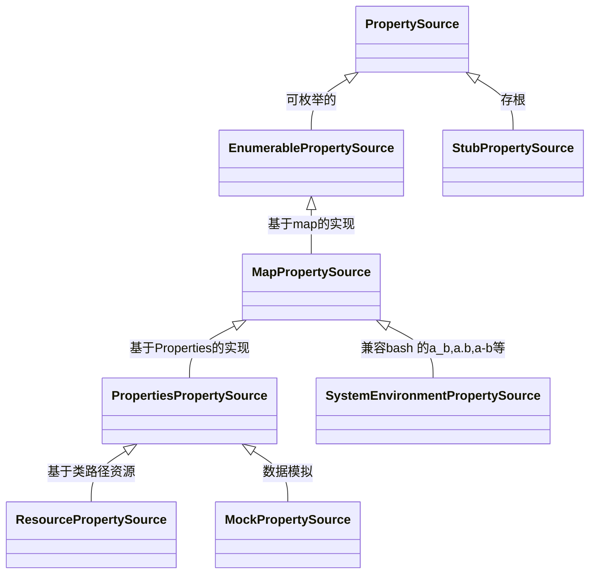
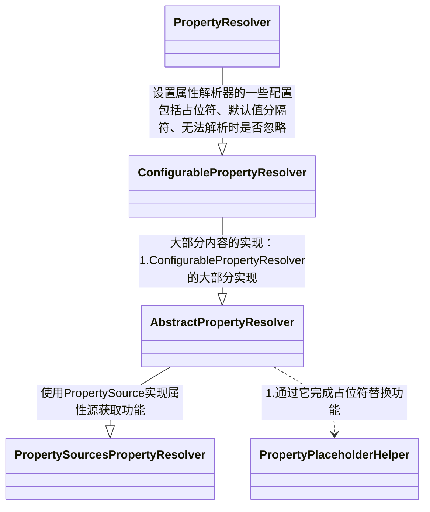
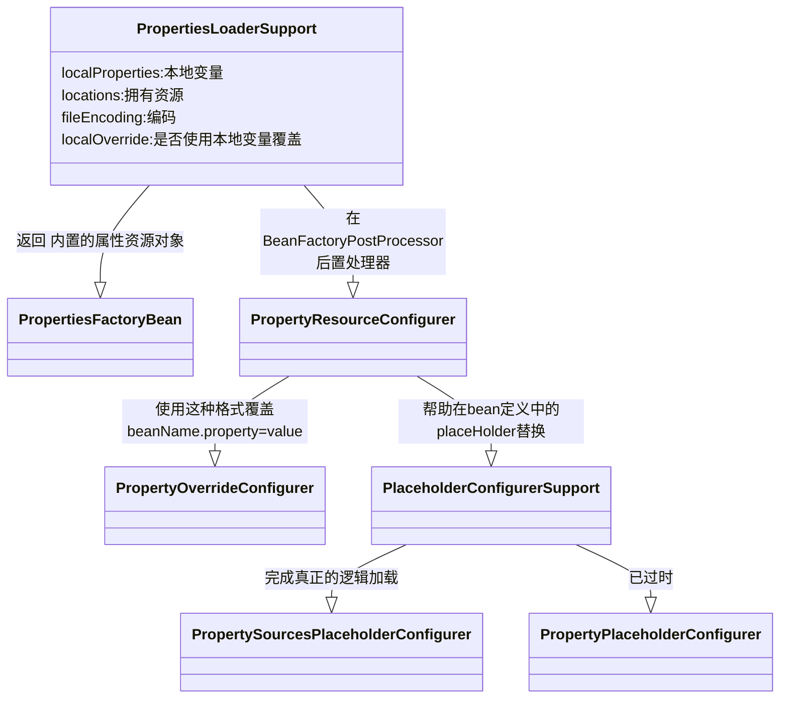

# 环境抽象

* *Environment* 接口是 对   程序两个关键的环境: 

    * *profile*
    * *properties*  

    进行的抽象

* *profile* 是一系列 bean定义的 逻辑分组, 只有当指定的*profile* 激活才会把加入到容器管理

* *properties* 管理者 很多属性资源, 例如  JVM系统属性, 环境变量, JNDI, 容器参数,  临时*properties*, *objects*, *map* 


# Profile

## 使用

### 与或非使用逻辑

```
!: A logical “not” of the profile

&: A logical “and” of the profiles

|: A logical “or” of the profiles
```

### 标注配置类上

```java
//标注配置类上
@Configuration
@Profile("development")
public class StandaloneDataConfig {

    @Bean
    public DataSource dataSource() {
        return new EmbeddedDatabaseBuilder()
            .setType(EmbeddedDatabaseType.HSQL)
            .addScript("classpath:com/bank/config/sql/schema.sql")
            .addScript("classpath:com/bank/config/sql/test-data.sql")
            .build();
    }
}

//多环境
@Profile({"p1", "p2"})
```

### XML配置

```xml
<beans xmlns="http://www.springframework.org/schema/beans"
    xmlns:xsi="http://www.w3.org/2001/XMLSchema-instance"
    xmlns:jdbc="http://www.springframework.org/schema/jdbc"
    xmlns:jee="http://www.springframework.org/schema/jee"
    xsi:schemaLocation="...">

    <!-- other bean definitions -->

    <beans profile="development">
        <jdbc:embedded-database id="dataSource">
            <jdbc:script location="classpath:com/bank/config/sql/schema.sql"/>
            <jdbc:script location="classpath:com/bank/config/sql/test-data.sql"/>
        </jdbc:embedded-database>
    </beans>

    <beans profile="production">
        <jee:jndi-lookup id="dataSource" jndi-name="java:comp/env/jdbc/datasource"/>
    </beans>
</beans>
//嵌套
<beans xmlns="http://www.springframework.org/schema/beans"
    xmlns:xsi="http://www.w3.org/2001/XMLSchema-instance"
    xmlns:jdbc="http://www.springframework.org/schema/jdbc"
    xmlns:jee="http://www.springframework.org/schema/jee"
    xsi:schemaLocation="...">

    <!-- other bean definitions -->

    <beans profile="production">
        <beans profile="us-east">
            <jee:jndi-lookup id="dataSource" jndi-name="java:comp/env/jdbc/datasource"/>
        </beans>
    </beans>
</beans>
```

## 激活Profile的方式

**编码方式**

```java
AnnotationConfigApplicationContext ctx = new AnnotationConfigApplicationContext();
ctx.getEnvironment().setActiveProfiles("development");
ctx.register(SomeConfig.class, StandaloneDataConfig.class, JndiDataConfig.class);
ctx.refresh();
```

**命令行**

```
 -Dspring.profiles.active="profile1,profile2"
```

**默认环境**

```java
@Configuration
@Profile("default")
public class DefaultDataConfig {

    @Bean
    public DataSource dataSource() {
        return new EmbeddedDatabaseBuilder()
            .setType(EmbeddedDatabaseType.HSQL)
            .addScript("classpath:com/bank/config/sql/schema.sql")
            .build();
    }
}
```


# 属性源

## 属性查找的优先级

* *Environment* 的查找是可继承的

* *StandardEnvironment* 包含了 系统变量和环境变量
* *StandardServletEnvironment*包含以下，　越排在上面优先级越高
    * ServletConfig parameters (if applicable — for example, in case of a `DispatcherServlet` context)
    * ServletContext parameters (web.xml context-param entries)
    * JNDI environment variables (`java:comp/env/` entries)
    * JVM system properties (`-D` command-line arguments)
    * JVM system environment (operating system environment variables)

## 属性源在spring中的使用

```java
@Configuration
@PropertySource("classpath:/com/myco/app.properties")
public class AppConfig {

    @Autowired
    Environment env;

    @Bean
    public TestBean testBean() {
        TestBean testBean = new TestBean();
        testBean.setName(env.getProperty("testbean.name"));
        return testBean;
    }
}
```

**占位符会从当前环境已加载的属性中取**

```java
@Configuration
@PropertySource("classpath:/com/${my.placeholder:default/path}/app.properties")
public class AppConfig {

    @Autowired
    Environment env;

    @Bean
    public TestBean testBean() {
        TestBean testBean = new TestBean();
        testBean.setName(env.getProperty("testbean.name"));
        return testBean;
    }
}
```


# 属性与资源环境

## 资源属性

> PropertySource：对 key value键值对的封装

### 类图




### PropertySource

### 简述

PropertySource 对象通常不会单独使用，而是通过 PropertySources 对象使用，该对象聚合属性源并与 PropertyResolver 实现结合使用，该实现可以跨 PropertySource 集执行基于优先级的搜索。 
PropertySource 标识不是根据封装的属性的内容来确定的，而是仅根据 PropertySource 的名称来确定的。

### 局部变量

**属性源的名称**

```java
protected final String name;
```

属性源**backend**

```java
protected final T source;
```

### StubPropertySource

1. 在创建应用程序上下文时无法急切初始化实际属性源的情况下，PropertySource 用作占位符。

2. 例如，基于 ServletContext 的属性源必须等待 ServletContext 对象可用于其封闭的 ApplicationContext。
3. 在这种情况下，应使用存根来保存属性源的预期默认位置/顺序，然后在上下文刷新期间替换。

```java
public static class StubPropertySource extends PropertySource<Object> {

   public StubPropertySource(String name) {
      super(name, new Object());
   }

   /**
    * Always returns {@code null}.
    */
   @Override
   @Nullable
   public String getProperty(String name) {
      return null;
   }
}
```

### ComparisonPropertySource

> 用于集合比较目的的 PropertySource 实现。

```java
static class ComparisonPropertySource extends StubPropertySource {

   private static final String USAGE_ERROR =
         "ComparisonPropertySource instances are for use with collection comparison only";

   public ComparisonPropertySource(String name) {
      super(name);
   }

   @Override
   public Object getSource() {
      throw new UnsupportedOperationException(USAGE_ERROR);
   }

   @Override
   public boolean containsProperty(String name) {
      throw new UnsupportedOperationException(USAGE_ERROR);
   }

   @Override
   @Nullable
   public String getProperty(String name) {
      throw new UnsupportedOperationException(USAGE_ERROR);
   }
}
```

### EnumerablePropertySource

> 能够查询其底层源对象以枚举所有可能的属性名称/值对的 PropertySource 实现。

公开 getPropertyNames() 方法以允许调用者内省可用属性

```java
public abstract String[] getPropertyNames();
```

### CompositePropertySource

> 一些列PropertySource的集合组合实现

```java
private final Set<PropertySource<?>> propertySources = new LinkedHashSet<>();
```

### CommandLinePropertySource

1. 基于命令行的属性源

2. 有两个实现类，一个是基于 `--opt=xjq` 的简单命令行

    *CommandLinePropertySource*

    一个是基于Jopt的命令行属性源 *CommandLinePropertySource*

### ResourcePropertySource

> **基于*Resource* 的 属性源**

**初始化**

```java
//将Resource 转化成Properties
//从resource从获取 resourcename
public ResourcePropertySource(String name, EncodedResource resource) throws IOException {
   super(name, PropertiesLoaderUtils.loadProperties(resource));
   this.resourceName = getNameForResource(resource.getResource());
}
```

**getNameForResource**

```java
private static String getNameForResource(Resource resource) {
   String name = resource.getDescription();
   if (!StringUtils.hasText(name)) {
      name = resource.getClass().getSimpleName() + "@" + System.identityHashCode(resource);
   }
   return name;
}
```


## 属性占位符解析

### 类图




### PropertyResolver

> 用于针对任何基础源 **解析属性**的接口

**获取属性**

```java
//返回给定的属性键是否可用于解析，即给定键的值不为空
boolean containsProperty(String key);
//返回与给定键关联的属性值，如果无法解析键，则返回 null。
String getProperty(String key);
String getProperty(String key, String defaultValue);
//返回与给定键关联的属性值，如果无法解析键，则返回 null。
<T> T getProperty(String key, Class<T> targetType);
//返回与给定键关联的属性值，如果键不能被返回，则返回 defaultValue
<T> T getProperty(String key, Class<T> targetType, T defaultValue);
String getRequiredProperty(String key) throws IllegalStateException;
	<T> T getRequiredProperty(String key, Class<T> targetType) throws IllegalStateException;
```

**解析占位符**

```java
// 解析给定文本中的 ${...} 占位符，将它们替换为由 getProperty 解析的相应属性值。没有默认值的无法解析的占位符将被忽略并保持不变
String resolvePlaceholders(String text);
String resolveRequiredPlaceholders(String text) throws IllegalArgumentException;
```

### ConfigurablePropertyResolver

**API**

1. 提供 *ConversionService* 转换服务：不通类型之间的转换
2. 设置 占位符前缀、后缀
3. 默认值与占位符之间的分隔符 默认为 冒号
4. 遇到无法解析的占位符时是否抛出异常。
5. 校验属性值

### AbstractPropertyResolver

#### 成员变量

```java
//必输属性
private final Set<String> requiredProperties = new LinkedHashSet<>();
//默认值分割符
private String valueSeparator =  SystemPropertyUtils.VALUE_SEPARATOR;

//前缀
public static final String PLACEHOLDER_PREFIX = "${";

//后缀
	/** Suffix for system property placeholders: "}". */
public static final String PLACEHOLDER_SUFFIX = "}";

//默认值分割符
	/** Value separator for system property placeholders: ":". */
public static final String VALUE_SEPARATOR = ":";

//遇到无法解析的 占用符时是否忽略
private boolean ignoreUnresolvableNestedPlaceholders = false;

```

```java
//类型转换
private volatile ConfigurableConversionService conversionService;

//placeHolder解析器：非严格
private PropertyPlaceholderHelper nonStrictHelper;
//placeHolder解析器：严格
private PropertyPlaceholderHelper strictHelper;
```


## 环境

> 不同的 *PropertySource* 构成不同的 *Environment*


### Environment

1. 当前应用程序运行环境的接口
2. 对应用程序环境的两个关键方面进行抽象：（*profile*）配置文件和（*properties*）属性。
3. 与属性访问相关的方法通过 *PropertyResolver* 接口公开。

**主要用来查询 当前环境激活的环境变量**


配置文件是一个命名的、逻辑的 bean 定义组，仅当给定的配置文件处于活动状态时才向容器注册

Bean 可以分配给配置文件，无论是在 XML 中定义还是通过注解

在 *ApplicationContext*  管理的Bean 可以通过   *EnvironmentAware*  接口注入环境变量 或者 `@Inject`


大多数情况下、应用程序级的 *bean* 不需要直接与  *Environment*  交互

而是 通过 占位符 属性 `${...}` 替换来 访问

默认情况下 

*PropertySourcesPlaceholderConfigurer* 是默认注册进Spring容器 中

并处理这些 变量替换

*environment* 对象的配置必须通过 *ConfigurableEnvironment* 接口完成

从所有 AbstractApplicationContext 子类 getEnvironment() 方法返回


```java
//所有已激活的环境变量
String[] getActiveProfiles();
//获取默认环境变量
String[] getDefaultProfiles();

//返回一个或多个给定的配置文件是否处于活动状态，或者在没有明确的活动配置文件的情况下，一个或多个给定的配置文件是否包含在一组默认配置文件中。如果配置文件以 '!' 开头 逻辑被反转，即如果给定的配置文件未激活，该方法将返回 true。 例如， env.acceptsProfiles("p1", "!p2") 如果配置文件 'p1' 处于活动状态或 'p2' 未处于活动状态，则将返回 true。
boolean acceptsProfiles(Profiles profiles);
```

### ConfigurableEnvironment

**配置profile**

```
void setActiveProfiles(String... profiles);
void addActiveProfile(String profile);
void setDefaultProfiles(String... profiles);
```

**返回系统环境属性**

```java
//由jvm设置
Map<String, Object> getSystemProperties();
//环境变量：由外部进程设置
Map<String, Object> getSystemEnvironment();
```

**合并**

```java
//将给定的父环境的活动配置文件、默认配置文件和属性源附加到此（子）环境各自的集合中。
void merge(ConfigurableEnvironment parent);
```

1. 对于存在于父和子中的任何同名 PropertySource 实例，将保留子实例并丢弃父实例。
2. 活动和默认配置文件名称也过滤重复，以避免混淆和冗余存储。
3. .在任何情况下，父环境都保持不变。请注意，在调用合并之后发生的对父环境的任何更改都不会反映在子环境中。因此，在调用merge之前应注意配置父属性源和配置文件信息

### AbstractEnvironment

### 简介

1. 环境实现的抽象基类
2. 允许通过 ACTIVE_PROFILES_PROPERTY_NAME 和 DEFAULT_PROFILES_PROPERTY_NAME 属性指定活动和默认配置文件
3. 具体子类的不同主要在于它们默认添加的 PropertySource 对象
4. AbstractEnvironment 不添加任何内容。
5. 子类通过 *customPropertySources(MutablePropertySources)* 构造*PropertySources*

### 成员变量

**profile属性**

```java
private final Set<String> activeProfiles = new LinkedHashSet<>();
protected static final String RESERVED_DEFAULT_PROFILE_NAME = "default";
private final Set<String> defaultProfiles = new LinkedHashSet<>(getReservedDefaultProfiles());

// ProfileParser：profile解析类
org.springframework.core.env.ProfilesParser
```

**占位符解析器**

```java
private final ConfigurablePropertyResolver propertyResolver =
      new PropertySourcesPropertyResolver(this.propertySources);
```

**资源集合**

```java
private final MutablePropertySources propertySources = new MutablePropertySources();
```

主要实现了 *profile*的 增删改查


### StandardEnvironment

> 适用于“标准”（即非网络）应用程序的环境实现

除了 *ConfigurableEnvironment* 的常用功能

* 例如属性解析和
* 与**profile**相关的操作）之外

此实现还配置了两个默认属性源，按以下顺序搜索：

* system properties
* system environment variables


### ConfigurableWebEnvironment

在 *ServletContext*  早期：*ServletConfig* 可用的时候，来初始化相关的*PropertySource*

```java
void initPropertySources(@Nullable ServletContext servletContext, @Nullable ServletConfig servletConfig);
```

### StandardServletEnvironment

```
extends StandardEnvironment implements ConfigurableWebEnvironment
```

*ServletContext* **初始化属性源**

初始化两个属性源

1. *ServletContextPropertySource*
2. *ServletConfigPropertySource*

```java
	@Override
public void initPropertySources(@Nullable ServletContext servletContext, @Nullable ServletConfig servletConfig) {
WebApplicationContextUtils.initServletPropertySources(getPropertySources(), servletContext, servletConfig);
	}
```

### MockEnvironment

伪造 属性环境

# spring资源环境自动加载机制

## 类图




## PropertyPlaceholderConfigurer逻辑

1. 获取配置的本地资源 数据
2. 自定义转换逻辑：覆盖properties的值
3. 对bean定义 遍历 *BeanDefinitionVisitor*  进行 占位符替换 

## PropertySourcesPlaceholderConfigurer逻辑

1. **将默认环境资源加入到资源管理中**

   ```java
   				this.propertySources.addLast(
   					new PropertySource<Environment>(ENVIRONMENT_PROPERTIES_PROPERTY_SOURCE_NAME, this.environment) {
   						@Override
   						@Nullable
   						public String getProperty(String key) {
   							return this.source.getProperty(key);
   						}
   					}
   				);
   ```

2. **将本地资源属性加入到资源管理中**

   ```java
   PropertySource<?> localPropertySource =
         new PropertiesPropertySource(LOCAL_PROPERTIES_PROPERTY_SOURCE_NAME, mergeProperties());
   if (this.localOverride) {
      this.propertySources.addFirst(localPropertySource);
   }
   else {
      this.propertySources.addLast(localPropertySource);
   }
   ```

3. **配置 占位符解析器**

```java
	protected void processProperties(ConfigurableListableBeanFactory beanFactoryToProcess,
			final ConfigurablePropertyResolver propertyResolver) throws BeansException {

		propertyResolver.setPlaceholderPrefix(this.placeholderPrefix);
		propertyResolver.setPlaceholderSuffix(this.placeholderSuffix);
		propertyResolver.setValueSeparator(this.valueSeparator);

		StringValueResolver valueResolver = strVal -> {
			String resolved = (this.ignoreUnresolvablePlaceholders ?
					propertyResolver.resolvePlaceholders(strVal) :
					propertyResolver.resolveRequiredPlaceholders(strVal));
			if (this.trimValues) {
				resolved = resolved.trim();
			}
			return (resolved.equals(this.nullValue) ? null : resolved);
		};

		doProcessProperties(beanFactoryToProcess, valueResolver);
	}
```

4. **bean定义 占位符替换**

```java
protected void doProcessProperties(ConfigurableListableBeanFactory beanFactoryToProcess,
      StringValueResolver valueResolver) {

   BeanDefinitionVisitor visitor = new BeanDefinitionVisitor(valueResolver);

   String[] beanNames = beanFactoryToProcess.getBeanDefinitionNames();
   for (String curName : beanNames) {
      // Check that we're not parsing our own bean definition,
      // to avoid failing on unresolvable placeholders in properties file locations.
      if (!(curName.equals(this.beanName) && beanFactoryToProcess.equals(this.beanFactory))) {
         BeanDefinition bd = beanFactoryToProcess.getBeanDefinition(curName);
         try {
            visitor.visitBeanDefinition(bd);
         }
         catch (Exception ex) {
            throw new BeanDefinitionStoreException(bd.getResourceDescription(), curName, ex.getMessage(), ex);
         }
      }
   }

   // New in Spring 2.5: resolve placeholders in alias target names and aliases as well.
   beanFactoryToProcess.resolveAliases(valueResolver);

   // New in Spring 3.0: resolve placeholders in embedded values such as annotation attributes.
   beanFactoryToProcess.addEmbeddedValueResolver(valueResolver);
}
```

## @PropertySource逻辑

`org.springframework.context.annotation.ConfigurationClassParser#doProcessConfigurationClass`

**解析*ConfigClass* 时 解析PropertySource**

```java
// Process any @PropertySource annotations
for (AnnotationAttributes propertySource : AnnotationConfigUtils.attributesForRepeatable(
      sourceClass.getMetadata(), PropertySources.class,
      org.springframework.context.annotation.PropertySource.class)) {
   if (this.environment instanceof ConfigurableEnvironment) {
      processPropertySource(propertySource);
   }
   else {
      logger.info("Ignoring @PropertySource annotation on [" + sourceClass.getMetadata().getClassName() +
            "]. Reason: Environment must implement ConfigurableEnvironment");
   }
}
```

**针对@PropertySource注解逻辑处理**

```java
{
//属性源名称
   String name = propertySource.getString("name");
   if (!StringUtils.hasLength(name)) {
      name = null;
   }
//属性源编码
   String encoding = propertySource.getString("encoding");
   if (!StringUtils.hasLength(encoding)) {
      encoding = null;
   }
  //属性源值
   String[] locations = propertySource.getStringArray("value");
   Assert.isTrue(locations.length > 0, "At least one @PropertySource(value) location is required");
    //not found时的处理逻辑
   boolean ignoreResourceNotFound = propertySource.getBoolean("ignoreResourceNotFound");
   //PropertySourceFactory工厂处理类
   Class<? extends PropertySourceFactory> factoryClass = propertySource.getClass("factory");
   PropertySourceFactory factory = (factoryClass == PropertySourceFactory.class ?
         DEFAULT_PROPERTY_SOURCE_FACTORY : BeanUtils.instantiateClass(factoryClass));

    //解析处理 locations
   for (String location : locations) {
      try {
          //针对location上的变量进行占位符替换
         String resolvedLocation = this.environment.resolveRequiredPlaceholders(location);
          //加载资源
         Resource resource = this.resourceLoader.getResource(resolvedLocation);
          //将资源计入到Environment
         addPropertySource(factory.createPropertySource(name, new EncodedResource(resource, encoding)));
      }
      catch (IllegalArgumentException | FileNotFoundException | UnknownHostException ex) {
          //处理找不到资源的情况
         // Placeholders not resolvable or resource not found when trying to open it
         if (ignoreResourceNotFound) {
            if (logger.isInfoEnabled()) {
               logger.info("Properties location [" + location + "] not resolvable: " + ex.getMessage());
            }
         }
         else {
            throw ex;
         }
      }
   }
}
```

**将解析的资源加入到Environment**

```java
{
   String name = propertySource.getName();
   MutablePropertySources propertySources = ((ConfigurableEnvironment) this.environment).getPropertySources();
//如果已经加载过：将 sourcename作为 name替换
   if (this.propertySourceNames.contains(name)) {
      // We've already added a version, we need to extend it
      PropertySource<?> existing = propertySources.get(name);
      // 
      if (existing != null) {
         PropertySource<?> newSource = (propertySource instanceof ResourcePropertySource ?
               ((ResourcePropertySource) propertySource).withResourceName() : propertySource);
         if (existing instanceof CompositePropertySource) {
            ((CompositePropertySource) existing).addFirstPropertySource(newSource);
         }
         else {
            if (existing instanceof ResourcePropertySource) {
               existing = ((ResourcePropertySource) existing).withResourceName();
            }
             //新旧版本 一起组合
            CompositePropertySource composite = new CompositePropertySource(name);
            composite.addPropertySource(newSource);
            composite.addPropertySource(existing);
            propertySources.replace(name, composite);
         }
         return;
      }
   }

   if (this.propertySourceNames.isEmpty()) {
      propertySources.addLast(propertySource);
   }
   else {
      String firstProcessed = this.propertySourceNames.get(this.propertySourceNames.size() - 1);
      propertySources.addBefore(firstProcessed, propertySource);
   }
   this.propertySourceNames.add(name);
}
```

