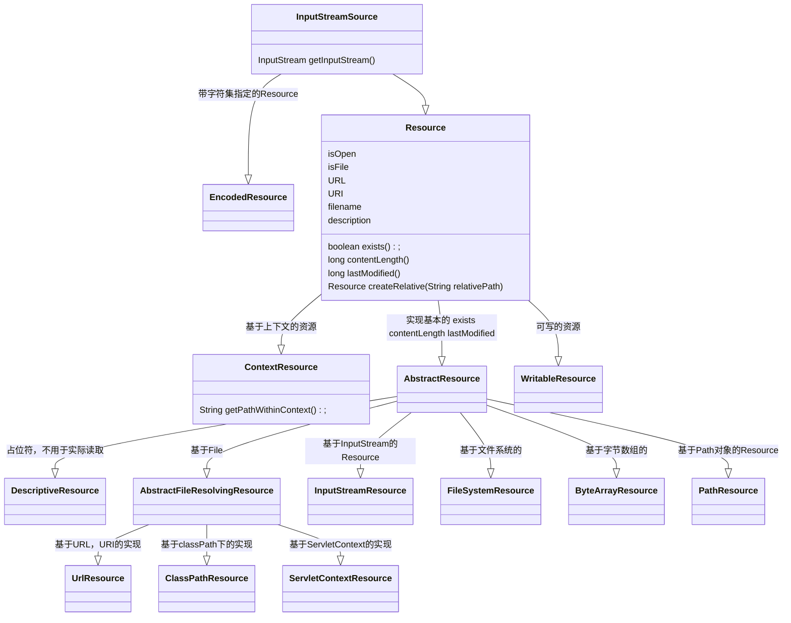
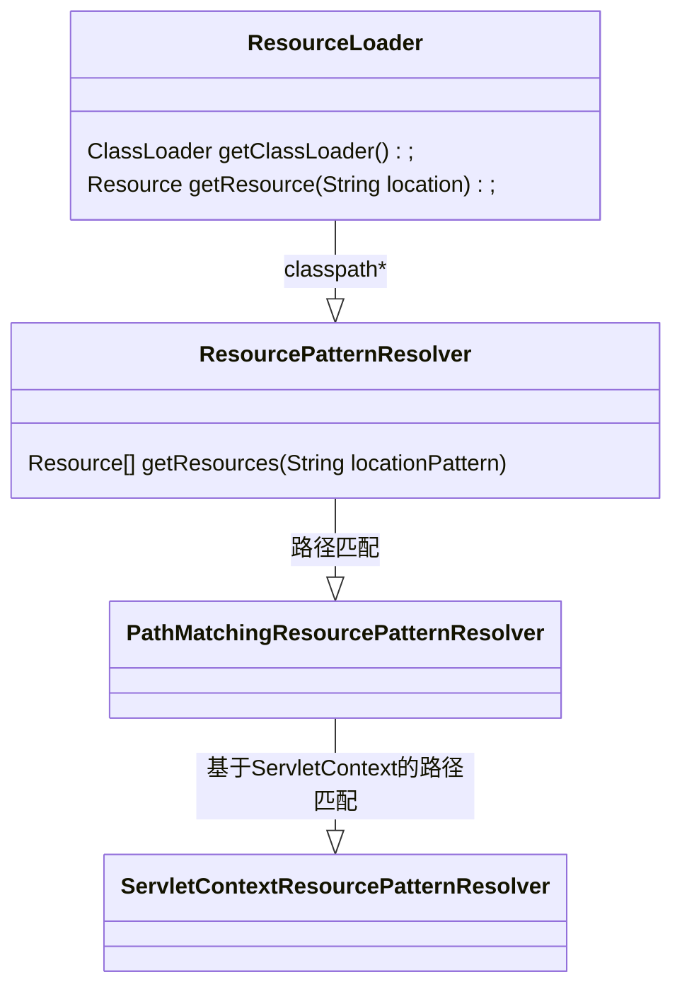

# 资源抽象

## 类图

```mermaid
classDiagram
class InputStreamSource{
	InputStream getInputStream()
}

InputStreamSource --|> EncodedResource:带字符集指定的Resource

class Resource{
	isOpen
	isFile
	URL
	URI
	filename
	description
	boolean exists();
    long contentLength()
    long lastModified()
    Resource createRelative(String relativePath)
}

class ContextResource{
	String getPathWithinContext();
}

InputStreamSource --|> Resource

Resource --|> ContextResource:基于上下文的资源
Resource --|> AbstractResource:实现基本的 exists contentLength lastModified
Resource --|> WritableResource:可写的资源


AbstractResource --|> DescriptiveResource:占位符，不用于实际读取
AbstractResource --|> AbstractFileResolvingResource: 基于File
AbstractResource --|> InputStreamResource:基于InputStream的Resource
AbstractResource --|> FileSystemResource:基于文件系统的
AbstractResource --|> ByteArrayResource:基于字节数组的
AbstractResource --|> PathResource:基于Path对象的Resource

AbstractFileResolvingResource --|> UrlResource:基于URL，URI的实现
AbstractFileResolvingResource --|> ClassPathResource:基于classPath下的实现
AbstractFileResolvingResource  --|> ServletContextResource:基于ServletContext的实现

```

# 资源载入

1. 方便 载入resource 
2. 支持 通配符匹配

## 类图

```mermaid
classDiagram
class ResourceLoader{
	ClassLoader getClassLoader();	
    Resource getResource(String location);	
}

class ResourcePatternResolver{
	Resource[] getResources(String locationPattern)
}

ResourceLoader--|> ResourcePatternResolver:classpath*
ResourcePatternResolver --|> PathMatchingResourcePatternResolver:路径匹配
PathMatchingResourcePatternResolver --|> ServletContextResourcePatternResolver:基于ServletContext的路径匹配
```

