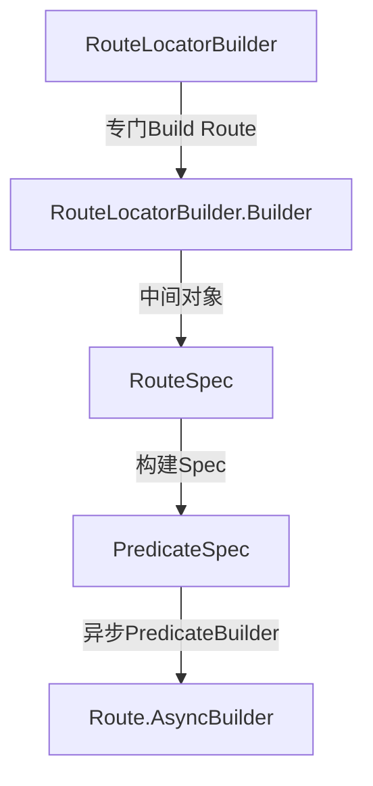

```mermaid
graph
a[RouteLocatorBuilder]
b[RouteLocatorBuilder.Builder]
c[Route.AsyncBuilder]
d[RouteSpec]
e[PredicateSpec]
a -- 专门Build Route--> b
b -- 中间对象--> d
d -- 构建Spec --> e
e -- 异步PredicateBuilder -->  c
```

