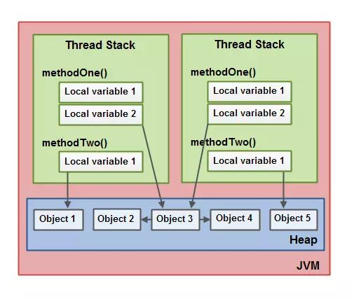
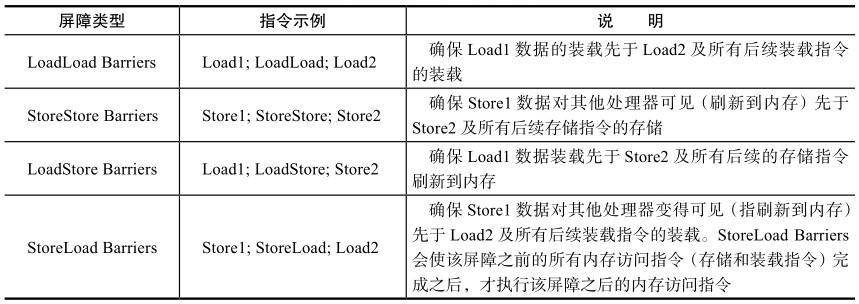

# JMM

## Java内存模型是什么？

Java是跨平台的语言，因为JVM屏蔽了底层操作系统和物理计算机的差异，**JMM也是JVM规范定义的一部分**，JMM抽象地定义了JVM在计算机内存中的工作方式。

JMM规定了所有的变量都存储在**主内存（Main Memory）**中。每个线程还有自己的**工作内存（Working Memory）**。

线程的工作内存中保存了该线程使用的主内存变量的副本拷贝，线程对变量的所有操作（读取、赋值等）都必须在工作内存中进行，而不能直接读写主内存中的变量。

不同的线程之间无法直接访问对方工作内存中的变量，线程之间值的传递都需要通过主内存来完成。

## 线程的数据共享

* JMM规定了线程之间的通信必须经过主内存，例如：线程a要将变量传给线程b，首先线程a要将本地工作内存中的变量刷新到主内存中的共享变量，然后线程b去主内存中读取刚刚被线程a更新后的共享变量，才能完成变量的传递。

* 线程间的传递需要将变量数据在工作内存和主内存之间来回传递。JMM 定义了 8 个操作来完成**主内存和工作内存**之间的交互操作。
    * **assign(赋值)**：作用于工作内存的变量，把一个从执行引擎接收到的值赋值给工作内存的变量；
    * **store (存储)**：作用于工作内存的变量，把工作内存中的变量的值传送到主内存中 , 以便随后的写入操作；
    * **write (写入)**：作用于主内存的变量, 它把传送给主内存的变量的值写入到主内存的变量中；
    * **unlock(解锁)**：作用于主内存的变量，把一个处于锁定状态的变量释放出来 , 释放后的变量才可以被其他线程锁定；
    * **lock(锁定)**：作用于主内存的变量，另外一个需要使用这个变量的线程对变量锁定，把一个主内存的变量标识为线程独占状态；
    * **read(读取)**：作用于主内存的变量，把变量值从主内存的变量中读取出来，以便随后载入工作内存的变量副本；
    * **load(载入)**：作用于工作内存的变量，它把从主内存中得到的变量值放入工作内存的变量副本中；
    * **use (使用)**：作用于工作内存的变量 ，将工作内存中的变量值传递给执行引擎使用。

    至此，两个线程完成了变量的传递。

## JMM的三大特性

JMM是一个抽象的概念，是围绕着并发编程中原子性、可见性、有序性这三个特性来建立的。上面介绍的Java 内存交互的8个基本操作，都遵循这三个特性。

**原子性**

一个操作不能被打断，要么全部执行完毕，要么不执行。在这点上有点类似于事务操作，要么全部执行成功，要么回退到执行该操作之前的状态。

**可见性**

一个线程对共享变量做了修改之后，其他的线程立即能够看到该变量的这种修改。JMM是通过主内存作为变量传递媒介来实现的。

**有序性**

在本线程内观察，所有的操作都是有序的；观察另外的线程，所有的操作都是无序的。编译器和处理器可能会对操作做重排序。对于单线程，编译器和处理器不会改变存在数据依赖关系的两个操作的执行顺序，**但不保证多线程的数据依赖**。

# Volatile关键字

volatile关键词作用于变量，具有两种语义：一是**保证变量对所有线程的可见性**，二是**禁止进行指令重排序**。下面分别加以说明。

## 线程可见性

volatile的作用是确保每次对volatile变量的读操作都从主内存里读取变量的值，每次对volatile变量的写操作也都将值写到主内存里。

## 禁止重排序

### **禁止重排序规则**

编译器有时候会对指令进行重排序优化以获得更好的性能

volatile禁止重排序的规则如下：

- 当程序执行到 volatile 变量的读操作或者写操作时，在其前面的操作的更改肯定全部已经进行，且结果对后面的操作可见；在其后面的操作肯定还没有进行；
- 在进行指令优化时，不能将后面的代码放到volatile变量访问语句之前执行，也不能将前面的代码放到volatile变量访问语句之后执行。

### **volatile 实现禁止重排序的原理**

JMM的处理器重排序规则会要求Java编译器在生成指令序列时，插入特定类型的**内存屏障（Memory Barriers）**指令，通过内存屏障来禁止特定类型的处理器重排序。

内存屏障类型包括下表列出的四种。

volatile实现禁止重排序的方式就是在编译生成字节码时，在对volatile变量的读写操作前后增加了内存屏障，以阻止和其他指令的执行顺序被重排。

**操作之间的重排序规则**

- 只要第二个操作是volatile写，不管第一个操作是什么都不会重排序
- 只要第一个操作是volatile读，不管第二个操作是什么都不会重排序
- 第一个操作是volatile写，第二个操作是volatile读，也不会发生重排序

**volatile 的使用场景**总结起来，就是“一次写入，到处读取”

**volatile不保证原子性**

