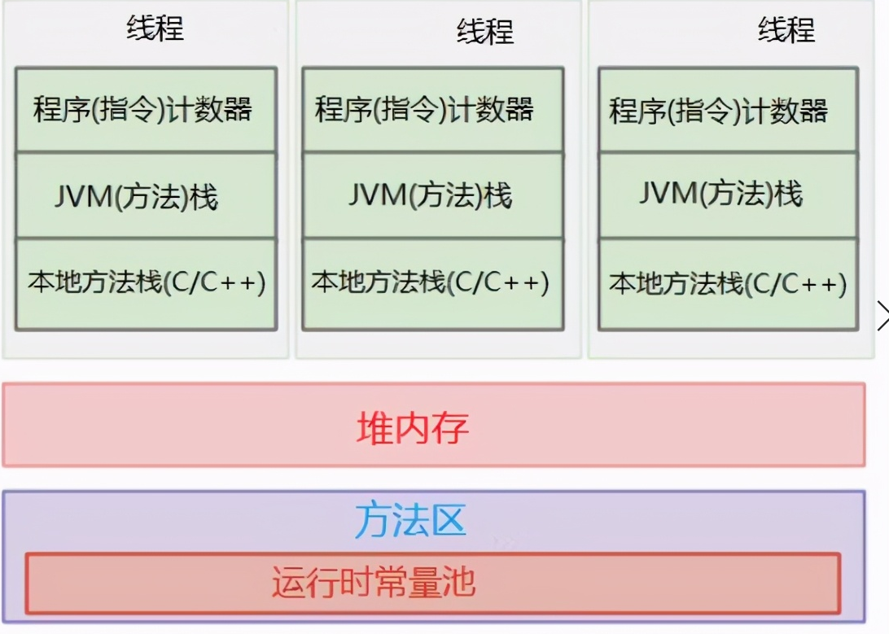

# JVM内存模型

Java虚拟机(Java Virtual Machine=JVM)的内存空间分为五个部分，分别是： 

* 程序计数器
* Java虚拟机栈 
* 本地方法栈 
* 堆 
* 方法区

## 程序计数器

### 什么是程序计数器？

程序计数器是一块较小的内存空间，可以把它看作当前线程正在执行的字节码的行号指示器。也就是说，程序计数器里面记录的是当前线程正在执行的那一条字节码指令的地址。 
**注：**但是，如果当前线程正在执行的是一个本地方法，那么此时程序计数器为空。 

### 程序计数器的作用

程序计数器有两个作用：

1. 字节码解释器通过改变程序计数器来依次读取指令，从而实现代码的流程控制，如：顺序执行、选择、循环、异常处理。
2. 在多线程的情况下，程序计数器用于记录当前线程执行的位置，从而当线程被切换回来的时候能够知道该线程上次运行到哪儿了。 

### 程序计数器的特点

1. 是一块较小的存储空间
2. 线程私有。每条线程都有一个程序计数器。
3. 是唯一一个不会出现OutOfMemoryError的内存区域。
4. 生命周期随着线程的创建而创建，随着线程的结束而死亡。 


## Java虚拟机栈(JVM Stack)

### 什么是Java虚拟机栈？

Java虚拟机栈是描述Java方法运行过程的内存模型。 
Java虚拟机栈会为每一个即将运行的Java方法创建一块叫做“栈帧”的区域，这块区域用于存储该方法在运行过程中所需要的一些信息，这些信息包括：

1. 局部变量表 
    存放基本数据类型变量、引用类型的变量、returnAddress类型的变量。
2. 操作数栈
3. 动态链接
4. 方法出口信息
5. 等

```
当一个方法即将被运行时，Java虚拟机栈首先会在Java虚拟机栈中为该方法创建一块“栈帧”，栈帧中包含局部变量表、操作数栈、动态链接、方法出口信息等。当方法在运行过程中需要创建局部变量时，就将局部变量的值存入栈帧的局部变量表中。 
当这个方法执行完毕后，这个方法所对应的栈帧将会出栈，并释放内存空间。
```

J**ava虚拟机栈是由一个个栈帧组成，而每个栈帧中都拥有：局部变量表、操作数栈、动态链接、方法出口信息。** 

### Java虚拟机栈的特点

1. 方法的局部变量表不会改变

    局部变量表的创建是在方法被执行的时候，随着栈帧的创建而创建。而且，局部变量表的大小在编译时期就确定下来了，在创建的时候只需分配事先规定好的大小即可。此外，在方法运行的过程中局部变量表的大小是不会发生改变的。

2. Java虚拟机栈会出现两种异常：StackOverFlowError和OutOfMemoryError。 

    1. StackOverFlowError： 
        若Java虚拟机栈的内存大小不允许动态扩展，那么当线程请求栈的深度超过当前Java虚拟机栈的最大深度的时候，就抛出StackOverFlowError异常。
    2. OutOfMemoryError： 
        若Java虚拟机栈的内存大小允许动态扩展，且当线程请求栈时内存用完了，无法再动态扩展了，此时抛出OutOfMemoryError异常。

3. Java虚拟机栈也是线程私有的，每个线程都有各自的Java虚拟机栈，而且随着线程的创建而创建，随着线程的死亡而死亡。

## 本地方法栈

### 什么是本地方法栈？

本地方法栈和Java虚拟机栈实现的功能类似，只不过本地方法区是本地方法运行的内存模型。

本地方法被执行的时候，在本地方法栈也会创建一个栈帧，用于存放该本地方法的局部变量表、操作数栈、动态链接、出口信息。

方法执行完毕后相应的栈帧也会出栈并释放内存空间。

也会抛出StackOverFlowError和OutOfMemoryError异常。


##  堆

堆是用来存放对象的内存空间。 
**几乎所有**的对象都存储在堆中。 

### 堆的特点

1. 线程共享 
    整个Java虚拟机只有一个堆，所有的线程都访问同一个堆。而程序计数器、Java虚拟机栈、本地方法栈都是一个线程对应一个的。
2. 在虚拟机启动时创建
3. 垃圾回收的主要场所。
4. 可以进一步细分为：新生代、老年代。 
    新生代又可被分为：Eden、From Survior、To Survior。 
    不同的区域存放具有不同生命周期的对象。这样可以根据不同的区域使用不同的垃圾回收算法，从而更具有针对性，从而更高效。
5. 堆的大小既可以固定也可以扩展，但主流的虚拟机堆的大小是可扩展的，因此当线程请求分配内存，但堆已满，且内存已满无法再扩展时，就抛出OutOfMemoryError。 


## 方法区

### 什么是方法区？

Java虚拟机规范中定义方法区是堆的一个逻辑部分。 
方法区中存放已经被虚拟机加载的类信息、常量、静态变量、即时编译器编译后的代码等。 

### 方法区的特点

1. 线程共享 
    方法区是堆的**一个逻辑部分**，因此和堆一样，都是线程共享的。整个虚拟机中只有一个方法区。
2. 内存回收效率低 
    方法区中的信息一般需要长期存在，回收一遍内存之后可能只有少量信息无效。 
    对方法区的内存回收的主要目标是：**对常量池的回收** 和 **对类型的卸载**。
3. Java虚拟机规范对方法区的要求比较宽松。 
    和堆一样，允许固定大小，也允许可扩展的大小，还允许不实现垃圾回收。 

### 什么是运行时常量池？

方法区中存放三种数据：**类信息**、**常量**、**静态变量**、即时编译器编译后的代码。其中常量存储在运行时常量池中。

我们一般在一个类中通过public static final来声明一个常量。这个类被编译后便生成Class文件，这个类的所有信息都存储在这个class文件中。

当这个类被Java虚拟机加载后，class文件中的常量就存放在方法区的运行时常量池中。而且在运行期间，可以向常量池中添加新的常量。如：String类的intern()方法就能在运行期间向常量池中添加字符串常量。

当运行时常量池中的某些常量没有被对象引用，同时也没有被变量引用，那么就需要垃圾收集器回收。 


### 元空间

**元空间的引入**

* JDK1.8以前的HotSpot JVM，方法区的实现 使用堆内存，也叫 永久代**(permanent generation)**
* 永久代的**GC**是和老年代(old generation)捆绑在一起的，无论谁满了，都会触发永久代和老年代的垃圾收集。
* JDK1.7开始了方法区的部分移除：**符号引用(Symbols)**移至**native heap**，**字面量(interned strings)**和**静态变量(class statics)**移至**java heap。**

**为什么要用Metaspace替代方法区**
随着动态类加载的情况越来越多，这块内存变得不太可控，如果设置小了，系统运行过程中就容易出现内存溢出，设置大了又浪费内存。

这个元空间是使用本地内存（Native Memory）实现的，也就是说它的内存是不在虚拟机内的，所以可以理论上物理机器还有多个内存就可以分配，而不用再受限于JVM本身分配的内存了。

如果使用永久代实现方法区，那么需要手动扩大堆的大小，而使用元空间之后，就可以直接存储在内存当中，不用手动去修改堆的大小。

## 直接内存

直接内存是除Java虚拟机之外的内存，但也有可能被Java使用。

在NIO中引入了一种基于通道和缓冲的IO方式。它可以通过调用本地方法直接分配Java虚拟机之外的内存，然后通过一个存储在Java堆中的DirectByteBuffer对象直接操作该内存，而无需先将外面内存中的数据复制到堆中再操作，从而提升了数据操作的效率。

直接内存的大小不受Java虚拟机控制，但既然是内存，当内存不足时就会抛出OOM异常。 


# 示意图




