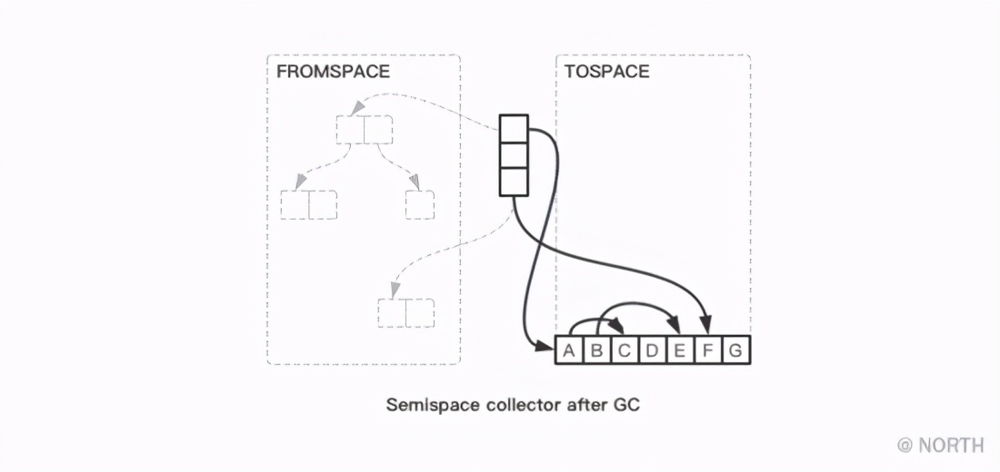

# JVM 垃圾回收算法——复制算法

## 复制算法

在复制算法中，回收器将堆空间划分为两个大小相等的半区 (semispace)，分别是 来源空间(fromspace) 和 目标空间(tospace) 。在进行垃圾回收时，回收器将存活对象从来源空间复制到目标空间，复制结束后，所有存活对象紧密排布在目标空间一端，最后将来源空间和目标空间互换。

### **复制前**


### **复制后**




### **代码段**

```
collect() {
// 变量前面加*表示指针
// free指向TOSPACE半区的起始位置
*free = *to_start;
for(root in Roots) {
copy(*free, root);
}
// 交换FROMSPACE和TOSPACE
swap(*from_start,*to_start);
}
```

核心函数 copy 的实现如下所示：

```
copy(*free,obj) {
// 检查obj是否已经复制完成
// 这里的tag仅是一个逻辑上的域
if(obj.tag != COPIED) {
// 将obj真正的复制到free指向的空间
copy_data(*free,obj);
// 给obj.tag贴上COPIED这个标签
// 即使有多个指向obj的指针，obj也不会被复制多次
obj.tag = COPIED;
// 复制完成后把对象的新地址存放在老对象的forwarding域中
obj.forwarding = *free;
// 按照obj的长度将free指针向前移动
*free += obj.size;

// 递归调用copy函数复制其关联的子对象
for(child ingetRefNode(obj.forwarding)){
*child = copy(*free,child);
}
}
returnobj.forwarding;
}
```

### **两个注意点**

- tag=COPIED

  标记该对象已经被复制完成

- forwarding

  标记该对象所复制后的地址

## **算法评价 3**

**优点**

- 吞吐量高：整个 GC 算法只搜索并复制存活对象，尤其是堆越大，差距越明显，毕竟它消耗的时间只是与活动对象数量成正比。
- 内存连续,无碎片
- 与缓存兼容：可以回顾一下前面说的局部性原理，由于所有存活对象都紧密的排布在内存里，非常有利于 CPU 的高速缓存。

**缺点**

- 堆空间利用率低
- 递归调用函数：复制某个对象时要递归复制它引用的对象，相较于迭代算法，递归的效率更低，而且有栈空间溢出的风险

## **Cheney 复制算法**

> Cheney 算法是用来解决如何遍历引用关系图并将存活对象移动到 TOSPACE 的算法，它使用迭代算法来代替递归

### 注意点

**双指针**

- scan 指针扫描对象的所有 第一层级引用, scan 前面的表示 已经被扫描过引用了, 后面的是已经被复制 还未 扫描过引用

- free 指针 指向链条尾端, 前面的表示已经复制完毕了

### 代码段

代码实现只需要在之前的代码上稍做修改，即可：

```
collect() {
// free指向TOSPACE半区的起始位置
*scan = *free = *to_start;
// 复制根节点直接引用的对象
for(root in Roots) {
copy(*free, root);
}
// scan开始向前移动
// 首先获取scan位置处对象所引用的对象
// 所有引用对象复制完成后，向前移动scan
while(*scan != *free) {
for(child ingetRefObject(scan)){
copy(*free, child);
}
*scan += scan.size;
}
swap(*from_start,*to_start);
}
```

而 copy 函数也不再包含递归调用，仅仅是完成复制功能：

```
copy(*free,obj) {
if(!is_pointer_to_heap(obj.forwarding,*to_start)) {
// 将obj真正的复制到free指向的空间
copy_data(*free,obj);
// 复制完成后把对象的新地址存放在老对象的forwarding域中
obj.forwarding = *free;
// 按照obj的长度将free指针向前移动
*free += obj.size;
}
returnobj.forwarding;
}
```

通过代码可以看出，Cheney 算法采用的是广度优先算法

广度优先搜索算法是需要一个先进先出的队列来辅助的，但这儿并没有队列。实际上 scan 和 free 之间的堆变成了一个队列，scan 左边是已经搜索完的对象，右边是待搜索对象。free 向前移动，队列就会追加对象，scan 向前移动，都会有对象被取出并进行搜索

### 算法评价

- 避免了栈的消耗和可能的栈溢出风险
- 相互引用的对象并不是相邻的，就没办法充分利用缓存

[参考](https://www.toutiao.com/i6885208625674093059/)

