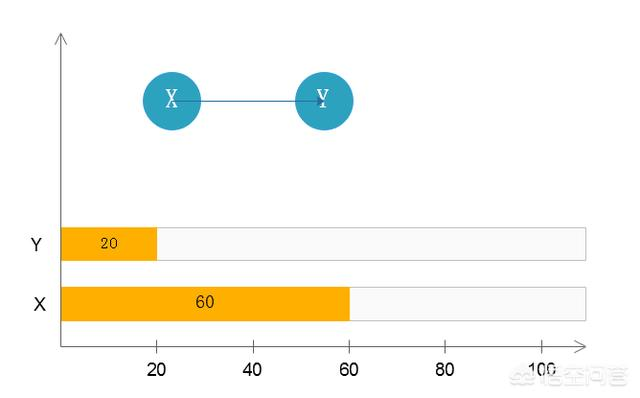

# 内存泄漏（memory leak ）

**占着茅坑不拉 shi**



```
如上图，对象X引用对象Y，X的生命周期为60，Y的生命周期为20，当Y生命周期结束的时候，X依然引用着B，这时候，垃圾回收期是不会回收对象Y的；如果对象X还引用着生命周期比较短的A、B、C...对象A又引用着对象a、b、c...

那么就可能造成大量无用的对象不能被回收，进而占据了内存资源，造成内存泄漏，直到内存溢出。
```

## 内存泄漏的分类

- 经常（不断）发生：发生内存泄露的代码会被多次执行，每次执行，泄露一块内存；
- 偶然发生：在某些特定情况下才会发生；
- 一次性：发生内存泄露的方法只会执行一次；
- 隐式泄露：一直占着内存不释放，直到执行结束；严格的说这个不算内存泄露，因为最终释放掉了，但是如果执行时间特别长，也可能会导致内存耗尽。

## 内存泄露产生的可能原因

- 循环过多或死循环，产生大量对象；
- 静态集合类引起内存泄漏，因为静态集合的生命周期和应用一致，所以静态集合引用的对象不能被释放；
- 单例模式，和静态集合导致内存泄露的原因类似；
- 事件监听（listeners）和回调（callbacks）；
- 各种连接，比如数据库连接、Socket 连接、IO 等，必须显式释放（close）；
- 内存中加载数据量过大；我之前项目有一次上线的时候，应用启动奇慢直到夯死，就是因为代码中会加载一个表中的数据到缓存（内存）中，测试环境只有几百条数据，但是生产环境有几百万的数据。


# 内存溢出（OutofMemory）

JVM中常见的两个**经典错误**

StackoverFlowError ：栈溢出

OutofMemoryError: java heap space：堆溢出

除此之外，还有以下的错误

- java.lang.StackOverflowError 栈溢出
- java.lang.OutOfMemoryError：java heap space  堆溢出
- java.lang.OutOfMemoryError：GC overhead limit exceeeded 
- java.lang.OutOfMemoryError：Direct buffer memory
- java.lang.OutOfMemoryError：unable to create new native thread
- java.lang.OutOfMemoryError：Metaspace


## 栈溢出StackoverFlowError

堆栈溢出，我们有最简单的一个递归调用，就会造成堆栈溢出，也就是深度的方法调用

栈一般是512K，不断的深度调用，直到栈被撑破

## OutOfMemoryError

## java heap space

创建了很多对象，导致堆空间不够存储

```
-Xms10m -Xmx20m
限定堆大小最大为20M,初始为10M
```


## GC overhead limit exceeded

GC回收时间过长时会抛出OutOfMemoryError，过长的定义是，**超过了98%的时间用来做GC**，**并且回收了不到2%的堆内存**

连续多次GC都只回收了不到2%的极端情况下，才会抛出。假设不抛出GC overhead limit 错误会造成什么情况呢？

那就是GC清理的这点内存很快会再次被填满，迫使GC再次执行，这样就形成了恶性循环，CPU的使用率一直都是100%，而GC却没有任何成果。

### 达到步骤

**设置JVM参数**

```
-Xms10m -Xmx10m -XX:+PrintGCDetails -XX:MaxDirectMemorySize=5m
```

**代码**

```java
import java.util.ArrayList;
import java.util.List;

public class GCOverheadLimitDemo {
    public static void main(String[] args) {
        int i = 0;
        List<String> list = new ArrayList<>();
        try {
            while(true) {
                list.add(String.valueOf(++i).intern());
            }
        } catch (Exception e) {
            System.out.println("***************i:" + i);
            e.printStackTrace();
            throw e;
        } finally {

        }

    }
}
```

**结果**

```
> Task :GCOverheadLimitDemo.main()
[GC (Allocation Failure) [PSYoungGen: 2048K->506K(2560K)] 2048K->1690K(9728K), 0.0029415 secs] [Times: user=0.00 sys=0.00, real=0.00 secs] 
[GC (Allocation Failure) [PSYoungGen: 2331K->481K(2560K)] 3515K->3313K(9728K), 0.0023773 secs] [Times: user=0.00 sys=0.00, 
Exception in thread "main" java.lang.OutOfMemoryError: GC overhead limit exceeded
[Full GC (Ergonomics) [PSYoungGen: 2047K->0K(2560K)] [ParOldGen: 7051K->524K(7168K)] 9099K->524K(9728K), [Metaspace: 2682K->2682K(1056768K)], 0.0061980 secs] [Times: user=0.00 sys=0.00, real=0.01 secs] 
	at java.lang.Integer.toString(Integer.java:401)
	at java.lang.String.valueOf(String.java:3099)
	at GCOverheadLimitDemo.main(GCOverheadLimitDemo.java:10)
Heap
 PSYoungGen      total 2560K, used 54K [0x00000000ffd00000, 0x0000000100000000, 0x0000000100000000)
  eden space 2048K, 2% used [0x00000000ffd00000,0x00000000ffd0d9b8,0x00000000fff00000)
  from space 512K, 0% used [0x00000000fff80000,0x00000000fff80000,0x0000000100000000)
  to   space 512K, 0% used [0x00000000fff00000,0x00000000fff00000,0x00000000fff80000)
 ParOldGen       total 7168K, used 524K [0x00000000ff600000, 0x00000000ffd00000, 0x00000000ffd00000)
  object space 7168K, 7% used [0x00000000ff600000,0x00000000ff6833d0,0x00000000ffd00000)
 Metaspace       used 2689K, capacity 4486K, committed 4864K, reserved 1056768K
  class space    used 290K, capacity 386K, committed 512K, reserved 1048576K

> Task :GCOverheadLimitDemo.main() FAILED

Execution failed for task ':GCOverheadLimitDemo.main()'.
> Process 'command 'C:/Program Files/Java/jdk1.8.0_141/bin/java.exe'' finished with non-zero exit value 1

* Try:
Run with --stacktrace option to get the stack trace. Run with --info or --debug option to get more log output. Run with --scan to get full insights.
```


## Direct buffer memory


**原因**

这是由于NIO引起的

写NIO程序的时候经常会使用ByteBuffer来读取或写入数据，这是一种基于通道(Channel) 与 缓冲区(Buffer)的I/O方式，它可以使用Native 函数库直接分配堆外内存，然后通过一个存储在Java堆里面的DirectByteBuffer对象作为这块内存的引用进行操作。这样能在一些场景中显著提高性能，因为避免了在Java堆和Native堆中来回复制数据。


ByteBuffer.allocate(capability)：第一种方式是分配JVM堆内存，属于GC管辖范围，由于需要拷贝所以速度相对较慢

ByteBuffer.allocteDirect(capability)：第二种方式是分配OS本地内存，不属于GC管辖范围，由于不需要内存的拷贝，所以速度相对较快


但如果不断分配本地内存，堆内存很少使用，那么JVM就不需要执行GC，DirectByteBuffer对象就不会被回收，这时候堆内存充足，但本地内存可能已经使用光了，再次尝试分配本地内存就会出现OutOfMemoryError，那么程序就崩溃了。


一句话说：本地内存不足，但是堆内存充足的时候，就会出现这个问题

**配置参数**

我们使用 -XX:MaxDirectMemorySize=5m 配置能使用的堆外物理内存为5M


**代码**

```java
import java.nio.ByteBuffer;

public class DirectBufferDemo {
    public static void main(String[] args) {
        ByteBuffer bb = ByteBuffer.allocateDirect(6 * 1024 * 1024);

    }
}
```

**日志**

```
> Task :DirectBufferDemo.main() FAILED
[GC (System.gc()) [PSYoungGen: 787K->504K(2560K)] 787K->648K(9728K), 0.0009607 secs] [Times: user=0.00 sys=0.00, real=0.00 secs] 
[Full GC (System.gc()) [PSYoungGen: 504K->0K(2560K)] [ParOldGen: 144K->533K(7168K)] 648K->533K(9728K), [Metaspace: 2649K->2649K(1056768K)], 0.0056731 secs] [Times: user=0.02 sys=0.00, real=0.01 secs] 
Exception in thread "main" java.lang.OutOfMemoryError: Direct buffer memory
	at java.nio.Bits.reserveMemory(Bits.java:694)
	at java.nio.DirectByteBuffer.<init>(DirectByteBuffer.java:123)
	at java.nio.ByteBuffer.allocateDirect(ByteBuffer.java:311)
	at DirectBufferDemo.main(DirectBufferDemo.java:5)
Heap
 PSYoungGen      total 2560K, used 61K [0x00000000ffd00000, 0x0000000100000000, 0x0000000100000000)
  eden space 2048K, 3% used [0x00000000ffd00000,0x00000000ffd0f750,0x00000000fff00000)
  from space 512K, 0% used [0x00000000fff00000,0x00000000fff00000,0x00000000fff80000)
  to   space 512K, 0% used [0x00000000fff80000,0x00000000fff80000,0x0000000100000000)
 ParOldGen       total 7168K, used 533K [0x00000000ff600000, 0x00000000ffd00000, 0x00000000ffd00000)
  object space 7168K, 7% used [0x00000000ff600000,0x00000000ff685708,0x00000000ffd00000)
 Metaspace       used 2682K, capacity 4486K, committed 4864K, reserved 1056768K
  class space    used 290K, capacity 386K, committed 512K, reserved 1048576K

Execution failed for task ':DirectBufferDemo.main()'.
> Process 'command 'C:/Program Files/Java/jdk1.8.0_141/bin/java.exe'' finished with non-zero exit value 1

* Try:
Run with --stacktrace option to get the stack trace. Run with --info or --debug option to get more log output. Run with --scan to get full insights.
```


## unable to create new native thread

不能够创建更多的新的线程了，也就是说创建线程的上限达到了


- 应用创建了太多线程，一个应用进程创建多个线程，超过系统承载极限
- 服务器并不允许你的应用程序创建这么多线程，linux系统默认运行单个进程可以创建的线程为1024个，如果应用创建超过这个数量，就会报 java.lang.OutOfMemoryError:unable to create new native thread


## Metaspace

元空间内存不足，Matespace元空间应用的是本地内存

-XX:MetaspaceSize 的处理器大小为20M

元空间就是我们的方法区，存放的是类模板，类信息，常量池等

Metaspace是方法区HotSpot中的实现，它与持久代最大的区别在于：Metaspace并不在虚拟内存中，而是使用本地内存，也即在java8中，class metadata（the virtual machines internal presentation of Java class），被存储在叫做Matespace的native memory

永久代（java8后背元空间Metaspace取代了）存放了以下信息：

- 虚拟机加载的类信息
- 常量池
- 静态变量
- 即时编译后的代码

模拟Metaspace空间溢出，我们不断生成类 往元空间里灌输，类占据的空间总会超过Metaspace指定的空间大小

**指定元空间大小**

```
-XX:MetaspaceSize=8m -XX:MaxMetaspaceSize=8m
```


**spring动态字节码技术**

```java
public class MetaspaceOutOfMemoryDemo {

    // 静态类
    static class OOMTest {

    }

    public static void main(final String[] args) {
        // 模拟计数多少次以后发生异常
        int i =0;
        try {
            while (true) {
                i++;
                // 使用Spring的动态字节码技术
                Enhancer enhancer = new Enhancer();
                enhancer.setSuperclass(OOMTest.class);
                enhancer.setUseCache(false);
                enhancer.setCallback(new MethodInterceptor() {
                    @Override
                    public Object intercept(Object o, Method method, Object[] objects, MethodProxy methodProxy) throws Throwable {
                        return methodProxy.invokeSuper(o, args);
                    }
                });
                enhancer.create();
            }
        } catch (Exception e) {
            System.out.println("发生异常的次数:" + i);
            e.printStackTrace();
        } finally {

        }

    }
}
```

```
> Task :MetaspaceOutOfMemoryDemo.main() FAILED
1
2
3
4
......
311
312
Exception in thread "main" java.lang.OutOfMemoryError: Metaspace
	at net.sf.cglib.core.AbstractClassGenerator.generate(AbstractClassGenerator.java:348)
	at net.sf.cglib.proxy.Enhancer.generate(Enhancer.java:492)
	at net.sf.cglib.core.AbstractClassGenerator$ClassLoaderData.get(AbstractClassGenerator.java:117)
	at net.sf.cglib.core.AbstractClassGenerator.create(AbstractClassGenerator.java:294)
	at net.sf.cglib.proxy.Enhancer.createHelper(Enhancer.java:480)
	at net.sf.cglib.proxy.Enhancer.create(Enhancer.java:305)
	at MetaspaceOutOfMemoryDemo.main(MetaspaceOutOfMemoryDemo.java:27)

Execution failed for task ':MetaspaceOutOfMemoryDemo.main()'.
> Process 'command 'C:/Program Files/Java/jdk1.8.0_141/bin/java.exe'' finished with non-zero exit value 1

* Try:
Run with --stacktrace option to get the stack trace. Run with --info or --debug option to get more log output. Run with --scan to get full insights
```
