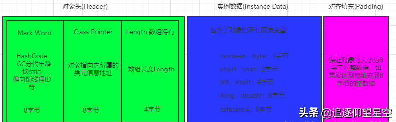

[参考链接](https://www.toutiao.com/i6872618702160953863/)

# Java 对象内存模型




# Object obj=new Object()占用字节

- 未开启指针压缩
  占用大小为：**8(Mark Word)+8(Class Pointer)=16 字节**
- 开启了指针压缩(默认是开启的)
  开启指针压缩后，Class Pointer 会被压缩为 4 字节，最终大小为：**8(Mark Word)+4(Class Pointer)+4(对齐填充)=16 字节**

* 打印 对象内存分布

  ```xml
          <dependency>
              <groupId>org.openjdk.jol</groupId>
              <artifactId>jol-core</artifactId>
              <version>0.10</version>
          </dependency>
  ```

  ```java
  package com.zwx.jvm;
  
  import org.openjdk.jol.info.ClassLayout;
  
  public class HeapMemory {
      public static void main(String[] args) {
          Object obj = new Object();
          System.out.println(ClassLayout.parseInstance(obj).toPrintable());
      }
  }
  ```

# 对象的创建


**类加载检查**

当虚拟机遇到一条 new 指令时

- 会去检查这个指令的参数能否在常量池中定位到一个类的符号引用
- 并检查代表的类是否已经被类加载器加载。如果没有被加载那么必须先执行这个类的加载。

**内存分配**

- 虚拟机将为新对象分配内存，对象所需内存的大小在类加载后便可以确定。
- 分配方式
  - Java 堆内存是规整的(使用标记整理或带压缩的垃圾收集器)，使用一个指针指向空闲位置，分配内存既将指针移动与分配大小相等的距离
  - 内存不是规整的(使用标记清除的垃圾收集器)，虚拟机维护一个可用内存块列表，分配内存时从列表中找到一个足够大的内存空间划分给对象并更新可用内存列表。
  - 无法找到足够的内存时会触发一次 GC
  - 分配内存时并发问题解决方案：
    - 对分配内存空间的动作进行同步操作---采用 CAS 失败重试的方式保证更新操作的原子性。
    - 每个线程在堆中预先分配一块小内存，称为本地线程分配缓冲(Thread Local Allocation Buffer,TLAB)，哪个线程要分配内存就在它的 TLAB 上分配，只有 TLAB 用完并分配新的 TLAB 时才需要同步锁定。通过-XX:+/-UseTLAB 参数来设定。

**初始化**

虚拟机需要将对象初始化为零值，保证对象的*实例变量*在代码中不赋初始值就能直接使用。类变量在类加载的准备阶段初始化为零值。

**设置对象头**

对对象头进行必要信息的设置，比如如何找到类的元数据信息、对象的 HashCode、GC 分代年龄等。

**执行 init 方法**

这时候需要执行`<init>`方法(构造方法)把对象按照程序员的意愿进行初始化。类变量的初始化操作在类加载的初始化阶段<clinit>方法完成

# **创建对象指令重排序问题**

new 一个对象的简单分解动作：

1. 分配对象的内存空间
2. 初始化对象
3. 设置引用指向分配的内存地址

其中 2、3 两步间会发生指令重排序，导致多线程时如果在初始化之前访问对象则会出现问题，单例模式的双重检测锁模式正是会存在这个问题。可以使用 volatile 来禁止指令重排序解决问题

# 对象的访问

## 句柄访问

> Java 虚拟机会在堆内划分出一块内存来存储句柄池，那么对象当中存储的就是句柄地址，然后句柄池中才会存储对象实例数据和对象类型数据地址


## 直接指针访问

> 直接指针访问的话对象中就会直接存储对象类型数据。

## 句柄访问和直接指针访问区别

> 使用句柄访问的时候，会多了一次指针定位,有一个好处就是，假如一个对象被移动(地址改变了),只需要改变句柄池的指向就可以了，不需要修改 reference 对象内的指向,而如果使用直接指针访问，就还需要到局部变量表内修改 reference 指向。

# javaGC

**对象分代年龄**

- 在 Java 对象头当中的 Mark Word 存储了对象的分代年龄, 一个对象的分代年龄可以理解为垃圾回收次数,当一个对象经过一次垃圾回收之后还存在,那么分代年龄就会加 1
- Java 堆内存中按照分代年龄来划分，分为 Young 区和 Old 区，对象分配首先会到 Young 区，达到一定分代年龄(-XX:MaxTenuringThreshold 可以设置大小，默认为 15)就会进入 Old 区(**注意：如果一个对象太大，那么就会直接进入 Old 区**)。

**为什么 jvm 要划分 GC 分区**

- 之所以会这么划分是因为如果整个堆只有一个区的话，那么垃圾回收的时候每次都需要把堆内所有对象都扫描一遍，浪费性能
- 而其实大部分 Java 对象的生命周期都是很短的，一旦一个对象回收很多次都回收不掉，可以认为下一次垃圾回收的时候可能也回收不掉
- 只有当 Young 区在进行垃圾回收之后还是没有腾出空间，那么再去触发 Old 区的垃圾回收。

**不连续导致的内存不连续?**

> 堆上分配的对象,在内存中是不连续的,有时候,明明有空间,是因为空间不连续，导致对象申请内存失败，导致触发 GC 了

解决的思路: **就是把 Young 区的对象按顺序放好**

所以就产生了一个方法，把 Young 区再次划分一下，分为 2 个区：**Eden 区**和**Survivor 区**。


**工作流程**

一个对象来了之后，先分配到 Eden 区，Eden 区满了之后，触发 GC，经过 GC 之后，为了防止空间不连续，把幸存下来的对象复制到 Survivor 区，然后 Eden 区就可以完整清理掉了

前提是:**大部分对象都是生命周期极短的，基本一次垃圾回收就可以把 Eden 区大部分对象回收掉**

**Survivor 区还是不连续?**

> 触发 GC 的时候 Survivor 区也会一起回收,Survivor 区又可能产生空间碎片,导致不连续了

解决办法: **把 Survivor 区给一分为二**


**工作流程**

首先还是在 Eden 区分配空间，Eden 区满了之后触发 GC，GC 之后把幸存对象 复制到 S0 区(S1 区是空的)，然后继续在 Eden 区分配对象，再次触发 GC 之后如果发现 S0 区放不下了(产生空间碎片，实际还有空间)，那么就把 S0 区对象复制到 S1 区，并把幸存对象也复制到 S1 区，这时候 S0 区是空的了，并依次反复操作，假如说 S0 区或者 S1 区空间对象复制移动了之后还是放不下，那就说明这时候是真的满了，那就去老年区借点空间过来（这就是**担保机制**，老年代需要提供这种空间分配担保），假如说老年区空间也不够了，那就会触发 Full GC，如果还是不够，那就会抛出 OutOfMemeoyError 异常了。

注意：为了确保 S0 和 S1 两个区域之间每次复制都能顺利进行，S0 和 S1 两个区的大小必须要保持一致，而且同一时间有一个区域一定是空的。虽然说这种做法是会导致了一小部分空间的浪费，但是综合其他性能的提升来说，是值得的。

当 Young 区的对象达到设置的分代年龄之后，对象会进入 Old 区，Old 区满了之后会触发 Full GC，如果还是清理不掉空间，那么就抛出 OutOfMemeoyError 异常。

# 关于 JavaGC 的名词

- 垃圾回收：简称 GC。
- Minor GC：针对新生代的 GC
- Major GC：针对老年代的 GC，一般老年代触发 GC 的同时也会触发 Minor GC，也就等于触发了 Full GC。
- Full GC：新生代+老年代同时发生 GC。
- Young 区：新生代
- Old 区：老年代
- Eden 区：暂时没发现有什么中文翻译(伊甸园?)
- Surcivor 区：幸存区
- S0 和 S1：也称之为 from 区和 to 区，注意 from 和 to 两个区是不断互换身份的，且 S0 和 S1 一定要相等，并且保证一块区域是空的

**内存分配流程图**


# jdk8 内存结构

**java 内存分布**


**元数据空间**

> 在 jdk8 以后,方法区( 也就是永久代), 变为 元数据空间
> 

**元数据空间与 永久代的区别**

元空间并不在虚拟机中，而是使用本地内存

元空间是方法区的在 HotSpot jvm 中的实现，方法区主要用于存储类的信息、常量池、方法数据、方法代码等。方法区逻辑上属于堆的一部分，但是为了与堆进行区分，通常又叫“非堆”。

**常用配置参数**

**MetaspaceSize**

初始化的 Metaspace 大小，控制元空间发生 GC 的阈值。GC 后，动态增加或降低 MetaspaceSize。在默认情况下，这个值大小根据不同的平台在 12M 到 20M 浮动。使用 Java -XX:+PrintFlagsInitial 命令查看本机的初始化参数

**MaxMetaspaceSize**

限制 Metaspace 增长的上限，防止因为某些情况导致 Metaspace 无限的使用本地内存，影响到其他程序。在本机上该参数的默认值为 4294967295B（大约 4096MB）。

**MinMetaspaceFreeRatio**

当进行过 Metaspace GC 之后，会计算当前 Metaspace 的空闲空间比，如果空闲比小于这个参数（即实际非空闲占比过大，内存不够用），那么虚拟机将增长 Metaspace 的大小。默认值为 40，也就是 40%。设置该参数可以控制 Metaspace 的增长的速度，太小的值会导致 Metaspace 增长的缓慢，Metaspace 的使用逐渐趋于饱和，可能会影响之后类的加载。而太大的值会导致 Metaspace 增长的过快，浪费内存。

**MaxMetasaceFreeRatio**

当进行过 Metaspace GC 之后， 会计算当前 Metaspace 的空闲空间比，如果空闲比大于这个参数，那么虚拟机会释放 Metaspace 的部分空间。默认值为 70，也就是 70%。

**MaxMetaspaceExpansion**

Metaspace 增长时的最大幅度。在本机上该参数的默认值为 5452592B（大约为 5MB）。

**MinMetaspaceExpansion**

Metaspace 增长时的最小幅度。在本机上该参数的默认值为 340784B（大约 330KB 为）。

> **可以配合 JVisualVM 来看**

# Java 对象头


[额外参考链接](https://www.toutiao.com/i6811393828289774094/)

