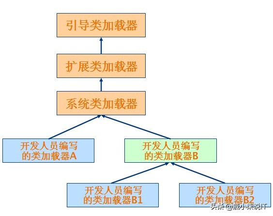
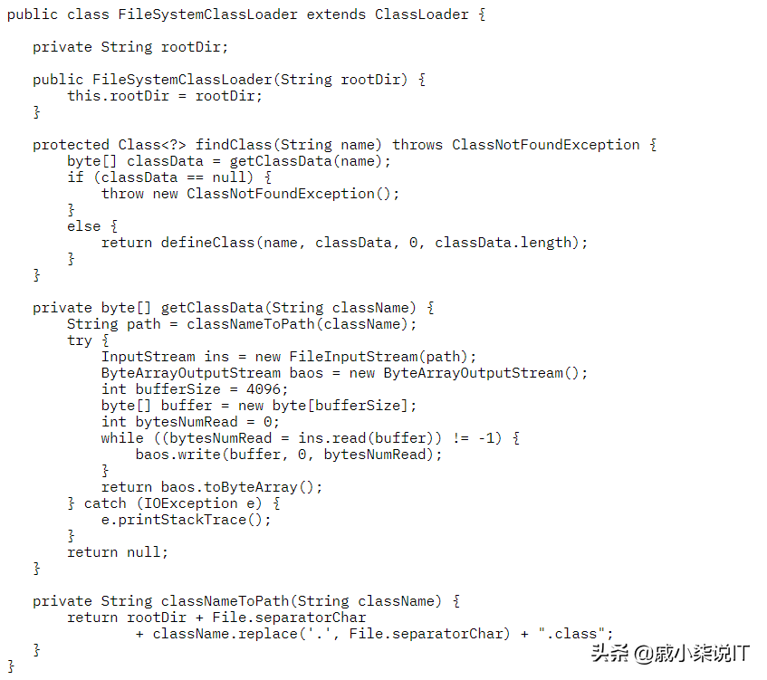
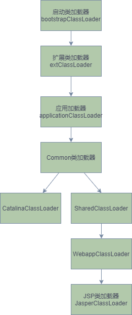

# **类加载器基本概念**

顾名思义，类加载器（class loader）用来加载 Java 类到 Java 虚拟机中。一般来说，Java 虚拟机使用 Java 类的方式如下：Java 源程序（.java 文件）在经过 Java 编译器编译之后就被转换成 Java 字节代码（.class 文件）。类加载器负责读取 Java 字节代码，并转换成 java.lang.Class 类的一个实例。

所有的类加载器都是 java.lang.ClassLoader 类的一个实例。

# **java.lang.ClassLoader**

| 方法                                              | 说明                       |
| ------------------------------------------------- | -------------------------- |
| getParent()                                       | 返回该类加载器的分类加载器 |
| loadClass(String name)                            | 加载类                     |
| findClass(String name)                            | 查询 class                 |
| findLoadedClass(String name)                      | 查询已经被加载过的类       |
| defineClass(String name,byte[] b,int off,int len) | 把 byte 字节数组转换成类   |
| resolveClass(Class<?> c)                          | 链接指定的 Java 类         |

# 类加载器的树状组织结构

- 引导类加载器（bootstrap class loader）

  - 它用来加载 Java 的核心库，比如 Object、System、 String ,Java 运行时的 rt.jar 等 jar 包
  - 是用 C++来实现的，并不继承自 java.lang.ClassLoader。

- 扩展类加载器（extensions class loader）

  - 它用来加载 Java 的扩展库。Java 虚拟机的实现会提供一个扩展目录。该类加载器在此目录里面查找并加载 Java 类。
  - 负责加载<JAVA_HOME>\lib\ext 目录中的，或者 java.ext.dirs 系统变量指定的路径中的所有类库;

- Application ClassLoader

    应用类加载器，主要是加载用户定义的 CLASSPATH 路径下的类


它根据 Java 应用的类路径（CLASSPATH）来加载 Java 类。一般来说，Java 应用的类都是由它来完成加载的。可以通过 ClassLoader.getSystemClassLoader()来获取它。




# 类加载器的代理模式

> 类加载器在尝试自己去查找某个类的字节代码并定义它时，会先代理给其父类加载器，由父类加载器先去尝试加载这个类

**代理模式是为了保证** Java 核心库的类型安全

**注意：**类加载的双亲委派 是需要根据代码遵守，但是可以打破，但是 Java核心类跟 扩展类是没法自定义类加载器加载的

**代理流程**

* 判断是否已加载
* 未加载则通过父类 加载器查找
* 若父类为空 则调用 bootstrap加载器
* 若父类找不到 则调用本类的查找方法

>如果不想打破双亲委派模型，那么只需要重写findClass方法即可

>  如果想打破双亲委派模型，那么就重写整个loadClass方法

```java
protected synchronized Class<?> loadClass(String name, boolean resolve)
    throws ClassNotFoundException
    {
    // First, check if the class has already been loaded
    Class c = findLoadedClass(name);
    if (c == null) {
        try {
        if (parent != null) {
            c = parent.loadClass(name, false);
        } else {
            c = findBootstrapClass0(name);
        }
        } catch (ClassNotFoundException e) {
            // If still not found, then invoke findClass in order
            // to find the class.
            c = findClass(name);
        }
    }
    if (resolve) {
        resolveClass(c);
    }
    return c;
    }
```

# 类加载过程

在前面介绍类加载器的代理模式的时候，提到过类加载器会首先代理给其它类加载器来尝试加载某个类。这就意味着真正完成类的加载工作的类加载器和启动这个加载过程的类加载器，有可能不是同一个。

* 真正完成类的加载工作是通过调用 defineClass来实现的；

* 而启动类的加载过程是通过调用 loadClass来实现的。前者称为一个类的定义加载器（defining loader），后者称为初始加载器（initiating loader）。

* 在 Java 虚拟机判断两个类是否相同的时候，**使用的是类的定义加载器**。

* 也就是说，哪个类加载器启动类的加载过程并不重要，重要的是最终定义这个类的加载器。

* 两种类加载器的关联之处在于：一个类的**定义加载器** 是它引用的**其它类的初始加载器**，或者说一个类的 初始加载器 是引用它的类的 定义加载器

    ```
    如类 com.example.Outer引用了类 com.example.Inner，则由类 com.example.Outer的定义加载器负责启动类 com.example.Inner的加载过程。
    
    方法 loadClass()抛出的是
    java.lang.ClassNotFoundException异常；方法 defineClass()抛出的是
    java.lang.NoClassDefFoundError异常。
    ```

* 类加载器在成功加载某个类之后，会把得到的 java.lang.Class类的实例缓存起来。下次再请求加载该类的时候，类加载器会直接使用缓存的类的实例，而不会尝试再次加载。也就是说，对于一个类加载器实例来说，相同全名的类只加载一次，即 loadClass方法不会被重复调用。


# Class.forName

Class.forName是一个静态方法，同样可以用来加载类。

该方法有两种形式：

```java
// name表示的是类的全名,initialize表示是否初始化类,loader表示加载时使用的类加载器
Class.forName(String name, boolean initialize, ClassLoader loader)
//第二种形式则相当于设置了参数 initialize的值为 true，loader的值为当前类的类加载器,Class.forName的一个很常见的用法是在加载数据库驱动的时候
Class.forName(String className)。
```


# 自定义文件系统类加载器

## 示例1




在开发自己的类加载器时，最好不要覆写 loadClass()方法，而是覆写 findClass()方法。

## 示例2

```java
import java.io.*;
import java.net.URL;
import java.nio.channels.Channels;
import java.nio.channels.FileChannel;
import java.nio.channels.WritableByteChannel;

public class MyCustomerLoader extends ClassLoader{
    @Override
    protected Class<?> findClass(String name) throws ClassNotFoundException {
        //读
        String file = "D:\\Person.class";
        FileInputStream in = null;
        try {
            in = new FileInputStream(file);
        } catch (FileNotFoundException e) {
            e.printStackTrace();
            return null;
        }
        FileChannel channel = in.getChannel();
        ByteArrayOutputStream baos = new ByteArrayOutputStream();
        WritableByteChannel writableByteChannel = Channels.newChannel(baos);
        try {
            channel.transferTo(0,channel.size(),writableByteChannel);
        } catch (IOException e) {
            e.printStackTrace();
            return null;
        }


        byte[] bytes = baos.toByteArray();

        return defineClass(name,bytes,0,bytes.length);
    }

    public static void main(String[] args) throws IOException, ClassNotFoundException {
        MyCustomerLoader myCustomerLoader = new MyCustomerLoader();
        Class<?> c1 = Class.forName("Person", true, myCustomerLoader);

        System.out.println(c1.getClassLoader());
    }
}
```


# 网络类加载器

下面将通过一个网络类加载器来说明如何通过类加载器来实现组件的动态更新。即基本的场景是：Java 字节代码（.class）文件存放在服务器上，客户端通过网络的方式获取字节代码并执行。当有版本更新的时候，只需要替换掉服务器上保存的文件即可。通过类加载器可以比较简单的实现这种需求。

类 NetworkClassLoader负责通过网络下载 Java 类字节代码并定义出 Java 类。它的实现与 FileSystemClassLoader类似。在通过 NetworkClassLoader加载了某个版本的类之后，一般有两种做法来使用它。第一种做法是使用 Java 反射 API。另外一种做法是使用接口。需要注意的是，并不能直接在客户端代码中引用从服务器上下载的类，因为客户端代码的类加载器找不到这些类。使用 Java 反射 API 可以直接调用 Java 类的方法。而使用接口的做法则是把接口的类放在客户端中，从服务器上加载实现此接口的不同版本的类。在客户端通过相同的接口来使用这些实现类。网络类加载器的具体代码见 下载。


# **类加载器与 Web 容器**


## web容器类加载原则

* 对于运行在 Java EE™容器中的 Web 应用来说，类加载器的实现方式与一般的 Java **应用有所不同**。不同的 Web 容器的实现方式也会有所不同。
* 以 Apache Tomcat 来说，**每个 Web 应用都有一个对应的类加载器实例**。该类加载器也使用代理模式，
* 所不同的是它是首先尝试去加载某个类，如果找不到再代理给父类加载器。这与一般类加载器的顺序是相反的。这是 Java Servlet 规范中的推荐做法，其目的是**使得 Web 应用自己的类的优先级高于 Web 容器提供的类**。
* 这种代理模式的一个例外是：**Java 核心库的类是不在查找范围之内的。这也是为了保证 Java 核心库的类型安全。**

绝大多数情况下，Web 应用的开发人员不需要考虑与类加载器相关的细节。下面给出几条简单的原则：

- 每个 Web 应用自己的 Java 类文件和使用的库的 jar 包，分别放在 WEB-INF/classes和 WEB-INF/lib目录下面。
- 多个应用共享的 Java 类文件和 jar 包，分别放在 Web 容器指定的由所有 Web 应用共享的目录下面。
- 当出现找不到类的错误时，检查当前类的类加载器和当前线程的上下文类加载器是否正确。


## Tomcat 类加载机制




# OSGI

OSGi™是 Java 上的动态模块系统。它为开发人员提供了面向服务和基于组件的运行环境，并提供标准的方式用来管理软件的生命周期。OSGi 已经被实现和部署在很多产品上，在开源社区也得到了广泛的支持。Eclipse 就是基于 OSGi 技术来构建的。

OSGi 中的每个模块（bundle）都包含 Java 包和类。模块可以声明它所依赖的需要导入（import）的其它模块的 Java 包和类（通过 Import-Package），也可以声明导出（export）自己的包和类，供其它模块使用（通过 Export-Package）。也就是说需要能够隐藏和共享一个模块中的某些 Java 包和类。这是通过 OSGi 特有的类加载器机制来实现的。OSGi 中的每个模块都有对应的一个类加载器。它负责加载模块自己包含的 Java 包和类。当它需要加载 Java 核心库的类时（以 java开头的包和类），它会代理给父类加载器（通常是启动类加载器）来完成。当它需要加载所导入的 Java 类时，它会代理给导出此 Java 类的模块来完成加载。模块也可以显式的声明某些 Java 包和类，必须由父类加载器来加载。只需要设置系统属性
org.osgi.framework.bootdelegation的值即可。

假设有两个模块 bundleA 和 bundleB，它们都有自己对应的类加载器 classLoaderA 和 classLoaderB。在 bundleA 中包含类 com.bundleA.Sample，并且该类被声明为导出的，也就是说可以被其它模块所使用的。bundleB 声明了导入 bundleA 提供的类 com.bundleA.Sample，并包含一个类 com.bundleB.NewSample继承自 com.bundleA.Sample。在 bundleB 启动的时候，其类加载器 classLoaderB 需要加载类 com.bundleB.NewSample，进而需要加载类 com.bundleA.Sample。由于 bundleB 声明了类 com.bundleA.Sample是导入的，classLoaderB 把加载类 com.bundleA.Sample的工作代理给导出该类的 bundleA 的类加载器 classLoaderA。classLoaderA 在其模块内部查找类 com.bundleA.Sample并定义它，所得到的类 com.bundleA.Sample实例就可以被所有声明导入了此类的模块使用。对于以 java开头的类，都是由父类加载器来加载的。如果声明了系统属性
org.osgi.framework.bootdelegation=com.example.core.*，那么对于包 com.example.core中的类，都是由父类加载器来完成的。

OSGi 模块的这种类加载器结构，使得一个类的不同版本可以共存在 Java 虚拟机中，带来了很大的灵活性。不过它的这种不同，也会给开发人员带来一些麻烦，尤其当模块需要使用第三方提供的库的时候。下面提供几条比较好的建议：

- 如果一个类库只有一个模块使用，把该类库的 jar 包放在模块中，在 Bundle-ClassPath中指明即可。
- 如果一个类库被多个模块共用，可以为这个类库单独的创建一个模块，把其它模块需要用到的 Java 包声明为导出的。其它模块声明导入这些类。
- 如果类库提供了 SPI 接口，并且利用线程上下文类加载器来加载 SPI 实现的 Java 类，有可能会找不到 Java 类。如果出现了 NoClassDefFoundError异常，首先检查当前线程的上下文类加载器是否正确。通过 Thread.currentThread().getContextClassLoader()就可以得到该类加载器。该类加载器应该是该模块对应的类加载器。如果不是的话，可以首先通过 class.getClassLoader()来得到模块对应的类加载器，再通过 Thread.currentThread().setContextClassLoader()来设置当前线程的上下文类加载器。
