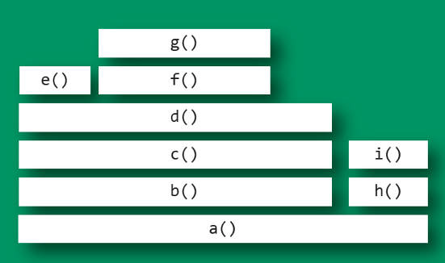

## 火焰图

软件的性能分析，往往需要查看 CPU 耗时，了解瓶颈在哪里。

[火焰图](http://www.brendangregg.com/flamegraphs.html)（flame graph）是性能分析的利器。本文介绍它的基本用法。


### 一、perf 命令

让我们从 perf 命令（performance 的缩写）讲起，它是 Linux 系统原生提供的性能分析工具，会返回 CPU 正在执行的函数名以及调用栈（stack）。


通常，它的执行频率是 99Hz（每秒99次），如果99次都返回同一个函数名，那就说明 CPU 这一秒钟都在执行同一个函数，可能存在性能问题。


> ```bash
> $ sudo perf record -F 99 -p 13204 -g -- sleep 30
> ```


上面的代码中，`perf record`表示记录，`-F 99`表示每秒99次，`-p 13204`是进程号，即对哪个进程进行分析，`-g`表示记录调用栈，`sleep 30`则是持续30秒。


运行后会产生一个庞大的文本文件。如果一台服务器有16个 CPU，每秒抽样99次，持续30秒，就得到 47,520 个调用栈，长达几十万甚至上百万行。


为了便于阅读，`perf record`命令可以统计每个调用栈出现的百分比，然后从高到低排列。


> ```bash
> $ sudo perf report -n --stdio
> ```


这个结果还是不易读，所以才有了火焰图。

火焰图是基于 perf 结果产生的 [SVG 图片](http://queue.acm.org/downloads/2016/Gregg4.svg)，用来展示 CPU 的调用栈。


y 轴表示调用栈，每一层都是一个函数。调用栈越深，火焰就越高，顶部就是正在执行的函数，下方都是它的父函数。


x 轴表示抽样数，如果一个函数在 x 轴占据的宽度越宽，就表示它被抽到的次数多，即执行的时间长。注意，x 轴不代表时间，而是所有的调用栈合并后，按字母顺序排列的。


**火焰图就是看顶层的哪个函数占据的宽度最大。只要有"平顶"（plateaus），就表示该函数可能存在性能问题。**

颜色没有特殊含义，因为火焰图表示的是 CPU 的繁忙程度，所以一般选择暖色调。


### 三、互动性

火焰的每一层都会标注函数名，鼠标悬浮时会显示完整的函数名、抽样抽中的次数、占据总抽样次数的百分比。下面是一个例子。


> ```javascript
> mysqld'JOIN::exec (272,959 samples, 78.34 percent)
> ```

按下 Ctrl + F 会显示一个搜索框，用户可以输入关键词或正则表达式，所有符合条件的函数名会高亮显示。


### 火焰图示例

```javascript
func_c 
func_b 
func_a 
start_thread 

func_d 
func_a 
start_thread 

func_d 
func_a 
start_thread
```

上面代码中，`start_thread`是启动线程，调用了`func_a`。后者又调用了`func_b`和`func_d`，而`func_b`又调用了`func_c`。


经过合并处理后，得到了下面的结果，即存在两个调用栈，第一个调用栈抽中1次，第二个抽中2次。

> ```javascript
> start_thread;func_a;func_b;func_c 1 
> start_thread;func_a;func_d 2
> ```



```
上面图片中，最顶层的函数`g()`占用 CPU 时间最多。`d()`的宽度最大，但是它直接耗用 CPU 的部分很少。

`b()`和`c()`没有直接消耗 CPU。因此，如果要调查性能问题，首先应该调查`g()`，其次是`i()`。

另外，从图中可知a()有两个分支b()和h()，这表明a()里面可能有一个条件语句，而b()分支消耗的 CPU 大大高于h()。

```


### 局限

两种情况下，无法画出火焰图，需要修正系统行为。

**（1）调用栈不完整**

当调用栈过深时，某些系统只返回前面的一部分（比如前10层）。

**（2）函数名缺失**

有些函数没有名字，编译器只用内存地址来表示（比如匿名函数）。


### Node 应用的火焰图

Node 应用的火焰图就是对 Node 进程进行性能抽样，与其他应用的操作是一样的。

> ```bash
> $ perf record -F 99 -p `pgrep -n node` -g -- sleep 30
> ```


### 浏览器的火焰图

Chrome 浏览器可以生成页面脚本的火焰图，用来进行 CPU 分析。

打开开发者工具，切换到 Performance 面板。然后，点击"录制"按钮，开始记录数据。这时，可以在页面进行各种操作，然后停止"录制"。

这时，开发者工具会显示一个时间轴。它的下方就是火焰图。


浏览器的火焰图与标准火焰图有两点差异：它是倒置的（即调用栈最顶端的函数在最下方）；x 轴是时间轴，而不是抽样次数。


## Arthas生成火焰图

`profiler` 命令支持生成应用热点的火焰图。本质上是通过不断的采样，然后把收集到的采样结果生成火焰图。

### 命令

```
profiler` 命令基本运行结构是 `profiler action [actionArg]
```

| 参数名称    | 参数说明                                                     |
| ----------- | ------------------------------------------------------------ |
| *action*    | 要执行的操作                                                 |
| *actionArg* | 属性名模式                                                   |
| [i:]        | 采样间隔（单位：ns）（默认值：10'000'000，即10 ms）          |
| [f:]        | 将输出转储到指定路径                                         |
| [d:]        | 运行评测指定秒                                               |
| [e:]        | 要跟踪哪个事件（cpu, alloc, lock, cache-misses等），默认是cpu |

### 启动profiler

```
$ profiler start
Started [cpu] profiling
```

### 获取已采集的sample的数量

```
$ profiler getSamples
23
```

### 查看profiler状态

```
$ profiler status
[cpu] profiling is running for 4 seconds
```

可以查看当前profiler在采样哪种`event`和采样时间。

### 停止profiler

#### 生成html格式结果

默认情况下，结果文件是`html`格式，也可以用`--format`参数指定：

```
$ profiler stop --format html
profiler output file: /tmp/test/arthas-output/20211207-111550.html
OK
```

或者在`--file`参数里用文件名指名格式。比如`--file /tmp/result.html` 。

### 通过浏览器查看arthas-output下面的profiler结果

默认情况下，arthas使用3658端口，则可以打开： http://localhost:3658/arthas-output/ 查看到`arthas-output`目录下面的profiler结果：


### profiler支持的events

在不同的平台，不同的OS下面，支持的events各有不同。比如在macos下面：

```
$ profiler list
Basic events:
  cpu
  alloc
  lock
  wall
  itimer
```

在linux下面

```
$ profiler list
Basic events:
  cpu
  alloc
  lock
  wall
  itimer
Perf events:
  page-faults
  context-switches
  cycles
  instructions
  cache-references
  cache-misses
  branches
  branch-misses
  bus-cycles
  L1-dcache-load-misses
  LLC-load-misses
  dTLB-load-misses
  mem:breakpoint
  trace:tracepoint
```

如果遇到OS本身的权限/配置问题，然后缺少部分event，可以参考`async-profiler`本身文档：[async-profiler](https://github.com/jvm-profiling-tools/async-profiler)


可以用`--event`参数指定要采样的事件，比如对`alloc`事件进入采样：


```
$ profiler start --event alloc
```


### 恢复采样

```
$ profiler resume
Started [cpu] profiling
```

`start`和`resume`的区别是：`start`是新开始采样，`resume`会保留上次`stop`时的数据。

通过执行`profiler getSamples`可以查看samples的数量来验证。


### 使用`execute`来执行复杂的命令

比如开始采样：

```
profiler execute 'start,framebuf=5000000'
```

停止采样，并保存到指定文件里：

```
profiler execute 'stop,file=/tmp/result.html'
```

具体的格式参考： [arguments.cpp](https://github.com/jvm-profiling-tools/async-profiler/blob/v2.5/src/arguments.cpp#L50)


### 查看所有支持的action

```
$ profiler actions
Supported Actions: [resume, dumpCollapsed, getSamples, start, list, execute, version, stop, load, dumpFlat, actions, dumpTraces, status]
```

### 查看版本

```
$ profiler version
Async-profiler 1.6 built on Sep  9 2019
Copyright 2019 Andrei Pangin
```

### 配置 framebuf 参数

> 如果遇到生成的火焰图有 `[frame_buffer_overflow]`，则需要增大 framebuf（默认值是 1’000’000），可以显式配置，比如：

```
profiler start --framebuf 5000000
```


### 配置 include/exclude 来过滤数据

如果应用比较复杂，生成的内容很多，想只关注部分数据，可以通过 include/exclude 来过滤。比如

```
profiler start --include 'java/*' --include 'demo/*' --exclude '*Unsafe.park*'
```

### 指定执行时间

比如，希望profiler执行 300 秒自动结束，可以用 `-d`/`--duration` 参数指定：

```
profiler start --duration 300
```


### 生成 jfr格式结果

> 注意，jfr只支持在 `start`时配置。如果是在`stop`时指定，则不会生效。

```
profiler start --file /tmp/test.jfr
```

`file`参数支持一些变量：

- 时间戳： `--file /tmp/test-%t.jfr`
- 进程ID： `--file /tmp/test-%p.jfr`

生成的结果可以用支持jfr格式的工具来查看。比如：

- JDK Mission Control ： https://github.com/openjdk/jmc
- JProfiler ： https://github.com/alibaba/arthas/issues/1416


### 生成的火焰图里的 unknown

- https://github.com/jvm-profiling-tools/async-profiler/discussions/409

[GITHUB](https://github.com/brendangregg/FlameGraph)


### 参考链接

https://arthas.aliyun.com/doc/profiler.html#profiler


