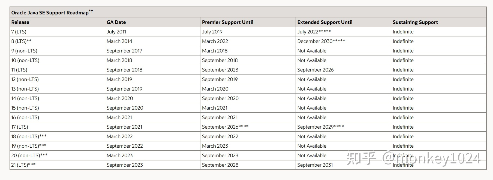

[TOC]


# java5

## 泛型 (Generics)

```
 List<Integer> list=new ArrayList<Integer>();
```

## 增强循环（Enhanced for Loop）

```
 int[] array = {1, 2, 3, 4, 5};
 for (int i : array) {
    System.out.println(i);
 } 
```

## 自动封箱拆箱(Autoboxing/Unboxing )。

**八大基本类型和它们的包装类能够自动的相互转换。**

## 枚举(Typesafe Enums)。

```
ps:枚举是一种实现线程安全的单例模式的好方式。

 enum TestEnum{
        one,
        two;
        TestEnum() {
        }
    }
```

## 可变参数 (Varargs)

**语法：(type... arguments)**

**可变参数本质仍然是用一个数组存储参数，只是java隐藏了这一过程。需要注意的是如果一个方法声明中含有可变参数，那必须放在最后一个位置。**

     /**
     * 可变参数测试
     *
     * @param args
     */
    public static void testVarargs(String... args) {
        //本质就是个数组
        System.out.println(args[1]);
        for (String arg : args) {
            System.out.println(arg);
        }
    }
## 静态导入（Static Import）。

**通过import类来使用类里的静态变量或方法（直接通过名字，不需要加上类名.）,简化了代码的书写。**

```
//单个导入
import static java.lang.Math.PI;
//批量导入
import static java.lang.Math.*;11
ps:过去的版本中只能通过继承类或实现接口才能使用。
```

## 注解（Annotations）。

**关键字@interface。**

```
//注释注解的注解又叫做元注解
@Retention(RetentionPolicy.RUNTIME)
@Target(ElementType.METHOD)
public @interface MyAnnotations {
    //注解内可以添加方法，也可以不添加
    //注解方法的返回值只能是基本类型，String，Class类,枚举,注解,可以有默认值。
    int id();
    String name() default "whh";
    Class classType();
    TestEnum enumType();
}
```

## 新的线程模型和并发库

**（java.util.concurrent)。**

# java6

## 集合框架增强。

为了更好的支持双向访问集合。添加了许多新的类和接口。
新的数组拷贝方法。Arrays.copyOf和Arrays.copyOfRange

```
//以下为添加的新接口和类
Deque,BlockingDeque,NavigableSet,NavigableMap,ConcurrentNavigableMap，ArrayDeque， ConcurrentSkipListSet ,ConcurrentSkipListMap,ConcurrentSkipListMap ,AbstractMap.SimpleEntry ,AbstractMap.SimpleImmutableEntry
```

## Scripting. 可以让其他语言在java平台上运行。 

java6包含了一个基于Mozilla Rhino实现的javascript脚本引擎。

## 支持JDBC4.0规范。

# java7

## 二进制前缀0b或者0B。

整型（byte, short, int, long）可以直接用二进制表示。

  //二进制字面值前缀0b 或0B
    int i = 0b010;//10进制值为2
    int j = 0B010;

## 字面常量数字的下划线。

用下划线连接整数提升其可读性，自身无含义，不可用在数字的起始和末尾。

    //数字间的下划线不影响实际值
     int k = 1_1;//值为11
## switch 支持String类型。

## 泛型实例化类型自动推断。

```
Map<String, List<String>> myMap = new HashMap<String, List<String>>();    // 之前
Map<String, List<String>> myMap = new HashMap<>();        // 现在
```

## try-with-resources语句。

```java
   /*
     * 声明在try括号中的对象称为资源，在方法执行完毕后会被自动关闭,相对与之前必须在finally关闭资源，这一特性大大提高了代码的简洁性。
     * 所有实现java.lang.AutoCloseable接口的类都作为资源被自动关闭。
    */
   try (BufferedReader reader=new BufferedReader(new FileReader("d:1.txt"))){
      return reader.readLine();
  }
```
## 单个catch中捕获多个异常类型

**（用| 分割）并通过改进的类型检查重新抛出异常。**

# java8

## lambada表达式(Lambda Expressions)。

**Lambda允许把函数作为一个方法的参数（函数作为参数传递进方法中)。**

## 方法引用（Method references）。

方法引用提供了非常有用的语法，可以直接引用已有Java类或对象（实例）的方法或构造器。与lambda联合使用，可以使语言的构造更紧凑简洁，减少冗余代码。

## 默认方法（Default methods）。

默认方法允许将新功能添加到库的接口中，并确保兼容实现老版本接口的旧有代码。

## 重复注解（Repeating Annotations）。

重复注解提供了在同一声明或类型中多次应用相同注解类型的能力。

## 类型注解（Type Annotation）。

在任何地方都能使用注解，而不是在声明的地方。

## 类型推断增强。

方法参数反射（Method Parameter Reflection）。

## Stream API 。

新添加的Stream API（java.util.stream） 把真正的函数式编程风格引入到Java中。Stream API集成到了Collections API里。

## HashMap改进，

在键值哈希冲突时能有更好表现。

## Date Time API。

加强对日期和时间的处理。

## java.util 包下的改进，

提供了几个实用的工具类。

* 并行数组排序。
* 标准的Base64编解码。
* 支持无符号运算。

## java.util.concurrent 包下增加了新的类和方法。

* java.util.concurrent.ConcurrentHashMap 类添加了新的方法以支持新的StreamApi和lambada表达式。
* java.util.concurrent.atomic 包下新增了类以支持可伸缩可更新的变量。
* java.util.concurrent.ForkJoinPool类新增了方法以支持 common pool。
* 新增了java.util.concurrent.locks.StampedLock类，为控制读/写访问提供了一个基于性能的锁，且有三种模式可供选择。

## HotSpot

* 删除了 永久代（PermGen）.
* 方法调用的字节码指令支持默认方法。

# java9

## java模块系统

（Java Platform Module System）。

## 新的版本号格式

```
$MAJOR.$MINOR.$SECURITY.$PATCH
```

## java shell

交互式命令行控制台。

## 在private instance methods方法上可以使用@SafeVarargs注解。

## diamond语法与匿名内部类结合使用。

## 下划线_不能单独作为变量名使用。

## 支持私有接口方法(您可以使用diamond语法与匿名内部类结合使用)。

## Javadoc

* 简化Doclet API。
* 支持生成HTML5格式。
* 加入了搜索框,使用这个搜索框可以查询程序元素、标记的单词和文档中的短语。
* 支持新的模块系统。

## JVM

* 增强了Garbage-First(G1)并用它替代Parallel GC成为默认的垃圾收集器。
* 统一了JVM 日志，为所有组件引入了同一个日志系统。
* 删除了JDK 8中弃用的GC组合。（DefNew + CMS，ParNew + SerialOld，Incremental CMS）。

## properties文件支持UTF-8编码

之前只支持ISO-8859-1。支持Unicode 8.0，在JDK8中是Unicode 6.2。

## Stream加强

## 集合加强

list.of()，map.of()，copyof等只读集合的快速创建


# java10

## 局部变量类型推断

（Local-Variable Type Inference）

```java
//之前的代码格式
URL url = new URL("http://www.oracle.com/"); 
URLConnection conn = url.openConnection(); 
Reader reader = new BufferedReader(
    new InputStreamReader(conn.getInputStream()))
//java10中用var来声明变量
var url = new URL("http://www.oracle.com/"); 
var conn = url.openConnection(); 
var reader = new BufferedReader(
    new InputStreamReader(conn.getInputStream()));
```


var是一个保留类型名称，而不是关键字。所以之前使用var作为变量、方法名、包名的都没问题，但是如果作为类或接口名，那么这个类和接口就必须重命名了。

var的使用场景主要有以下四种：

* 本地变量初始化。
* 增强for循环中。
* 传统for循环中声明的索引变量。
* Try-with-resources 变量。​

## Optional类添加了新的方法

orElseThrow(无参数版)

相比于已经存在的get方法，这个方法更推荐使用。

# java11

## 直接运行

```text
java HelloWorld.java
```

## String新增方法

trip方法，可以去除首尾空格，与之前的trim的区别是还可以去除unicode编码的空白字符，例如：

```java
char c = '\u2000';//Unicdoe空白字符
String str = c + "abc" + c;
System.out.println(str.strip());
System.out.println(str.trim());

System.out.println(str.stripLeading());//去除前面的空格
System.out.println(str.stripTrailing());//去除后面的空格
```

isBlank方法，判断字符串长度是否为0，或者是否是空格，制表符等其他空白字符

```java
String str = " ";
System.out.println(str.isBlank());
```

repeat方法，字符串重复的次数

```java
String str = "monkey";
System.out.println(str.repeat(4));
```

## lambda表达式中的变量类型推断

jdk11中允许在lambda表达式的参数中使用var修饰

```java
//支持lambda表达式参数中使用var
   MyInterface mi = (var a,var b)->{
       System.out.println(a);
       System.out.println(b);
   };

   mi.m1("monkey",1024);
```


## 支持Unicode 10.0,在jdk10中是8.0

## 标准化HTTP Client

## 编译器线程的延迟分配

添加了新的命令-XX:+UseDynamicNumberOfCompilerThreads动态控制编译器线程的数量。

## 新的垃圾收集器—ZGC

一种可伸缩的低延迟垃圾收集器(实验性)。

## Epsilon

一款新的实验性无操作垃圾收集器。Epsilon GC 只负责内存分配，不实现任何内存回收机制。这对于性能测试非常有用，可用于与其他GC对比成本和收益。

## Lambda参数的局部变量语法

java10中引入的var字段得到了增强，现在可以用在lambda表达式的声明中。如果lambda表达式的其中一个形式参数使用了var，那所有的参数都必须使用var。

**当然这个var的使用是有限制的，仅适用于局部变量，增强for循环的索引，以及普通for循环的本地变量；它不能使用于方法形参，构造方法形参，方法返回类型等。**

## Optional加强

## InputStream.transferTo

# Java12

## 升级的switch语句

在jdk12之前的switch语句中，如果没有写break，则会出现case穿透现象，下面是对case穿透的一个应用，根据输入的月份打印相应的季节。

在jdk12之后我们可以省略全部的break和部分case，这样使用

```java
int month = 3;
    switch (month) {
        case 3,4,5 -> System.out.println("spring");
        case 6,7,8 -> System.out.println("summer");
        case 9,10,11 -> System.out.println("autumn");
        case 12, 1,2 -> System.out.println("winter");
        default -> System.out.println("wrong");
    }
```

这个是预览功能，如果需要编译和运行的话需要使用下面命令，预览功能在2个版本之后会成为正式版，

```text
编译:
    javac --enable-preview -source 12 Test.java

运行：
    java --enable-preview Test
```

# Java13

## 升级的switch语句

jdk13中对switch语句又进行了升级，可以switch的获取返回值

```java
int month = 3;
   String result = switch (month) {
        case 3,4,5 -> "spring";
        case 6,7,8 -> "summer";
        case 9,10,11 -> "autumn";
        case 12, 1,2 -> "winter";
        default -> "wrong";
    };

    System.out.println(result);
```

对于jdk15之后的版本可以直接编译和运行，否则需要使用下面命令执行该预览功能

```text
编译:
    javac --enable-preview -source 13 Test.java

运行：
    java --enable-preview Test
```

## 文本块的变化

在jdk13之前的版本中如果输入的字符串中有换行的话，需要添加换行符

```java
String s = "Hello\nWorld\nLearn\nJava";
    System.out.println(s);
```

jdk13之后可以直接这样写：

```java
String s = """
            Hello
            World
            Learn
            Java
           """;
  System.out.println(s);
```

# Java14

## instanceof模式匹配

该特性可以减少强制类型转换的操作，简化了代码，代码示例：

```java
public class TestInstanceof{
    public static void main(String[] args){

        //jdk14之前的写法
        Object obj = new Integer(1);
        if(obj instanceof Integer){
            Integer i = (Integer)obj;
            int result = i + 10;
            System.out.println(i);
        }

        //jdk14新特性  不用再强制转换了
        //这里相当于是将obj强制为Integer之后赋值给i了
        if(obj instanceof Integer i){
            int result = i + 10;
            System.out.println(i);
        }else{
            //作用域问题，这里是无法访问i的
        }
    }
}
```

```java
编译:
    javac --enable-preview -source 14 TestInstanceof.java

运行：
    java --enable-preview TestInstanceof
```

## 友好的空指针

（NullPointerException）提示

jdk14中添加了对于空指针异常友好的提示，便于开发者快速定位空指针的对象。示例代码：

```java
class Machine{
    public void start(){
        System.out.println("启动");
    }
}

class Engine{
    public Machine machine;
}

class Car{
    public Engine engine;

}

public class TestNull{
    public static void main(String[] args){
        //这里会报出空指针，但是哪个对象是null呢？
        new Car().engine.machine.start();
    }
}
```

我们在运行上面代码的时候，错误信息就可以明确的指出那个对象为null了。此外，还可以使用下面参数来查看:

```text
java -XX:+ShowCodeDetailsInExceptionMessages TestNull
```

这样编译器会明确的告诉开发者哪个对象是null。

## record类型

之前在编写javabean类的时候，需要编写成员变量，get方法，构造方法，toString方法，hashcode方法，equals方法。

jdk14编写User

```java
public record User(String name,Integer age){}
```

通过反编译命令可以看到该字节码文件中的内容，User类是继承了Record类型：

```text
javap -p -private user
```

```java
public class TestUser{
    public static void main(String[] args){
        User u = new User("jack",15);
        System.out.println(u);
        System.out.println(u.name());
    }
}
```

```text
编译:
    javac --enable-preview -source 14 TestUser.java

运行：
    java --enable-preview TestUser
```

## Sealed Classes

密封类和接口，作用是限制一个类可以由哪些子类继承或者实现。

1. 如果指定模块的话，sealed class和其子类必须在同一个模块下。如果没有指定模块，则需要在同一个包下。
2. sealed class指定的子类必须直接继承该sealed class。
3. sealed class的子类要用final修饰。
4. sealed class的子类如果不想用final修饰的话，可以将子类声明为sealed class。

Animal类，在指定允许继承的子类时可以使用全限定名

```java
public sealed class Animal 
    permits Cat, Dog{//多个子类之间用,隔开

        public void eat(){}
}
```

Cat类

```java
public final class Cat extends Animal{
    public void eat(){
        System.out.println("123");
    }
}
```

 Dog类

```java
public sealed class Dog extends Animal
    permits Husky {}
```

Husky类

```java
public final class Husky extends Dog{
}
```

Test类

```java
public class Test{
    public static void main(String[] args){
        Cat c = new Cat();
        c.eat();
        Dog d = new Dog();
    }
}
```

## CharSequence新增的方法

该接口中新增了default方法isEmpty()，作用是判断CharSequence是否为空。

## TreeMap新增方法

- putIfAbsent
- computeIfAbsent
- computeIfPresent
- compute
- merge

## 文本块

文本块由预览版变为正式版

## 无需配置环境变量

win系统中安装完成之后会自动将java.exe, javaw.exe, javac.exe, jshell.exe这几个命令添加到环境变量中。这部分可以打开环境变量看下。不过还是建议配置环境变量，因为这几个命令不够用

# java16

这里只介绍一些跟开发关联度较大的特性，除此之外JDK16还更新了许多其他新特性，感兴趣的同学可以去Oracle官网查看


## 包装类构造方法的警告

 使用包装类的构造方法在编译的时候会出现警告，不建议再使用包装类的构造方法。下面代码在javac编译之后会出现警告。

## 新增日时段

在DateTimeFormatter.ofPattern传入B可以获取现在时间对应的日时段，上午，下午等

```java
System.out.println(DateTimeFormatter.ofPattern("B").format(LocalDateTime.now()));
```

## InvocationHandler新增方法

```java
public static Object invokeDefault(Object proxy, Method method, Object... args)
```

该方法可以调用父接口中defalut方法，比如有下面接口

```java
interface Girl{
    default void eat(){
        System.out.println("cucumber");
    }

}
```

```java
interface Girl{
    default void eat(){
        System.out.println("cucumber");
    }

}
```

实现类

```java
public class Lucy implements Girl{
    public void eat(){
        System.out.println("banana");
    }
}
```

测试类：

```java
import java.lang.reflect.InvocationHandler;
import java.lang.reflect.Method;
import java.lang.reflect.Proxy;

public class Test{
    public static void main(String[] args) {
        Girl girl = new Lucy();


        //不使用invokeDefault会调用重写的eat方法
        Girl proxy1 = (Girl)Proxy.newProxyInstance(girl.getClass().getClassLoader(),girl.getClass().getInterfaces(),
            (obj,method,params)->{
            Object invoke = method.invoke(girl);
            return invoke;
        });
        proxy1.eat();

        //使用invokeDefault会调用父接口中的default方法
        Girl proxy2 = (Girl)Proxy.newProxyInstance(Girl.class.getClassLoader(),new Class<?>[]{Girl.class},
            (obj,method,params)->{
            if (method.isDefault()) {
                return InvocationHandler.invokeDefault(obj, method, params);
            }
            return null;
        });
        proxy2.eat();

    }

}
```

## Stream().toList()

## 其他

 在之前jdk版本中作为预览功能的Record类，模式匹配的instanceof，打包工具jpackage，已成为正式版。jdk16对GC，jvm运行时内存等内容有一些变化，例如：**ZGC并发栈处理**，**弹性meta space**。

# Java17

java17是一个LTS（long term support）长期支持的版本，根据计划来看java17会支持到2029年（java8会支持到2030年，OMG），同时Oracle提议下一个LTS版本是java21，在2023年9月发布，这样讲LST版本的发布周期由之前的3年变为了2年。这里只介绍一些跟开发关联度较大的特性，除此之外JDK17还更新了一些其他新特性，感兴趣的同学可以从[这里查看](https://link.zhihu.com/?target=https%3A//www.oracle.com/news/announcement/oracle-releases-java-17-2021-09-14/)：



## switch语法的变化(预览)

在之前版本中新增的instanceof模式匹配的特性在switch中也支持了，即我们可以在switch中减少强转的操作。比如下面的代码：

```java
interface Animal{}

class Rabbit implements Animal{
    //特有的方法
    public void run(){
        System.out.println("run");
    }
}

class Bird implements Animal{
    //特有的方法
    public void fly(){
        System.out.println("fly");
    }
}
```

新特性可以减少Animal强转操作代码的编写：

```java
public class Switch01{
    public static void main(String[] args) {
        Animal a = new Rabbit();
        animalEat(a);
    }

    public static void animalEat(Animal a){
        switch(a){
            //如果a是Rabbit类型，则在强转之后赋值给r，然后再调用其特有的run方法
            case Rabbit r -> r.run();
            //如果a是Bird类型，则在强转之后赋值给b，然后调用其特有的fly方法
            case Bird b -> b.fly();
            //支持null的判断
            case null -> System.out.println("null");
            default -> System.out.println("no animal");
        }
    }

}
```


该功能在java17中是预览的，编译和运行需要加上额外的参数:

```text
javac --enable-preview -source 17 Switch01.java
java  --enable-preview Switch01
```

## Sealed Classes

在jdk15中已经添加了Sealed Classes，只不过当时是作为预览版，经历了2个版本之后，在jdk17中Sealed Classes已经成为正式版了。Sealed Classes的作用是可以限制一个类或者接口可以由哪些子类继承或者实现。

## 伪随机数的变化

增加了伪随机数相关的类和接口来让开发者使用stream流进行操作

- RandomGenerator
- RandomGeneratorFactory

之前的java.util.Random和java.util.concurrent.ThreadLocalRandom都是RandomGenerator接口的实现类。

## 去除了AOT和JIT

AOT（Ahead-of-Time）是java9中新增的功能，可以先将应用中中的字节码编译成机器码。

Graal编译器作为使用java开发的JIT（just-in-time ）即时编译器在java10中加入（注意这里的JIT不是之前java中的JIT，在JEP 317中有说明[https://openjdk.java.net/jeps/317](https://link.zhihu.com/?target=https%3A//openjdk.java.net/jeps/317)）。

以上两项功能由于使用量较少，且需要花费很多精力来维护，因此在java17中被移除了。当然你可以通过Graal VM来继续使用这些功能。


# 参考链接：

- [JDK Release Notes](https://links.jianshu.com/go?to=http%3A%2F%2Fwww.oracle.com%2Ftechnetwork%2Fjava%2Fjavase%2Fjdk-relnotes-index-2162236.html)
- [What's New in JDK 8](https://links.jianshu.com/go?to=http%3A%2F%2Fwww.oracle.com%2Ftechnetwork%2Fjava%2Fjavase%2F8-whats-new-2157071.html)
- [What’s New in JDK 9](https://links.jianshu.com/go?to=https%3A%2F%2Fdocs.oracle.com%2Fjavase%2F9%2Fwhatsnew%2Ftoc.htm%23JSNEW-GUID-C23AFD78-C777-460B-8ACE-58BE5EA681F6)
- [JDK 10 Release Notes](https://links.jianshu.com/go?to=http%3A%2F%2Fwww.oracle.com%2Ftechnetwork%2Fjava%2Fjavase%2F10-relnote-issues-4108729.html%23NewFeature)
- [JDK 11 Release Notes](https://links.jianshu.com/go?to=https%3A%2F%2Fwww.oracle.com%2Ftechnetwork%2Fjava%2Fjavase%2F11-relnote-issues-5012449.html%23NewFeature)

