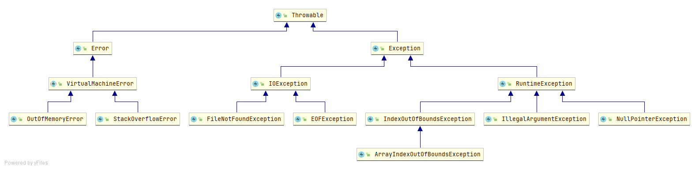

# Java异常类结构图

**错误：**Error类以及他的子类的实例，代表了JVM本身的错误。错误不能被程序员通过代码处理，Error很少出现。因此，程序员应该关注Exception为父类的分支下的各种异常类。

**异常：**Exception以及他的子类，代表程序运行时发送的各种不期望发生的事件。可以被Java异常处理机制使用，是异常处理的核心。

**综上针对这些异常，可以分为两类：非检查异常、检查异常.**

**非检查异常**：上图中的Error 和 RuntimeException 以及他们的子类都属于非检查异常。这类异常在javac在编译时，不会提示和发现这样的异常，不要求在程序处理这些异常。所以如果愿意，我们可以编写代码处理（使用try...catch...finally）这样的异常，也可以不处理。

**检查异常**：除了Error 和 RuntimeException的其它异常都属于检查异常。这类异常是javac强制要求程序员为这样的异常做预备处理工作（使用try...catch...finally或者throws）。在方法中要么用try-catch语句捕获它并处理，要么用throws子句声明抛出它，否则编译不会通过。这样的异常一般是由程序的运行环境导致的

**finally块不管异常是否发生，只要对应的try执行了，则它一定也执行。只有一种方法让finally块不执行：System.exit()。**

