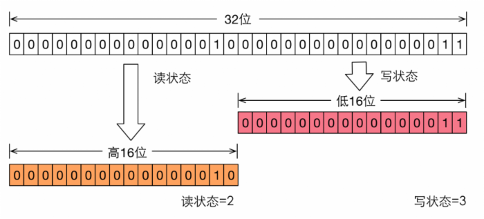

# 概述

**简介**

* ReentrantReadWriteLock是Lock的另一种实现方式，ReentrantLock是一个可重入的排他锁，同一时间只允许一个线程访问
* 而ReentrantReadWriteLock允许多个读线程同时访问，但不允许写线程和读线程、写线程和写线程同时访问。相对于排他锁，提高了并发性。
* 在实际应用中，大部分情况下对共享数据（如缓存）的访问都是读操作远多于写操作，这时ReentrantReadWriteLock能够提供比排他锁更好的并发性和吞吐量。
* 读写锁内部维护了两个锁，一个用于读操作，一个用于写操作。所有 ReadWriteLock实现都必须保证 writeLock操作的内存同步效果也要保持与相关 readLock的联系。也就是说，成功获取读锁的线程会看到写入锁之前版本所做的所有更新。

　　

**ReentrantReadWriteLock锁功能**

1. 支持公平和非公平的获取锁的方式；
2. 支持可重入。读线程在获取了读锁后还可以获取读锁；写线程在获取了写锁之后既可以再次获取写锁又可以获取读锁；
3. 还允许从写入锁降级为读取锁，其实现方式是：先获取写入锁，然后获取读取锁，最后释放写入锁。但是，从读取锁升级到写入锁是不允许的；
4. 读取锁和写入锁都支持锁获取期间的中断；
5. Condition支持。仅写入锁提供了一个 Conditon 实现；读取锁不支持 Conditon ，readLock().newCondition() 会抛出 UnsupportedOperationException。 


# 实现原理

​		ReentrantReadWriteLock 也是基于AQS实现的，它的自定义同步器（继承AQS）需要在同步状态（一个整型变量state）上维护多个读线程和一个写线程的状态，读写锁将变量切分成了两个部分，高16位表示读，低16位表示写。




## 写锁的获取与释放（WriteLock）


### 获取写锁

* 如果存在读锁 则 返回失败
* 如果存在 写锁 且不为当前线程所拥有，则返回失败
* 如果存在 写锁  且为当前线程 且没有超过 极值，则加锁成功
* 如果读写锁都不存在
    * 如果是公平锁则 进入队列等待
    * 如果是非公平锁，则先尝试获取 锁，然后进入队列等待

```java
//获取写锁
public void lock() {
    sync.acquire(1);
}

//AQS实现的独占式获取同步状态方法
public final void acquire(int arg) {
    if (!tryAcquire(arg) &&
        acquireQueued(addWaiter(Node.EXCLUSIVE), arg))
        selfInterrupt();
}

//自定义重写的tryAcquire方法
protected final boolean tryAcquire(int acquires) {
    Thread current = Thread.currentThread();
    int c = getState();
    int w = exclusiveCount(c);    //取同步状态state的低16位，写同步状态
    if (c != 0) {
        // (Note: if c != 0 and w == 0 then shared count != 0)
        //存在读锁或当前线程不是已获取写锁的线程，返回false
        if (w == 0 || current != getExclusiveOwnerThread())
            return false;
		//说明当前线程获取了写锁，判断可重入次数（最大次数65535）
        if (w + exclusiveCount(acquires) > MAX_COUNT)    //
            throw new Error("Maximum lock count exceeded");
        // Reentrant acquire
        setState(c + acquires);
        return true;
    }
    //此时c=0,读锁和写锁都没有被获取
    if (writerShouldBlock() ||
        !compareAndSetState(c, c + acquires))
        return false;
    setExclusiveOwnerThread(current);
    return true;
}
```


### 释放写锁

> 支持可重入的释放

```java
//写锁释放
public void unlock() {
    sync.release(1);
}

//AQS提供独占式释放同步状态的方法
public final boolean release(int arg) {
    if (tryRelease(arg)) {
        Node h = head;
        if (h != null && h.waitStatus != 0)
            unparkSuccessor(h);
        return true;
    }
    return false;
}

//自定义重写的tryRelease方法
protected final boolean tryRelease(int releases) {
    if (!isHeldExclusively())
        throw new IllegalMonitorStateException();
    int nextc = getState() - releases;    //同步状态减去releases
    //判断同步状态的低16位（写同步状态）是否为0，如果为0则返回true，否则返回false.
    //因为支持可重入
    boolean free = exclusiveCount(nextc) == 0;
    if (free)
        setExclusiveOwnerThread(null);
    setState(nextc);    //以获取写锁，不需要其他同步措施，是线程安全的
    return free;
}
```

## 读锁的获取与释放

### 获取读锁

* 如果有写锁在且当前线程没有拥有锁  则 返回失败
* 如果是 非公平锁 则判断下一个排队的是否为写锁，如果不是 则 直接 尝试 CAS获取一个读锁。

```java
public void lock() {
    sync.acquireShared(1);
}

//使用AQS提供的共享式获取同步状态的方法
public final void acquireShared(int arg) {
    if (tryAcquireShared(arg) < 0)
        doAcquireShared(arg);
}

//自定义重写的tryAcquireShared方法，参数是unused，因为读锁的重入计数是内部维护的
protected final int tryAcquireShared(int unused) {
    /*
             * Walkthrough:
             * 1. If write lock held by another thread, fail.
             * 2. Otherwise, this thread is eligible for
             *    lock wrt state, so ask if it should block
             *    because of queue policy. If not, try
             *    to grant by CASing state and updating count.
             *    Note that step does not check for reentrant
             *    acquires, which is postponed to full version
             *    to avoid having to check hold count in
             *    the more typical non-reentrant case.
             * 3. If step 2 fails either because thread
             *    apparently not eligible or CAS fails or count
             *    saturated, chain to version with full retry loop.
             */
    Thread current = Thread.currentThread();
    int c = getState();
    if (exclusiveCount(c) != 0 &&
        getExclusiveOwnerThread() != current)
        return -1;
    int r = sharedCount(c);
    if (!readerShouldBlock() &&
        r < MAX_COUNT &&
        compareAndSetState(c, c + SHARED_UNIT)) {
        if (r == 0) { //缓存第一个获取读锁的线程
            firstReader = current;
            firstReaderHoldCount = 1;
        } else if (firstReader == current) { //可重入获取第一个读锁计数
            firstReaderHoldCount++;
        } else { //不是第一个获取读锁的线程
            HoldCounter rh = cachedHoldCounter; //当前线程缓存的 holdCounter,每个线程一个
            if (rh == null || rh.tid != getThreadId(current))
                cachedHoldCounter = rh = readHolds.get();
            else if (rh.count == 0) // 当前线程 获取读锁->释放读锁->获取读锁，这个过程没有第三方线程获取读锁，这种情况需要重新设置 ThreadLocal
                readHolds.set(rh);
            rh.count++;
        }
        return 1;
    }
    
     //第一次获取读锁失败，有两种情况：
		//1）没有写锁被占用时，尝试通过一次CAS去获取锁时，更新失败（说明有其他读锁在申请）
		//2）（非公平锁的逻辑）当前线程占有写锁，并且有其他写锁在当前线程的下一个节点等待获取写锁，除非当前线程的下一个节点被取消，否则fullTryAcquireShared也获取不到读锁
    return fullTryAcquireShared(current);
}
```

**公平与非公平 *readerShouldBlock()*逻辑**

```java
//FairSync中需要判断是否有前驱节点，如果有则返回false，否则返回true。遵循FIFO
final boolean readerShouldBlock() {
    return hasQueuedPredecessors();
}
//unfair
final boolean readerShouldBlock() {
    return apparentlyFirstQueuedIsExclusive();
}
//当head节点不为null且head节点的下一个节点s不为null且s是独占模式（写线程）且s的线程不为null时，返回true。
//目的是不应该让写锁始终等待。作为一个启发式方法用于避免可能的写线程饥饿，这只是一种概率性的作用，因为如果有一个等待的写线程在其他尚未从队列中出队的读线程后面等待，那么新的读线程将不会被阻塞。
final boolean apparentlyFirstQueuedIsExclusive() {
    Node h, s;
    return (h = head) != null &&
        (s = h.next)  != null &&
        !s.isShared()         &&
        s.thread != null;
}
//头节点的 下一个不是当前线程，则继续阻塞
 public final boolean hasQueuedPredecessors() {
        // The correctness of this depends on head being initialized
        // before tail and on head.next being accurate if the current
        // thread is first in queue.
        Node t = tail; // Read fields in reverse initialization order
        Node h = head;
        Node s;
        return h != t &&
            ((s = h.next) == null || s.thread != Thread.currentThread());
    }
```


**第一次获取失败，尝试完整版本的自旋获取锁**

```java
       final int fullTryAcquireShared(Thread current) {
            /*
             * This code is in part redundant with that in
             * tryAcquireShared but is simpler overall by not
             * complicating tryAcquireShared with interactions between
             * retries and lazily reading hold counts.
             */
            HoldCounter rh = null;
            for (;;) {
                int c = getState();
                if (exclusiveCount(c) != 0) { //如果当前线程不是写锁的持有者，直接返回-1，结束尝试获取读锁，需要排队去申请读锁
                    if (getExclusiveOwnerThread() != current) //且不是当前线程，则返回
                        return -1;
                    // else we hold the exclusive lock; blocking here
                    // would cause deadlock.
                	} else if (readerShouldBlock()) { //如果当前线程持有写锁，而且还有其他线程已经排队在申请写锁，故，即使申请读锁的线程已经持有写锁（写锁内部再次申请读锁，俗称锁降级）还是会失败，因为有其他线程也在申请写锁，此时，只能结束本次申请读锁的请求，转而去排队。
                    // Make sure we're not acquiring read lock reentrantly
                    if (firstReader == current) { 
                        // 当前线程已持有写锁，且有其他线程在申请写锁，且当前线程已获取过读锁，则可以继续获取读锁
                        // assert firstReaderHoldCount > 0;
                    } else {
                        // 当前线程已持有写锁，且有其他线程在申请写锁，且当前线程未获取读锁，则返回阻塞
                        if (rh == null) {
                            rh = cachedHoldCounter;
                            if (rh == null || rh.tid != getThreadId(current)) {
                                rh = readHolds.get();
                                if (rh.count == 0)
                                    readHolds.remove();  
                            }
                        }
                        if (rh.count == 0)
                            return -1;
                    }
                }
                //共享锁最大值判定
                if (sharedCount(c) == MAX_COUNT)
                    throw new Error("Maximum lock count exceeded");
                //尝试获取一个读锁,获取失败 则继续
                if (compareAndSetState(c, c + SHARED_UNIT)) {
                    //第一次使用 firstReader，firstReaderHoldCount
                    if (sharedCount(c) == 0) {
                        firstReader = current;
                        firstReaderHoldCount = 1;
                    } else if (firstReader == current) {
                        firstReaderHoldCount++;
                    } else {
                        //其他线程使用 ThreadLocal
                        if (rh == null)
                            rh = cachedHoldCounter;
                        if (rh == null || rh.tid != getThreadId(current))
                            rh = readHolds.get();
                        else if (rh.count == 0)
                            readHolds.set(rh);
                        rh.count++;
                        cachedHoldCounter = rh; // cache for release
                    }
                    return 1;
                }
            }
        }
```


### 释放写锁

```java
        protected final boolean tryReleaseShared(int unused) {
            //第一个获取读锁 更新 重入计数
            Thread current = Thread.currentThread();
            if (firstReader == current) {
                // assert firstReaderHoldCount > 0;
                if (firstReaderHoldCount == 1)
                    firstReader = null;
                else
                    firstReaderHoldCount--;
            } else {
                //否则 从 ThreadLocal 中 取 HoldCount
                HoldCounter rh = cachedHoldCounter;
                if (rh == null || rh.tid != getThreadId(current))
                    rh = readHolds.get();
                int count = rh.count;
                if (count <= 1) {
                    readHolds.remove();
                    if (count <= 0)
                        throw unmatchedUnlockException();
                }
                --rh.count;
            }
            
            //更新状态，为0 返回true，表示全部读锁释放完毕
            for (;;) {
                int c = getState();
                int nextc = c - SHARED_UNIT;
                if (compareAndSetState(c, nextc))
                    // Releasing the read lock has no effect on readers,
                    // but it may allow waiting writers to proceed if
                    // both read and write locks are now free.
                    return nextc == 0;
            }
        }
```

