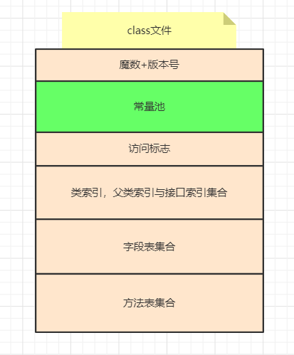

# 常量池

通常来说，我们提到的常量池分为三种

- class文件中的常量池
- 运行时常量池
- 字符串常量池


# class文件中的常量池

> class文件中的常量池当然是位于class文件中，而**class文件又是位于磁盘上**。



常量池可以理解为class文件中资源仓库，它是class文件结构中与其它项目关联最多的数据类型，主要用于存放编译器生成的各种字面量(Literal)和符号引用(Symbolic References)。


字面量就是我们所说的常量概念，如文本字符串、被声明为final的常量值等。


符号引用是一组符号来描述所引用的目标，符号可以是任何形式的字面量，只要使用时能无歧义地定位到目标即可（它与直接引用区分一下，直接引用一般是指向方法区的本地指针，相对偏移量或是一个能间接定位到目标的句柄）。一般包括下面三类常量：

- 类和接口的全限定名
- 字段的名称和描述符
- 方法的名称和描述符


```java
public class Main {
    public static void main(String[] args) {
        String name = "dmz";
    }
}

//编译成以下字节码
public class com.dmz.jvm.Main
  minor version: 0
  major version: 52
  flags: ACC_PUBLIC, ACC_SUPER
// 这里就是常量池了
Constant pool:
   #1 = Methodref          #4.#20         // java/lang/Object."<init>":()V
   #2 = String             #21            // dmz
   #3 = Class              #22            // com/dmz/jvm/Main
   #4 = Class              #23            // java/lang/Object
   #5 = Utf8               <init>
   #6 = Utf8               ()V
   #7 = Utf8               Code
   #8 = Utf8               LineNumberTable
   #9 = Utf8               LocalVariableTable
  #10 = Utf8               this
  #11 = Utf8               Lcom/dmz/jvm/Main;
  #12 = Utf8               main
  #13 = Utf8               ([Ljava/lang/String;)V
  #14 = Utf8               args
  #15 = Utf8               [Ljava/lang/String;
  #16 = Utf8               name
  #17 = Utf8               Ljava/lang/String;
  #18 = Utf8               SourceFile
  #19 = Utf8               Main.java
  #20 = NameAndType        #5:#6          // "<init>":()V
  #21 = Utf8               dmz
  #22 = Utf8               com/dmz/jvm/Main
  #23 = Utf8               java/lang/Object
 // 下面是方法表                           
{
  public com.dmz.jvm.Main();
    descriptor: ()V
    flags: ACC_PUBLIC
    Code:
      stack=1, locals=1, args_size=1
         0: aload_0
         1: invokespecial #1                  // Method java/lang/Object."<init>":()V
         4: return
      LineNumberTable:
        line 7: 0
      LocalVariableTable:
        Start  Length  Slot  Name   Signature
            0       5     0  this   Lcom/dmz/jvm/Main;

  public static void main(java.lang.String[]);
    descriptor: ([Ljava/lang/String;)V
    flags: ACC_PUBLIC, ACC_STATIC
    Code:
      stack=1, locals=2, args_size=1
         // 可以看到方法表中的指令引用了常量池中的常量，这也是为什么说常量池是资源仓库的原因
         // 因为它会被class文件中的其它结构引用         
         0: ldc           #2                  // String dmz
         2: astore_1
         3: return
      LineNumberTable:
        line 9: 0
        line 10: 3
      LocalVariableTable:
        Start  Length  Slot  Name   Signature
            0       4     0  args   [Ljava/lang/String;
            3       1     1  name   Ljava/lang/String;
}
SourceFile: "Main.java"
```


# **字符串常量池**

字符串常量池比较特殊，在JDK1.7之前，其存在于永久代中，到JDK1.7及之后，已经中永久代移到了堆中。

## **方法区，元空间，永久代区别**

* 方法区是JVM在内存分配时需要遵守的**规范**，是一个理论，具体的实现可以因人而异
* 永久代是hotspot的jdk1.8以前对方法区的**实现**，使用jdk1.7的老司机肯定以前经常遇到过java.lang.OutOfMemoryError: PremGen space异常。这里的PermGen space其实指的就是方法区。
* 元空间是jdk1.8对方法区的实现，jdk1.8彻底移除了永久代，其实，移除永久代的工作从JDK 1.7就开始了。JDK 1.7中，存储在永久代的部分数据就已经转移到Java Heap或者Native Heap。但永久代仍存在于JDK 1.7中，并没有完全移除，譬如符号引用(Symbols)转移到了native heap；字面量(interned strings)转移到了Java heap；类的静态变量(class statics)转移到了Java heap。到jdk1.8彻底移除了永久代，将JDK7中还剩余的永久代信息全部移到元空间，元空间相比对永久代最大的差别是，元空间使用的是本地内存（Native Memory）。

## **存储引用**

**字符串常量池存储的是字符串实例对象的引用！**

```
简单来说，HotSpot VM里StringTable是个哈希表，里面存的是主流字符串的引用（而不是驻留字符串实例自身）。也就是说某些普通的字符串实例被这个StringTable引用之后就等同被赋予了“驻留字符串”的身份。这个StringTable在每个HotSpot VM的实例里只有一份，被所有的类共享。类的运行时常量池里的CONSTANT_String类型的常量，经过解析（resolve）之后，同样存的是字符串的引用；解析的过程会去查询StringTable，以保证运行时常量池所引用的字符串与StringTable所引用的是一致的。 
​ ------R大博客
```

- 字符串常量池本质就是一个哈希表
- 字符串常量池中存储的是字符串实例的引用
- 字符串常量池在被整个JVM共享
- 在解析运行时常量池中的符号引用时，会去查询字符串常量池，确保运行时常量池中解析后的直接引用跟字符串常量池中的引用是一致的


## intern方法分析

```
/** 
 * Returns a canonical representation for the string object. 
 * <p> 
 * A pool of strings, initially empty, is maintained privately by the 
 * class <code>String</code>. 
 * <p> 
 * When the intern method is invoked, if the pool already contains a 
 * string equal to this <code>String</code> object as determined by 
 * the {@link #equals(Object)} method, then the string from the pool is 
 * returned. Otherwise, this <code>String</code> object is added to the 
 * pool and a reference to this <code>String</code> object is returned. 
 * <p> 
 * It follows that for any two strings <code>s</code> and <code>t</code>, 
 * <code>s.intern() == t.intern()</code> is <code>true</code> 
 * if and only if <code>s.equals(t)</code> is <code>true</code>. 
 * <p> 
 * All literal strings and string-valued constant expressions are 
 * interned. String literals are defined in section 3.10.5 of the 
 * <cite>The Java™ Language Specification</cite>. 
 * 
 * @return  a string that has the same contents as this string, but is 
 *          guaranteed to be from a pool of unique strings. 
 */  
public native String intern();  
```

这是一个 native 方法，

如果常量池中**存在当前字符串**（使用 hashCode判断）, 就会直接返回当前字符串. 如果常量池中没有此字符串, 会将此字符串放入常量池中后, 再返回”。


```java
public static void main(String[] args) {
    String s = new String("1");
    s.intern();
    String s2 = "1";
    System.out.println(s == s2);

    String s3 = new String("1") + new String("1");
    s3.intern();
    String s4 = "11";
    System.out.println(s3 == s4);
}
```

打印结果是

- jdk6 下false false
- jdk7 下false true

## **jdk6与Jdk7区别**

* jdk6 遇到字面量时，会 判断字面量 是否存在常量池中，是的话，就直接返回 常量池引用，否的话 从 方法区也就是永久代中 生成一份 字符串实例，并将引用指向 常量池
* jdk7 遇到字面量时，会 判断字面量 是否存在常量池中，是的话，就直接返回 常量池引用，否的话 直接再堆中成一份 字符串实例，并将引用指向 常量池


# 运行时常量池

## 位置在哪？

**位于方法区中**，1.6在永久代，1.7在元空间中，永久代跟元空间都是对方法区的实现

## 用来干什么？

jvm在执行某个类的时候，必须经过加载、连接、初始化，而连接又包括验证、准备、解析三个阶段。而当类加载到内存中后，jvm就会将class常量池中的内容存放到运行时常量池中，由此可知，运行时常量池也是每个类都有一个。在上面我也说了，class常量池中存的是字面量和符号引用，也就是说他们存的并不是对象的实例，而是对象的符号引用值。而经过解析（resolve）之后，也就是把符号引用替换为直接引用，解析的过程会去查询全局字符串池，也就是我们上面所说的StringTable，以保证运行时常量池所引用的字符串与全局字符串池中所引用的是一致的。

所以简单来说，**运行时常量池就是用来存放class常量池中的内容的。**


# 测试

```java
// 环境1.7及以上
public class Clazz {
    public static void main(String[] args) {
        String s1 = new StringBuilder().append("ja").append("va1").toString();
        String s2 = s1.intern();
        System.out.println(s1==s2);
        
        String s5 = "dmz";
        String s3 = new StringBuilder().append("d").append("mz").toString();
        String s4 = s3.intern();
        System.out.println(s3 == s4);

        String s7 = new StringBuilder().append("s").append("pring").toString();
        String s8 = s7.intern();
        String s6 = "spring";
        System.out.println(s7 == s8);
    }
}
```


[链接](https://blog.csdn.net/qq_41907991/article/details/106799400)

