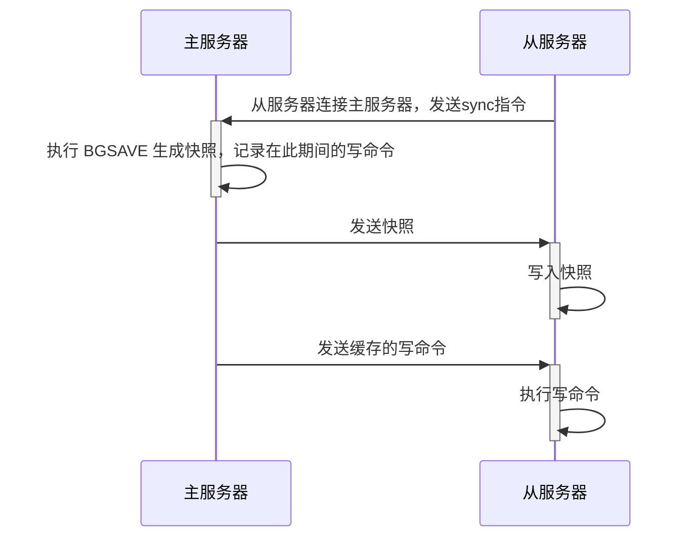

# 前言

**启用服务**

```shell
./redis-server /root/redis-5.0.7/etc/redis.conf 
```

**关闭服务**

```
redis-cli -p 6379 shutdown 
```


# Redis参数配置解析

## 服务端配置

```
# redis进程是否以守护进程的方式运行，yes为是，no为否(不以守护进程的方式运行会占用一个终端)。 
daemonize no 
# 绑定的主机地址 
bind 127.0.0.1 
# redis进程的端口号 
port 6379 
#是否开启保护模式，默认开启。要是配置里没有指定bind和密码。开启该参数后，redis只会本地进行访问，拒绝外部访问。要是开启了密码和bind，可以开启。否则最好关闭设置为no。 
protected-mode yes
# 指定redis进程的PID文件存放位置 
pidfile /var/run/redis.pid
```

## **客户端配置**

```
# 客户端闲置多长时间后关闭连接，默认此参数为0即关闭此功能 
timeout 300 
# 设置同一时间最大客户连接数，默认无限制。redis可以同时连接的客户端数为redis程序可以打开的最大文件描述符，如果设置 maxclients 0，表示不作限制。当客户端连接数到达限制时，Redis会关闭新的连接并向客户端返回 max number of clients reached 错误信息 
maxclients 128 
# 设置redis连接密码，如果配置了连接密码，客户端在连接redis是需要通过AUTH<password>命令提供密码，默认关闭 
requirepass footbared 
# 指定Redis最大内存限制，Redis在启动时会把数据加载到内存中，达到最大内存后，Redis会先尝试清除已到期或即将到期的Key。当此方法处理后，仍然到达最大内存设置，将无法再进行写入操作，但仍然可以进行读取操作。Redis新的vm机制，会把Key存放内存，Value会存放在swap区 
maxmemory<bytes> 
# 选择数据库，默认为0可以使用select <dbid>命令在连接上指定数据库id 
databases 16 
```

## 日志

```
# redis日志级别，可用的级别有debug.verbose.notice.warning 
loglevel verbose 
# log文件输出位置，如果进程以守护进程的方式运行，此处又将输出文件设置为stdout的话，就会将日志信息输出到/dev/null里面去了 
logfile stdout 
```

## 持久化

```
# 指定在多少时间内刷新次数达到多少的时候会将数据同步到数据文件 
save <seconds> <changes> 
# 指定存储至本地数据库时是否压缩文件，默认为yes即启用存储 
rdbcompression yes 
# 指定本地数据库文件名 
dbfilename dump.db 
# 指定本地数据问就按存放位置 
dir ./ 
# 指定是否在每次更新操作后进行日志记录，Redis在默认情况下是异步的把数据写入磁盘，如果不开启，可能会在断电时导致一段时间内的数据丢失。因为redis本身同步数据文件是按上面save条件来同步的，所以有的数据会在一段时间内只存在于内存中。默认为no。 
appendonly no 
# 指定跟新日志文件名默认为appendonly.aof 
appendfilename appendonly.aof 
# 指定更新日志的条件，有三个可选参数 - no：表示等操作系统进行数据缓存同步到磁盘(快)，always：表示每次更新操作后手动调用fsync()将数据写到磁盘(慢，安全)， everysec：表示每秒同步一次(折衷，默认值)； 
appendfsync everysec 
```

## 集群配置

```
# 指定当本机为slave服务时，设置master服务的IP地址及端口，在redis启动的时候他会自动跟master进行数据同步 
replicaof <masterip> <masterport> 
# 当master设置了密码保护时，slave服务连接master的密码 
masterauth <master-password> 
```


# 主从同步原理

## **全量同步**

Redis全量复制一般发生在Slave初始化阶段，这时Slave需要将Master上的所有数据都复制一份。具体步骤如下： 

* 从服务器连接主服务器，发送SYNC命令； 
* 主服务器接收到SYNC命名后，开始执行BGSAVE命令生成RDB文件并使用缓冲区记录此后执行的所有写命令； 
* 主服务器BGSAVE执行完后，向所有从服务器发送快照文件，并在发送期间继续记录被执行的写命令； 
* 从服务器收到快照文件后丢弃所有旧数据，载入收到的快照； 
* 主服务器快照发送完毕后开始向从服务器发送缓冲区中的写命令； 
* 从服务器完成对快照的载入，开始接收命令请求，并执行来自主服务器缓冲区的写命令； 



完成上面几个步骤后就完成了从服务器数据初始化的所有操作，从服务器此时可以接收来自用户的读请求。

## **增量同步**

Redis增量复制是指Slave初始化后开始正常工作时 **主服务器发生的写操作同步到从服务器**的过程。 

增量复制的过程主要是主服务器每执行一个写命令就会向从服务器发送相同的写命令，从服务器接收并执行收到的写命令。

**Redis主从同步策略**

主从刚刚连接的时候，进行全量同步；

全同步结束后，进行增量同步。

当然，如果有需要，slave 在任何时候都可以发起全量同步。redis 策略是，无论如何，首先会尝试进行增量同步，如不成功，要求从机进行全量同步。

**注意点**

如果多个Slave断线了，需要重启的时候，因为只要Slave启动，就会发送sync请求和主机全量同步，当多个同时出现的时候，可能会导致Master IO剧增宕机。


# **Redis Sentinel（哨兵）**

## 简介

Redis的主从复制下，一旦主节点由于故障不能提供服务，需要人工将从节点晋升为主节点，同时还要通知应用方更新主节点地址，对于很多应用场景这种故障处理的方法是无法接受的。但是Redis从2.8开始正式提供了Redis Sentinel（哨兵）架构来解决这个问题。

​    Redis Sentinel是一个分布式架构，其中包含若干个Sentinel节点和Redis数据节点，每个Sentinel节点会对数据节点和其余Sentinel节点进行监控，当它发现节点不可达时，会对节点做下线标识。如果被标识的是主节点，它还会和其他Sentinel节点进行“协商”，当大多数Sentinel节点都认为主节点不可达时，它们会选举出一个Sentinel节点来完成自动故障转移的工作，同时会将这个变化通知给Redis应用方。整个过程完全是自动的，不需要人工来介入，所以这套方案很有效地解决了Redis的高可用问题。

## 实现原理

**三个定时监控任务**

* **获取最新拓扑结构**

    每隔10秒，每个Sentinel节点会向主节点和从节点发送info命令获取最新的拓扑结构。

* **主节点判断**

    每隔2秒，每个Sentinel节点会向Redis数据节点的__sentinel__:hello频道上发送该Sentinel节点对于主节点的判断以及当前Sentinel节点的信息，同时每个Sentinel节点也会订阅该频道，来了解其他Sentinel节点以及它们对主节点的判断。

* **心跳检测**

    每隔一秒，每个Sentinel节点会向主节点、从节点、其余Sentinel节点发送一条ping命令做一次心跳检测，来确认这些节点当前是否可达。

**主观下线**

因为每隔一秒，每个Sentinel节点会向主节点、从节点、其余Sentinel节点发送一条ping命令做一次心跳检测，当这些节点超过down-after-milliseconds没有进行有效回复，Sentinel节点就会对该节点做失败判定，这个行为叫做主观下线。

**客观下线**

当Sentinel主观下线的节点是主节点时，该Sentinel节点会向其他Sentinel节点询问对主节点的判断，当超过`<quorum>`个数，那么意味着大部分的Sentinel节点都对这个主节点的下线做了同意的判定，于是该Sentinel节点认为主节点确实有问题，这时该Sentinel节点会做出客观下线的决定。

**领导者Sentinel节点选举**

Raft算法：假设s1(sentinel-1)最先完成客观下线，它会向其余Sentinel节点发送命令，请求成为领导者；收到命令的Sentinel节点如果没有同意过其他Sentinel节点的请求，那么就会同意s1的请求，否则拒绝；如果s1发现自己的票数已经大于等于某个值，那么它将成为领导者。

**故障转移**

1）领导者Sentinel节点在从节点列表中选出一个节点作为新的主节点

2）上一步的选取规则是与主节点复制相似度最高的从节点

3）领导者Sentinel节点让剩余的从节点成为新的主节点的从节点

4）Sentinel节点集合会将原来的主节点更新为从节点，并保持着对其关注，当其恢复后命令它去复制新的主节点

# 主从+哨兵

## 主从结构+哨兵(sentinel)


一个主节点(master)可拥有多个从节点(slave)，从节点实现对主节点的复制，保证数据同步。

而哨兵(sentinel)则对各节点进行监控，主要包括主节点存活检测、主从运行情况检测等，一旦主节点宕机，哨兵可自动进行故障转移 (failover)、主从切换。接下来就开始搭建这样一个集群，首先是主从结构，然后是哨兵模式，接着往下看。


## **Redis 主从配置及数据同步**

```
主
192.168.1.210 6379
从
192.168.1.210 6380
192.168.1.210 6381
192.168.1.210 6382
```

```
bind：0.0.0.0 
port：6379 
protected-mode：no 
daemonize：yes 
logfile：./redis.log 
requirepass：pwdtest@2019 
masterauth：pwdtest@2019 
replicaof 192.168.231.130 6379
```

## **Redis 哨兵模式搭建**

### **哨兵模式详解**

Sentinel 使用的算法核心是 Raft 算法，主要用途就是用于分布式系统，系统容错，以及Leader选举，每个Sentinel都需要定期的执行以下任务：

- 每个 Sentinel 会自动发现其他 Sentinel 和从服务器，它以每秒钟一次的频率向它所知的主服务器、从服务器以及其他 Sentinel 实例发送一个 PING 命令。
- 如果一个实例(instance)距离最后一次有效回复 PING 命令的时间超过 down-after-milliseconds 选项所指定的值， 那么这个实例会被 Sentinel 标记为主观下线。 有效回复可以是： +PONG 、 -LOADING 或者 -MASTERDOWN 。
- 如果一个主服务器被标记为主观下线， 那么正在监视这个主服务器的所有Sentinel要以每秒一次的频率确认主服务器的确进入了主观下线状态。
- 如果一个主服务器被标记为主观下线， 并且有足够数量的Sentinel(至少要达到配置文件指定的数量)在指定的时间范围内同意这一判断， 那么这个主服务器被标记为客观下线。
- 在一般情况下， 每个Sentinel会以每 10 秒一次的频率向它已知的所有主服务器和从服务器发送 INFO 命令。 当一个主服务器被Sentinel标记为客观下线时，Sentinel向下线主服务器的所有从服务器发送 INFO 命令的频率会从 10 秒一次改为每秒一次。
- 当没有足够数量的Sentinel同意主服务器已经下线， 主服务器的客观下线状态就会被移除。 当主服务器重新向Sentinel的 PING 命令返回有效回复时， 主服务器的主关下线状态就会被移除。


### 哨兵配置

**基本信息配置**

```
# 哨兵sentinel实例运行的端口，默认26379   
port 26379 
# 哨兵sentinel的工作目录 
dir ./
# 是否开启保护模式，默认开启。 
protected-mode:no 
# 是否设置为后台启动。 
daemonize:yes 
 
# 哨兵sentinel的日志文件 
logfile:./sentinel.log 
```

**哨兵配置**

* 监控 的master结点
* 访问结点的密码
* 下线间隔
* 主备切换时 对新 master进行同步
* 故障转移的超时时间

```
# 哨兵sentinel监控的redis主节点的  
## ip：主机ip地址 
## port：哨兵端口号 
## master-name：可以自己命名的主节点名字（只能由字母A-z、数字0-9 、这三个字符".-_"组成。） 
## quorum：当这些quorum个数sentinel哨兵认为master主节点失联 那么这时 客观上认为主节点失联了   
# sentinel monitor <master-name> <ip> <redis-port> <quorum>   
sentinel monitor mymaster 127.0.0.1 6379 2 
 
# 当在Redis实例中开启了requirepass，所有连接Redis实例的客户端都要提供密码。 
# sentinel auth-pass <master-name> <password>   
sentinel auth-pass mymaster 123456   
 
# 指定主节点应答哨兵sentinel的最大时间间隔，超过这个时间，哨兵主观上认为主节点下线，默认30秒   
# sentinel down-after-milliseconds <master-name> <milliseconds> 
sentinel down-after-milliseconds mymaster 30000   
 
# 指定了在发生failover主备切换时，最多可以有多少个slave同时对新的master进行同步。这个数字越小，完成failover所需的时间就越长；反之，但是如果这个数字越大，就意味着越多的slave因为replication而不可用。可以通过将这个值设为1，来保证每次只有一个slave，处于不能处理命令请求的状态。 
# sentinel parallel-syncs <master-name> <numslaves> 
sentinel parallel-syncs mymaster 1   
 
# 故障转移的超时时间failover-timeout，默认三分钟，可以用在以下这些方面： 
## 1. 同一个sentinel对同一个master两次failover之间的间隔时间。   
## 2. 当一个slave从一个错误的master那里同步数据时开始，直到slave被纠正为从正确的master那里同步数据时结束。   
## 3. 当想要取消一个正在进行的failover时所需要的时间。 
## 4.当进行failover时，配置所有slaves指向新的master所需的最大时间。不过，即使过了这个超时，slaves依然会被正确配置为指向master，但是就不按parallel-syncs所配置的规则来同步数据了 
# sentinel failover-timeout <master-name> <milliseconds>   
sentinel failover-timeout mymaster 180000 
 
# 当sentinel有任何警告级别的事件发生时（比如说redis实例的主观失效和客观失效等等），将会去调用这个脚本。一个脚本的最大执行时间为60s，如果超过这个时间，脚本将会被一个SIGKILL信号终止，之后重新执行。 
# 对于脚本的运行结果有以下规则：   
## 1. 若脚本执行后返回1，那么该脚本稍后将会被再次执行，重复次数目前默认为10。 
## 2. 若脚本执行后返回2，或者比2更高的一个返回值，脚本将不会重复执行。   
## 3. 如果脚本在执行过程中由于收到系统中断信号被终止了，则同返回值为1时的行为相同。 
# sentinel notification-script <master-name> <script-path>   
sentinel notification-script mymaster /var/redis/notify.sh 
 
# 这个脚本应该是通用的，能被多次调用，不是针对性的。 
# sentinel client-reconfig-script <master-name> <script-path> 
sentinel client-reconfig-script mymaster /var/redis/reconfig.sh 
```

```
redis-cli -p 26379 
info sentinel 
```


