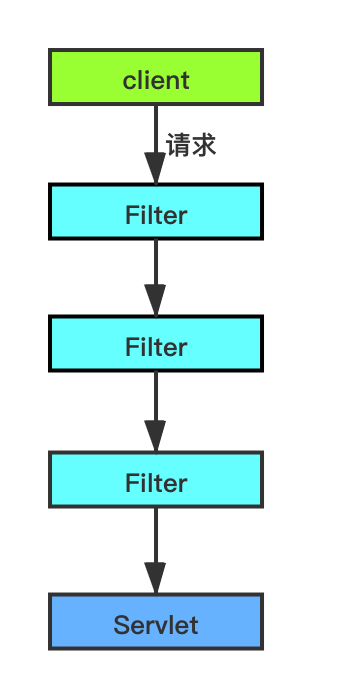
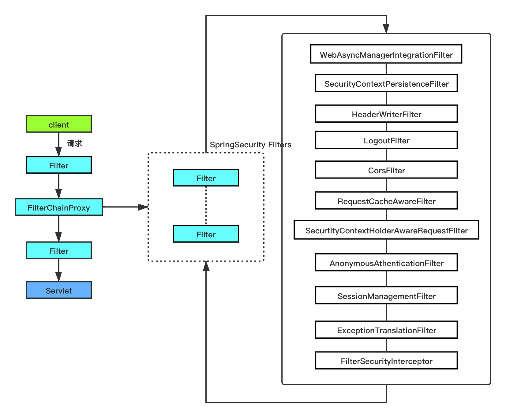

# SpringSecurity核心注解

## @EnableWebSecurity

```java
@Retention(RetentionPolicy.RUNTIME)
@Target(ElementType.TYPE)
@Documented
@Import({ WebSecurityConfiguration.class, SpringWebMvcImportSelector.class, OAuth2ImportSelector.class,
      HttpSecurityConfiguration.class })
@EnableGlobalAuthentication
@Configuration
public @interface EnableWebSecurity {

   /**
    * Controls debugging support for Spring Security. Default is false.
    * @return if true, enables debug support with Spring Security
    */
   boolean debug() default false;

}
```

从注解源码可以看到，该注解有如下作用：

1. 控制Spring Security是否使用调试模式(通过注解属性debug指定)，默认为false，表示缺省不使用调试模式。
2. 导入 WebSecurityConfiguration，用于配置Web安全过滤器FilterChainProxy，并创建过滤器链springSecurityFilterChain来保护你的Spring应用。
    1. 如果是Servlet 环境，导入WebMvcSecurityConfiguration。
    2. 如果是OAuth2环境（spring-security-oauth2-client），导入OAuth2ClientConfiguration。
    3. 使用注解@EnableGlobalAuthentication启用全局认证机制，即全局的AuthenticationManager，AuthenticationManager会在运行时对请求着进行身份验证。

## @EnableGlobalAuthentication

* 通过启用认证管理器（AuthenticationManager）来启用全局认证机制，核心逻辑就在AuthenticationConfiguration类里

```java
@Retention(RetentionPolicy.RUNTIME)
@Target(ElementType.TYPE)
@Documented
@Import(AuthenticationConfiguration.class)
@Configuration
public @interface EnableGlobalAuthentication {

}
```

## @EnableGlobalMethodSecurity

Spring Security默认是禁用注解的，要想开启注解，需要在继承WebSecurityConfigurerAdapter的类上加@EnableGlobalMethodSecurity注解，来判断用户对某个控制层的方法是否具有访问权限。

还可以在@EnableGlobalMethodSecurity中添加几个属性。

* @EnableGlobalMethodSecurity(securedEnabled=true)开启@Secured 注解过滤权限。
* @EnableGlobalMethodSecurity(jsr250Enabled=true)开启@RolesAllowed 注解过滤权限 。
* @EnableGlobalMethodSecurity(prePostEnabled=true)使用表达式时间方法级别的安全性 4个注解可用。
    - @PreAuthorize 在方法调用之前,基于表达式的计算结果来限制对方法的访问
    - @PostAuthorize 允许方法调用,但是如果表达式计算结果为false,将抛出一个安全性异常
    - @PostFilter 允许方法调用,但必须按照表达式来过滤方法的结果
    - @PreFilter 允许方法调用,但必须在进入方法之前过滤输入值


# SpringSecurity核心组件

在SpringSecurity中，有着许多的组件包括AuthenticationManager、AccessDesicionManager和UsernamePasswordAuthenticationFilter等。

对于SpringSecurity来说，最大的两个问题就是：**认证（Authentication）和授权（Authorization）**。SpringSecurity框架旨在将认证从授权中剥离出来，并也有适用于二者的策略和可扩展的设计。


##  认证

```java
public interface AuthenticationManager {
  Authentication authenticate(Authentication authentication)
    throws AuthenticationException;
}
```

*AuthenticationManger*最普遍的实现类是 *ProviderManager*，而 *ProviderManager* 会将认证委托给 *AuthenticationProvider*。

*AuthenticationProvider*接口和*AuthenticationManager*相似，但是它有一个额外的方法允许查询它支持的*Authentication*方式：

```java
public interface AuthenticationProvider {
	Authentication authenticate(Authentication authentication)
			throws AuthenticationException;

	boolean supports(Class<?> authentication);
}
```

## 授权

旦认证成功，我们就可以进行授权了，它核心的策略就是AccessDecisionManager。同样的，它将授权逻辑全部委托给AccessDecisionVoter来实现。

一个AccessDecisionVoter考虑一个Authentication（代表一个Principal）和一个被ConfigAttributes装饰的安全对象，这里的ConfigAttributes就是一个包含了URL以及这个URL该有权限的对象的集合。

```java
boolean supports(ConfigAttribute attribute);

boolean supports(Class<?> clazz);

int vote(Authentication authentication, S object,
        Collection<ConfigAttribute> attributes);
```


# SpringSecurity中的Filter

除了认证和授权外，SpringSecurity的另外一个核心就是Servlet的Filter来实现的。先简单回顾下Servlet中Filter的调用原理。 下图展示了处理单个

## **Servlet调用原理**



## FilterChainProxy以及其内部的Filter

SpringSecurity在过滤器链中扮演的就是一个Filter，其类型是FilterChainProxy。但它又不是一个普通的Filter，因为FilterChainProxy中包含了额外的过滤器，每个过滤器都发挥特殊的作用。下面用一张图展示下FliterChainProxy中包含的过滤器链。



SpringSecurity的FilterChainProxy是以bean的形式注入到Spring容器中的，并且它是默认配置，所以在每次请求中都会存在，所以在SpringSecurity保护的应用中，每次请求都会经过FilterChainProxy。


