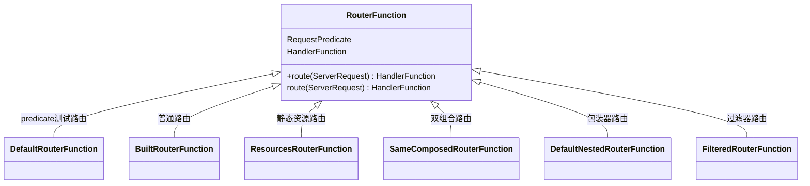

# Web on Reactive Stack

> 响应式 的 web框架

此部分涵盖对基于Reactive Streams API构建的响应式栈的Web应用程序的支持，

该应用程序可在非阻塞服务器（例如Netty，Undertow和Servlet 3.1+容器）上运行。

各个章节涵盖了Spring WebFlux框架，响应式WebClient，对测试的支持以及响应式库

对于基于 Servlet栈的  Web应用程序，请参阅   [Web on Servlet Stack](https://docs.spring.io/spring-framework/docs/current/reference/html/web.html#spring-web).


# Spring WebFlux

## **WebFlux调用执行链**


## **DispatcherHandler调用链**

### 初始化

```java
public DispatcherHandler(ApplicationContext applicationContext) {
	initStrategies(applicationContext);
}
```

```java
	protected void initStrategies(ApplicationContext context) {
        //获取HandlerMapping
		Map<String, HandlerMapping> mappingBeans = BeanFactoryUtils.beansOfTypeIncludingAncestors(
				context, HandlerMapping.class, true, false);

		ArrayList<HandlerMapping> mappings = new ArrayList<>(mappingBeans.values());
		AnnotationAwareOrderComparator.sort(mappings);
		this.handlerMappings = Collections.unmodifiableList(mappings);
		//获取HandlerApater
		Map<String, HandlerAdapter> adapterBeans = BeanFactoryUtils.beansOfTypeIncludingAncestors(
				context, HandlerAdapter.class, true, false);

		this.handlerAdapters = new ArrayList<>(adapterBeans.values());
		AnnotationAwareOrderComparator.sort(this.handlerAdapters);
		
        //获取resultHandler
		Map<String, HandlerResultHandler> beans = BeanFactoryUtils.beansOfTypeIncludingAncestors(
				context, HandlerResultHandler.class, true, false);

		this.resultHandlers = new ArrayList<>(beans.values());
		AnnotationAwareOrderComparator.sort(this.resultHandlers);
	}
```

### 核心处理逻辑

```java
public Mono<Void> handle(ServerWebExchange exchange) {
    //mappings为空，返回error
    if (this.handlerMappings == null) {
        return createNotFoundError();
    }
    //如果是预取请求则处理预检请求
    if (CorsUtils.isPreFlightRequest(exchange.getRequest())) {
        return handlePreFlight(exchange);
    }
    //取第一个 handlerMapping 的 getHandler方法不为空的handler
    //调用handler
    //调用result
    return Flux.fromIterable(this.handlerMappings)
        .concatMap(mapping -> mapping.getHandler(exchange))
        .next()
        .switchIfEmpty(createNotFoundError())
        .flatMap(handler -> invokeHandler(exchange, handler))
        .flatMap(result -> handleResult(exchange, result));
}
```

### **DispatcherHandler调用链**


### HandlerAdapter类图

> 执行 Handler的 类


### AbstractHandlerMapping继承关系图


### RouterFunctionMapping调用链

> getHandlerInternal调用链


### RouterFunction类图



### RouterFunctions分析

RouterFunctions工具类有三大类方法

* 生成 `HttpHandler` 与 `WebHandler` 实例
* 直接生成 *RouterFunction* 实例
* 取得 *Builder*


# 杂项问题

## **springBoot是如何判断 webflux还是 webMVC，还是其他**

### **从 *classPath* 判断**

* *org.springframework.web.reactive.DispatcherHandler* 对应 webflux的核心类
* *org.springframework.web.servlet.DispatcherServlet* webMVC的核心类
* *org.glassfish.jersey.servlet.ServletContainer* jersey的核心类

### **如果三个都存在**

* 则判断 *javax.servlet.Servlet* *org.springframework.web.context.ConfigurableWebApplicationContext* 是否存在类路径
* 都存在则 使用 *SERVLET* 

```java
//org.springframework.boot.WebApplicationType#deduceFromClasspath
    static WebApplicationType deduceFromClasspath() {
		if (ClassUtils.isPresent(WEBFLUX_INDICATOR_CLASS, null) && !ClassUtils.isPresent(WEBMVC_INDICATOR_CLASS, null)
				&& !ClassUtils.isPresent(JERSEY_INDICATOR_CLASS, null)) {
			return WebApplicationType.REACTIVE;
		}
		for (String className : SERVLET_INDICATOR_CLASSES) {
			if (!ClassUtils.isPresent(className, null)) {
				return WebApplicationType.NONE;
			}
		}
		return WebApplicationType.SERVLET;
	}
```

### 根据 不同的 *WebApplicationType* 创建不同的 *SpringContext*

```java
//org.springframework.boot.ApplicationContextFactory
ApplicationContextFactory DEFAULT = (webApplicationType) -> {
   try {
      switch (webApplicationType) {
      case SERVLET:
         return new AnnotationConfigServletWebServerApplicationContext();
      case REACTIVE:
         return new AnnotationConfigReactiveWebServerApplicationContext();
      default:
         return new AnnotationConfigApplicationContext();
      }
   }
   catch (Exception ex) {
      throw new IllegalStateException("Unable create a default ApplicationContext instance, "
            + "you may need a custom ApplicationContextFactory", ex);
   }
};
```


