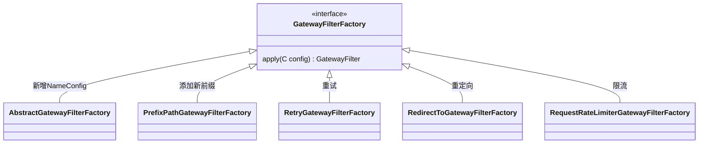

# 概述

## 简介

* *SpringCloudGateWay* 提供了 构建API网关的 一系列库，基于 *SpringWebFlux*
* SpringCloud *Gateway* 旨在提供简单 有效的 API路由，并重点关注  安全，监控/指标和弹性。

# 特性

* 基于Spring5，基于响应式，基于springBoot2.0
* 可以对任意请求属性 匹配 路由
* Circuit Breaker即断路器 集成
* 服务发现客户端集成
* 请求控制
* 限流
* URL重写


# How It Works


1. 客户端向Spring Cloud Gateway发出请求

2. 如果网关Handler Mapping  确定请求与路由匹配，则将其发送到网关WebHandler。
3. 该handler 通过特定于请求的过滤器链来运行请求。
4. filters 由虚线分隔的原因是，filters 可以在发送代理请求之前和之后都运行逻辑。
    所有“前置”过滤器逻辑均被执行。然后发出代理请求。发出代理请求后，将运行“后”过滤器逻辑。


# 源码分析

> 是基于 WebFlux 的 *DispatcherHandler* 下的一个 *HandlerMapping*,DispatherHandler本身不负责处理具体的业务逻辑，只负责寻找*HandlerMapping*

* *SpringGateWay* 实现了 *RoutePredicateHandlerMapping* 

## 类分析

### **RoutePredicateHandlerMapping类图**


### **Route相关类图**


### **RouteLocator**


### RouteDefinitionLocator


### GatewayFilter

> 由工厂模式构建




### GlobalFilter

> 全局过滤器


**AsyncBuilder**：构建 响应式的 *Route*

***RouteDefinition***：构建者的数据来源

***RouteDefinitionLocator***： route定义查找

***Route*** ：路由的定义

***RouteLocator***:查找*Route*


**重定向代码**

```java
public Mono<Void> filter(ServerWebExchange exchange,
                         GatewayFilterChain chain) {
    if (!exchange.getResponse().isCommitted()) {
        setResponseStatus(exchange, httpStatus);

        final ServerHttpResponse response = exchange.getResponse();
        response.getHeaders().set(HttpHeaders.LOCATION, uri.toString());
        return response.setComplete();
    }
    return Mono.empty();
}
```


### FilteringWebHandler

**源码**

```java
	@Override
	public Mono<Void> handle(ServerWebExchange exchange) {
		Route route = exchange.getRequiredAttribute(GATEWAY_ROUTE_ATTR);
		List<GatewayFilter> gatewayFilters = route.getFilters();

		List<GatewayFilter> combined = new ArrayList<>(this.globalFilters);
		combined.addAll(gatewayFilters);
		// TODO: needed or cached?
		AnnotationAwareOrderComparator.sort(combined);

		if (logger.isDebugEnabled()) {
			logger.debug("Sorted gatewayFilterFactories: " + combined);
		}

		return new DefaultGatewayFilterChain(combined).filter(exchange);
	}
```

## **流程图**


# 使用案例

> 以 spring-cloud-nacos为例

## 依赖

```xml
//nacos配置中心
<!-- SpringCloud Ailibaba Nacos Config -->
        <dependency>
            <groupId>org.springframework.cloud</groupId>
            <artifactId>spring-cloud-starter-alibaba-nacos-config</artifactId>
            <version>0.9.0.RELEASE</version>
        </dependency>

//如果不引用这个的话，无法自动加载服务注册
        <dependency>
            <groupId>org.springframework.boot</groupId>
            <artifactId>spring-boot-starter-webflux</artifactId>
        </dependency>

//ncaos服务注册与发现
        <dependency>
            <groupId>org.springframework.cloud</groupId>
            <artifactId>spring-cloud-starter-alibaba-nacos-discovery</artifactId>
            <exclusions>
                <exclusion>
                    <groupId>com.alibaba.nacos</groupId>
                    <artifactId>nacos-client</artifactId>
                </exclusion>
            </exclusions>
        </dependency>
        <dependency>
            <groupId>com.alibaba.nacos</groupId>
            <artifactId>nacos-client</artifactId>
        </dependency>
```

## 配置

```properties
server.port=8084
spring.application.name=gateways
spring.cloud.nacos.discovery.server-addr=127.0.0.1:8848
spring.cloud.nacos.config.server-addr=127.0.0.1:8848

//使用nacos作为注册中心
spring.cloud.nacos.config.file-extension=yml
spring.cloud.nacos.config.shared-dataids=${spring.application.name}.${spring.cloud.nacos.config.file-extension}
spring.cloud.nacos.config.refreshable-dataids=${spring.application.name}.${spring.cloud.nacos.config.file-extension}
```


## 使用

### 代码配置

```java
package com.weisanju.gateway;

import org.springframework.beans.factory.annotation.Value;
import org.springframework.boot.SpringApplication;
import org.springframework.boot.SpringBootConfiguration;
import org.springframework.boot.autoconfigure.EnableAutoConfiguration;
import org.springframework.boot.autoconfigure.SpringBootApplication;
import org.springframework.cloud.client.discovery.EnableDiscoveryClient;
import org.springframework.cloud.gateway.route.RouteLocator;
import org.springframework.cloud.gateway.route.builder.RouteLocatorBuilder;
import org.springframework.context.annotation.Bean;
import org.springframework.context.annotation.Import;
import org.springframework.http.MediaType;
import org.springframework.web.reactive.function.BodyInserters;
import org.springframework.web.reactive.function.server.RequestPredicates;
import org.springframework.web.reactive.function.server.RouterFunction;
import org.springframework.web.reactive.function.server.RouterFunctions;
import org.springframework.web.reactive.function.server.ServerResponse;
import reactor.core.publisher.Mono;

import java.util.Map;

@SpringBootApplication
//@Import(AdditionalRoutesImportSelector.class)
public class GatewayApplication {
    public static final String HELLO_FROM_FAKE_ACTUATOR_METRICS_GATEWAY_REQUESTS = "hello from fake /actuator/metrics/gateway.requests";
    public static void main(String[] args) {
        SpringApplication.run(GatewayApplication.class, args);
    }
    @Value("${test.uri:http://httpbin.org:80}")
    String uri;


    @Value("${xjq}")
    String xjq;

    @Bean
    public RouterFunction<ServerResponse> testWhenMetricPathIsNotMeet() {
        RouterFunction<ServerResponse> route = RouterFunctions
                .route(RequestPredicates.path("/actuator/metrics/gateway.requests"), request -> ServerResponse.ok()
                        .body(BodyInserters.fromObject(HELLO_FROM_FAKE_ACTUATOR_METRICS_GATEWAY_REQUESTS)));
        return route;
    }

    @Bean
    public RouterFunction<ServerResponse> testFunRouterFunction() {
        RouterFunction<ServerResponse> route = RouterFunctions.route(RequestPredicates.path("/testfun"),
                request -> ServerResponse.ok().body(BodyInserters.fromObject("hello")));
        return route;
    }

    @Bean
    public RouteLocator customRouteLocator(RouteLocatorBuilder builder) {
        //@formatter:off
        // String uri = "http://httpbin.org:80";
        // String uri = "http://localhost:9080";
        return builder.routes()
                .route(r -> r.host("**.abc.org").and().path("/anything/png")
                        .filters(f ->
                                f.prefixPath("/httpbin")
                                        .addResponseHeader("X-TestHeader", "foobar"))
                        .uri(uri)
                )
                .route("read_body_pred", r -> r.host("*.readbody.org")
                        .and().readBody(String.class,
                                s -> s.trim().equalsIgnoreCase("hi"))
                        .filters(f -> f.prefixPath("/httpbin")
                                .addResponseHeader("X-TestHeader", "read_body_pred")
                        ).uri(uri)
                )
                .route("rewrite_request_obj", r -> r.host("*.rewriterequestobj.org")
                        .filters(f -> f.prefixPath("/httpbin")
                                .addResponseHeader("X-TestHeader", "rewrite_request")
                                .modifyRequestBody(String.class, Hello.class, (exchange, s) -> {
                                    return Mono.just(new Hello(s.toUpperCase()));
                                })
                        ).uri(uri)
                )
                .route("rewrite_request_upper", r -> r.host("*.rewriterequestupper.org")
                        .filters(f -> f.prefixPath("/httpbin")
                                .addResponseHeader("X-TestHeader", "rewrite_request_upper")
                                .modifyRequestBody(String.class, String.class,
                                        (exchange, s) -> {
                                            return Mono.just(s.toUpperCase() + s.toUpperCase());
                                        })
                        ).uri(uri)
                )
                .route("rewrite_response_upper", r -> r.host("*.rewriteresponseupper.org")
                        .filters(f -> f.prefixPath("/httpbin")
                                .addResponseHeader("X-TestHeader", "rewrite_response_upper")
                                .modifyResponseBody(String.class, String.class,
                                        (exchange, s) -> {
                                            return Mono.just(s.toUpperCase());
                                        })
                        ).uri(uri)
                )
                .route("rewrite_empty_response", r -> r.host("*.rewriteemptyresponse.org")
                        .filters(f -> f.prefixPath("/httpbin")
                                .addResponseHeader("X-TestHeader", "rewrite_empty_response")
                                .modifyResponseBody(String.class, String.class,
                                        (exchange, s) -> {
                                            if (s == null) {
                                                return Mono.just("emptybody");
                                            }
                                            return Mono.just(s.toUpperCase());
                                        })

                        ).uri(uri)
                )
                .route("rewrite_response_fail_supplier", r -> r.host("*.rewriteresponsewithfailsupplier.org")
                        .filters(f -> f.prefixPath("/httpbin")
                                .addResponseHeader("X-TestHeader", "rewrite_response_fail_supplier")
                                .modifyResponseBody(String.class, String.class,
                                        (exchange, s) -> {
                                            if (s == null) {
                                                return Mono.error(new IllegalArgumentException("this should not happen"));
                                            }
                                            return Mono.just(s.toUpperCase());
                                        })
                        ).uri(uri)
                )
                .route("rewrite_response_obj", r -> r.host("*.rewriteresponseobj.org")
                        .filters(f -> f.prefixPath("/httpbin")
                                .addResponseHeader("X-TestHeader", "rewrite_response_obj")
                                .modifyResponseBody(Map.class, String.class, MediaType.TEXT_PLAIN_VALUE,
                                        (exchange, map) -> {
                                            Object data = map.get("data");
                                            return Mono.just(data.toString());
                                        })
                                .setResponseHeader("Content-Type", MediaType.TEXT_PLAIN_VALUE)
                        ).uri(uri)
                )
                .route(r -> r.path("/image/webp")
                        .filters(f ->
                                f.prefixPath("/httpbin")
                                        .addResponseHeader("X-AnotherHeader", "baz"))
                        .uri(uri)
                ).route("xjqService",r->r.path("/xjq/**").uri("lb://service-xjq"))
/*                .route(r -> r.order(-1)
                        .host("**.throttle.org").and().path("/get")
                        .filters(f -> f.prefixPath("/httpbin")
                                .filter(new ThrottleGatewayFilter()
                                        .setCapacity(1)
                                        .setRefillTokens(1)
                                        .setRefillPeriod(10)
                                        .setRefillUnit(TimeUnit.SECONDS)))
                        .uri(uri)
                )*/
                .build();
        //@formatter:on
    }
    static class Hello {

        String message;

        Hello() {
        }

        Hello(String message) {
            this.message = message;
        }

        public String getMessage() {
            return message;
        }

        public void setMessage(String message) {
            this.message = message;
        }

    }

}
```

### 配置文件配置

```yml
spring:
  cloud:
    gateway:
      discovery:
        locator:
          enabled: true
      routes:
        # 认证中心
        - id: xjqService
          uri: lb://service-xjq
          predicates:
            - Path=/xjq/**
        - id: xdhService
          uri: lb://service-xdh
          predicates:
            - Path=/xdh/**
```

### 配置中心配置

```
.route("xjqService",r->r.path("/xjq/**").uri("lb://service-xjq"))
```


## 过滤器

### 全局过滤器

### 专用过滤器

```yml
      routes:
        # 认证中心
        - id: xjqService
          uri: lb://service-xjq
          predicates:
            - Path=/xjq/**
          filters:
            # 验证码处理
            - name: BlackListUrlFilter
              args:
                blacklist: 
                  - /xjq/123
                  - /xjq/456
```


