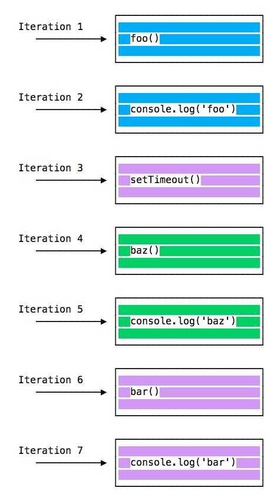

## Node.js 事件循环

**事件循环**是了解 Node.js 最重要的方面之一。

为什么这么重要？ 因为它阐明了 Node.js 如何做到异步且具有非阻塞的 I/O，所以它基本上阐明了 Node.js 的“杀手级应用”，正是这一点使它成功了。


Node.js JavaScript 代码运行在单个线程上。 每次只处理一件事。

这个限制实际上非常有用，因为它大大简化了编程方式，而不必担心并发问题。

只需要注意如何编写代码，并避免任何可能阻塞线程的事情，例如同步的网络调用或无限的循环。


通常，在大多数浏览器中，每个浏览器选项卡都有一个事件循环，以使每个进程都隔离开，并避免使用无限的循环或繁重的处理来阻止整个浏览器的网页。


该环境管理多个并发的事件循环，例如处理 API 调用。 Web 工作进程也运行在自己的事件循环中。

主要需要关心代码会在单个事件循环上运行，并且在编写代码时牢记这一点，以避免阻塞它。


### 阻塞事件循环

任何花费太长时间才能将控制权返回给事件循环的 JavaScript 代码，都会阻塞页面中任何 JavaScript 代码的执行，甚至阻塞 UI 线程，并且用户无法单击浏览、滚动页面等。


JavaScript 中几乎所有的 I/O 基元都是非阻塞的。 网络请求、文件系统操作等。 被阻塞是个异常，这就是 JavaScript 如此之多基于回调（最近越来越多基于 promise 和 async/await）的原因。


### 调用堆栈

调用堆栈是一个 LIFO 队列（后进先出）。


事件循环不断地检查调用堆栈，以查看是否需要运行任何函数。


当执行时，它会将找到的所有函数调用添加到调用堆栈中，并按顺序执行每个函数。


### 一个简单的事件循环的阐释


```js
const bar = () => console.log('bar')
const baz = () => console.log('baz')
const foo = () => { 
    console.log('foo')  setTimeout(bar, 0)  baz()
}
foo()
```

```bash
foo
baz
bar
```

当运行此代码时，会首先调用 foo()。 在 foo() 内部，会首先调用 setTimeout，将 `bar` 作为参数传入，并传入 0 作为定时器指示它尽快运行。 然后调用 baz()。

#### **调用堆栈**


#### 调用顺序



#### 消息队列

当调用 setTimeout() 时，浏览器或 Node.js 会启动定时器。 当定时器到期时（在此示例中会立即到期，因为将超时值设为 0），则回调函数会被放入“**消息队列**”中。


在消息队列中，用户触发的事件（如单击或键盘事件、或获取响应）也会在此排队，然后代码才有机会对其作出反应。 类似 `onLoad` 这样的 DOM 事件也如此。


事件循环会赋予调用堆栈优先级,它首先处理在调用堆栈中找到的所有东西，一旦其中没有任何东西，便开始处理消息队列中的东西。

我们不必等待诸如 `setTimeout`、fetch、或其他的函数来完成它们自身的工作，因为它们是由浏览器提供的，并且位于它们自身的线程中

例如，如果将 `setTimeout` 的超时设置为 2 秒，但不必等待 2 秒，等待发生在其他地方。

### ES6 作业队列

ECMAScript 2015 引入了作业队列的概念,Promise 使用了该队列（也在 ES6/ES2015 中引入）

这种方式会尽快地执行异步函数的结果，而不是放在调用堆栈的末尾。

在当前函数结束之前 resolve 的 Promise 会在当前函数之后被立即执行。


有个游乐园中过山车的比喻很好：消息队列将你排在队列的后面（在所有其他人的后面），你不得不等待你的回合，而工作队列则是快速通道票，这样你就可以在完成上一次乘车后立即乘坐另一趟车。


```js
const bar = () => console.log('bar')
const baz = () => console.log('baz')
const foo = () => {  console.log('foo')  setTimeout(bar, 0)  new Promise((resolve, reject) =>    resolve('应该在 baz 之后、bar 之前')  ).then(resolve => console.log(resolve))  baz()}
foo()
```

```txt
foo
baz
应该在 baz 之后、bar 之前
bar
```

这是 Promise（以及基于 promise 构建的 async/await）与通过 `setTimeout()` 或其他平台 API 的普通的旧异步函数之间的巨大区别。


### process.nextTick()

当尝试了解 Node.js 事件循环时，其中一个重要的部分就是 `process.nextTick()`。

每当事件循环进行一次完整的行程时，我们都将其称为一个滴答。


当将一个函数传给 `process.nextTick()` 时，则指示引擎在当前操作结束（在下一个事件循环滴答开始之前）时调用此函数：

```js
process.nextTick(() => {
  //做些事情
})
```

事件循环正在忙于处理当前的函数代码。

当该操作结束时，JS 引擎会运行在该操作期间传给 `nextTick` 调用的所有函数。


当要确保在下一个事件循环迭代中代码已被执行，则使用 `nextTick()`。


 

