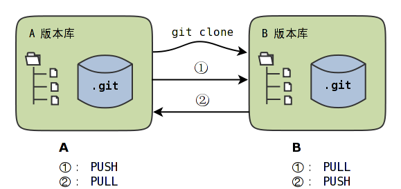
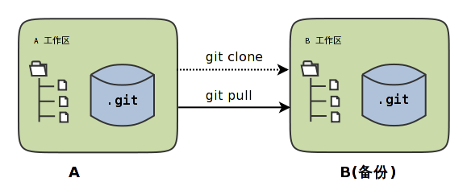
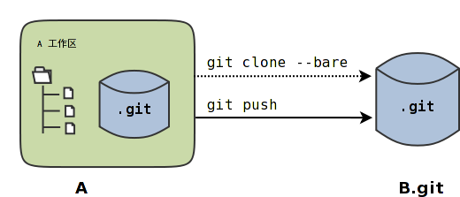

## 鸡蛋不装在一个篮子里

Git的版本库目录和工作区在一起，因此存在一损俱损的问题，即如果删除一个项目的工作区，同时也会把这个项目的版本库删除掉。一个项目仅在一个工作区中维护太危险了，如果有两个工作区就会好很多。

上图中一个项目使用了两个版本库进行维护，两个版本库之间通过拉回（PULL）和/或推送（PUSH）操作实现同步。

- 版本库A通过克隆操作创建克隆版本库B。
- 版本库A可以通过推送（PUSH）操作，将新提交传递给版本库B；
- 版本库A可以通过拉回（PULL）操作，将版本库B中的新提交拉回到自身（A）。



Git使用**git clone**命令实现版本库克隆，主要有如下三种用法：

```
用法1: git clone <repository> <directory>
用法2: git clone --bare   <repository> <directory.git>
用法3: git clone --mirror <repository> <directory.git>
```

这三种用法的区别如下：

- 用法1将`<repository>`指向的版本库创建一个克隆到`<directory>`目录。目录`<directory>`相当于克隆版本库的工作区，文件都会检出，版本库位于工作区下的`.git`目录中。
- 用法2和用法3创建的克隆版本库都不含工作区，直接就是版本库的内容，这样的版本库称为裸版本库。一般约定俗成裸版本库的目录名以`.git`为后缀，所以上面示例中将克隆出来的裸版本库目录名写做`<directory.git>`。
- 用法3区别于用法2之处在于用法3克隆出来的裸版本对上游版本库进行了注册，这样可以在裸版本库中使用**git fetch**命令和上游版本库进行持续同步。
- 用法3只在 1.6.0 或更新版本的Git才提供。

Git的PUSH和PULL命令的用法相似，使用下面的语法：

```
git push [<remote-repos> [<refspec>]]
git pull [<remote-repos> [<refspec>]]
```

其中方括号的含义是参数可以省略，`<remote-repos>`是远程版本库的地址或名称，`<refspec>`是引用表达式，暂时理解为引用即可。在后面的章节再具体介绍PUSH和PULL命令的细节。

## 对等工作区

不使用`--bare`或者`--mirror`创建出来的克隆包含工作区，这样就会产生两个包含工作区的版本库。这两个版本库是对等的



但是往往提交是在一个版本（A）中进行的，另外一个（B）作为备份。对于这种对等工作区模式，版本库的同步只有一种可行的操作模式

就是在备份库（B）执行 git pull 命令从源版本库（A）拉回新的提交实现版本库同步

为什么不能从版本库A向版本库B执行 git push 的推送操作呢？看看下面的操作。

执行克隆命令，将**版本库**`/path/to/my/workspace/demo`克隆到`/path/to/my/workspace/demo-backup`。

```
$ git clone /path/to/my/workspace/demo /path/to/my/workspace/demo-backup
Cloning into /path/to/my/workspace/demo-backup...
done.
```

进入 demo 版本库，生成一些测试提交（使用`--allow-empty`参数可以生成空提交）。

```
$ cd /path/to/my/workspace/demo/
$ git commit --allow-empty -m "sync test 1"
[master 790e72a] sync test 1
$ git commit --allow-empty -m "sync test 2"
[master f86b7bf] sync test 2
```

能够在 demo 版本库向 demo-backup 版本库执行PUSH操作么？

不行：允许向工作区推送已经检出的分支

为了实现同步，需要进入到备份版本库中，执行**git pull**命令。

```
$ git pull
From /path/to/my/workspace/demo
   6e6753a..f86b7bf  master     -> origin/master
Updating 6e6753a..f86b7bf
Fast-forward
```

**为什么执行 git pull 拉回命令没有像执行 git push 命令那样提供那么多的参数呢？**

这是因为在执行**git clone**操作后，克隆出来的demo-backup版本库中对源版本库（上游版本库）进行了注册

，所以当在 demo-backup 版本库执行拉回操作，无须设置上游版本库的地址。

在 demo-backup 版本库中可以使用下面的命令**查看对上游版本库的注册信息**：

```
$ cd /path/to/my/workspace/demo-backup
$ git remote -v
origin  /path/to/my/workspace/demo (fetch)
origin  /path/to/my/workspace/demo (push)
```

实际注册上游远程版本库的奥秘都在Git的配置文件中（略去无关的行）：

```
$ cat /path/to/my/workspace/demo-backup/.git/config
...
[remote "origin"]
        fetch = +refs/heads/*:refs/remotes/origin/*
        url = /path/to/my/workspace/demo
[branch "master"]
        remote = origin
        merge = refs/heads/master
```

关于配置文件`[remote]`小节和`[branch]`小节的奥秘在后面的章节予以介绍。

## 克隆生成裸版本库

上一节在对等工作区模式下，工作区之间执行推送，可能会引发大段的错误输出，如果采用裸版本库则没有相应的问题。这是因为裸版本库没有工作区。没有工作区还有一个好处就是空间占用会更小。



使用`--bare`参数克隆demo版本库到`/path/to/repos/demo.git`，然后就可以从 demo 版本库向克隆的裸版本库执行推送操作了

（为了说明方便，使用了`/path/to/repos/`作为Git裸版本的根路径，在后面的章节中这个目录也作为Git服务器端版本库的根路径。可以在磁盘中以root账户创建该路径并设置正确的权限。）

```
$ git clone --bare /path/to/my/workspace/demo /path/to/repos/demo.git
Cloning into bare repository /path/to/repos/demo.git...
done.
```

克隆出来的`/path/to/repos/demo.git`目录就是版本库目录，不含工作区。

- 看看`/path/to/repos/demo.git`目录的内容。

  ```
  $ ls -F /path/to/repos/demo.git
  branches/  config  description  HEAD  hooks/  info/  objects/  packed-refs  refs/
  ```

- 还可以看到`demo.git`版本库`core.bare`的配置为`true`。

  ```
  $ git --git-dir=/path/to/repos/demo.git config core.bare
  true
  ```

这个方式实现版本库本地镜像显然是更好的方法，因为可以直接在工作区修改、提交，然后执行**git push**命令实现推送。稍有一点遗憾的是推送命令还需要加上裸版本库的路径。这个遗憾在后面介绍远程版本库的章节会给出解决方案。

## 创建生成裸版本库

裸版本库不但可以通过克隆的方式创建，还可以通过**git init**命令以初始化的方式创建。之后的同步方式和上一节大同小异。

```
$ git init --bare /path/to/repos/demo-init.git
Initialized empty Git repository in /path/to/repos/demo-init.git/
```

可是空版本库没有内容啊，那就执行PUSH操作为其创建内容呗。

```
$ cd /path/to/my/workspace/demo
$ git push /path/to/repos/demo-init.git
No refs in common and none specified; doing nothing.
Perhaps you should specify a branch such as 'master'.
fatal: The remote end hung up unexpectedly
error: failed to push some refs to '/path/to/repos/demo-init.git'
```

```
没有指定要推送的引用，而且两个版本库也没有共同的引用。
所以什么也没有做。
可能您需要提供要推送的分支名，如 'master'。
严重错误：远程操作意外终止
错误：部分引用推送失败，至 '/path/to/repos/demo-init.git'
```

关于这个问题详细说明要在后面的章节介绍，这里先说一个省略版：因为`/path/to/repos/demo-init.git` 版本库刚刚初始化完成，还没有任何提交更不要说分支了

当执行**git push**命令时，如果没有设定推送的分支，而且当前分支也没有注册到远程某个分支

将检查远程分支是否有和本地相同的分支名（如master），如果有，则推送，否则报错。

所以需要把**git push**命令写的再完整一些。像下面这样操作，就可以完成向空的裸版本库的推送。

```
$ git push /path/to/repos/demo-init.git master:master
```

上面的**git push**命令也可以简写为：**git push /pat h/to/repos/demo-init.git master**。

推送成功了么？看看`demo-init.git`版本库中的提交。

```
$ git --git-dir=/path/to/repos/demo-init.git log --oneline -2
0285742 sync test 4
d4b42b7 sync test 3
```

好了继续在 demo 中执行几次提交。

```
$ cd /path/to/my/workspace/demo/
$ git commit --allow-empty -m "sync test 5"
[master 424aa67] sync test 5
$ git commit --allow-empty -m "sync test 6"
[master 70a5aa7] sync test 6
```

然后再向`demo-init.git`推送。注意这次使用的命令。

```
$ git push /path/to/repos/demo-init.git
```

为什么这次使用**git push**命令后面没有跟上分支名呢？这是因为远程版本库（demo-init.git）中已经不再是空版本库了，而且有名为master的分支。