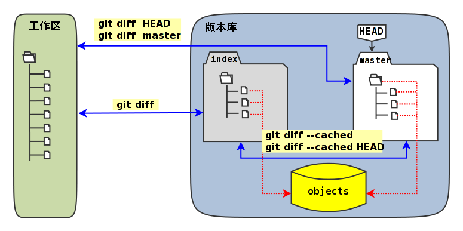
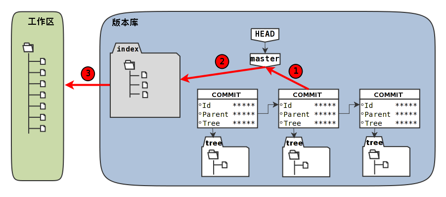

## 工作区、暂存区、版本库

### 暂存区

Git暂存区（stage，或称为index）的设计是Git最成功的设计之一，也是最难理解的一个设计。

在版本库`.git`目录下，有一个`index`文件

### **记录时间戳**

当执行**git status**命令（或者**git diff**命令）扫描工作区改动的时候，先依据`.git/index`文件中记录的（工作区跟踪文件的）时间戳、长度等信息判断工作区文件是否改变

如果工作区的文件时间戳改变，说明文件的内容**可能**被改变了，需要要打开文件，读取文件内容，和更改前的原始文件相比较，判断文件内容是否被更改

如果文件内容没有改变，则将该文件新的时间戳记录到`.git/index`文件中

因为判断文件是否更改，使用时间戳、文件长度等信息进行比较要比通过文件内容比较要快的多，所以Git这样的实现方式可以让工作区状态扫描更快速的执行，这也是Git高效的因素之一。

### 虚拟工作区

文件`.git/index`实际上就是一个包含文件索引的目录树，像是一个虚拟的工作区

这个虚拟工作区的目录树中，记录了文件名、文件的状态信息（时间戳、文件长度等）

文件的内容并不存储其中，而是保存在Git对象库`.git/objects`目录中，文件索引建立了文件和对象库中对象实体之间的对应

下面这个图展示了工作区、版本库中的暂存区和版本库之间的关系。


* 图中左侧为工作区，右侧为版本库。在版本库中标记为`index`的区域是暂存区（stage，亦称index），标记为`master`的是master分支所代表的目录树。
* 图中可以看出此时HEAD实际是指向master分支的一个“游标”。所以图示的命令中出现HEAD的地方可以用master来替换。

- 图中的objects标识的区域为Git的对象库，实际位于`.git/objects`目录下
- 当对工作区修改（或新增）的文件执行**git add**命令时，暂存区的目录树被更新，同时工作区修改（或新增）的文件内容被写入到对象库中的一个新的对象中，而该对象的ID被记录在暂存区的文件索引中。
- 当执行提交操作（**git commit**）时，暂存区的目录树写到版本库（对象库）中，master分支会做相应的更新。即master最新指向的目录树就是提交时原暂存区的目录树。

- 当执行**git reset HEAD**命令时，暂存区的目录树会被重写，被master分支指向的目录树所替换，但是工作区不受影响。
- 当执行**git rm –cached \<file>**命令时，会直接从暂存区删除文件，工作区则不做出改变。
- 当执行**git checkout .**或者**git checkout – \<file>**命令时，会用暂存区全部或指定的文件替换工作区的文件。这个操作很危险，会清除工作区中未添加到暂存区的改动。
- 当执行**git checkout HEAD .**或者**git checkout HEAD \<file>**命令时，会用HEAD指向的master分支中的全部或者部分文件替换暂存区和以及工作区中的文件。这个命令也是极具危险性的，因为不但会清除工作区中未提交的改动，也会清除暂存区中未提交的改动。


使用暂存区或者版本库的文件 替换工作区的文件

```shell
#全部替换
git checkout .
#替换某个文件
git checkout – <file>
#用HEAD指向的master分支中的全部或者部分文件替换暂存区和以及工作区中的文件。
# v->w、s
git checkout HEAD .
# 指定文件替换 v->w、s
git checkout HEAD <file>
```


```shell
#清除当前工作区中没有加入版本库的文件和目录 f表示强制执行、d表示递归清理目录
git clean -fd
```

```sh
# --pretty=raw参数以便显示每个提交对象的parent、tree属性
git log -2 --pretty=raw
```

```sh
# -s 精简输出 -b输出分支名
git status -s -b
```

### **暂存区目录树的浏览**

有什么办法能够像查看工作区一样的，直观的查看暂存区以及HEAD当中的目录树么？

对于HEAD（版本库中当前提交）指向的目录树，可以使用Git底层命令**git ls-tree**来查看。

```
# 使用-l参数，可以显示文件的大小。上面welcome.txt大小为25字节。
$ git ls-tree -l HEAD
100644 blob fd3c069c1de4f4bc9b15940f490aeb48852f3c42      25    welcome.txt
```

要**显示暂存区的目录树**，可以使用**git ls-files**命令。

```
$ git ls-files -s
100644 18832d35117ef2f013c4009f5b2128dfaeff354f 0       a/b/c/hello.txt
100644 51dbfd25a804c30e9d8dc441740452534de8264b 0       welcome.txt
```

注意这个输出和之前使用**git ls-tree**命令输出不一样，如果想要使用**git ls-tree**命令

需要先将暂存区的目录树写入Git对象库（用**git write-tree**命令），然后在针对**git write-tree**命令写入的 tree 执行**git ls-tree**命令。

```
$ git write-tree
9431f4a3f3e1504e03659406faa9529f83cd56f8
$ git ls-tree -l 9431f4a
040000 tree 53583ee687fbb2e913d18d508aefd512465b2092       -    a
100644 blob 51dbfd25a804c30e9d8dc441740452534de8264b      34    welcome.txt
```

## **Git diff**

比较图




## GIT对象

### **查看GIT对象结构**

**查看git对象类型**

```sh
$ git cat-file -t e695606
commit
$ git cat-file -t f58d
tree
$ git cat-file -t a0c6
commit
```

**查看git对象结构**

```sh
$ git cat-file -p e695606
tree f58da9a820e3fd9d84ab2ca2f1b467ac265038f9
parent a0c641e92b10d8bcca1ed1bf84ca80340fdefee6
author Jiang Xin <jiangxin@ossxp.com> 1291022581 +0800
committer Jiang Xin <jiangxin@ossxp.com> 1291022581 +0800

#查看tree对象的结构 
weisanju@B-3BVVQ05P-2126 demo01 % git cat-file -p  df36838bf559b620ec5abdb30e6a593bb9af4ec7
100644 blob c86a7936f2a61955b463708abdf29b7567124f27	a.txt
100644 blob 3da1ec26e9c8512eae062868a9ff9bae47e5625b	b.txt
100644 blob fa64294350b06d9617cbfa34e0a60aca01b6c8be	test.ini
# tree对象中存在 blob对象、查看blob对象对应ID的 类别：就是blob类型
weisanju@B-3BVVQ05P-2126 demo01 % git cat-file -t c86a7936f2a61955b463708abdf29b7567124f27
blob

#查询blob对象ID对应的 结构：就是文件内容
weisanju@B-3BVVQ05P-2126 demo01 % git cat-file -p c86a7936f2a61955b463708abdf29b7567124f27
HelloWorld2
#这些对象保存在 Git库中的objects目录下（ID的前两位作为目录名，后38位作为文件名）


# 用下面的命令可以看到所有这些对象（tree、blob、commit）在对象库中的实际位置。
weisanju@B-3BVVQ05P-2126 demo01 % ls -l  .git/objects/c8/6a7936f2a61955b463708abdf29b7567124f27
-r--r--r--  1 weisanju  staff  28 11 20 20:18 .git/objects/c8/6a7936f2a61955b463708abdf29b7567124f27
```


**对象之间的关系**


### 命名空间

**head与master的关系**

```sh
# 以下三个命令有同样的输出,在当前版本库中，HEAD、master和refs/heads/master具有相同的指向。
git log -1 HEAD
git log -1 master
git log -1 refs/heads/master
```

```
# 找到了四个文件，其中在.git/logs目录下的文件稍后再予以关注，现在把目光锁定在.git/HEAD和.git/refs/heads/master上。
$ find .git -name HEAD -o -name master
.git/HEAD
.git/logs/HEAD
.git/logs/refs/heads/master
.git/refs/heads/master
# 输出文件内容
weisanju@B-3BVVQ05P-2126 demo01 % cat .git/HEAD
ref: refs/heads/master
# 输出文件内容：指向最新的提交。这是一个 commit对象
weisanju@B-3BVVQ05P-2126 demo01 % cat .git/refs/heads/master
0e1ac87c48749584745bbbcfa72798135a45c553
```


* 原来分支master指向的是一个提交ID（最新提交）。这样的分支实现是多么的巧妙啊：

* 可以从任何提交开始建立一条历史跟踪链，那么用一个文件指向这个链条的最新提交，那么这个文件就可以用于追踪整个提交历史了

* 这个文件就是.git/refs/heads/master文件。
* 目录`.git/refs`是保存引用的命名空间，其中`.git/refs/heads`目录下的引用又称为分支
* 对于分支既可以使用正规的长格式的表示法，如`refs/heads/master`，也可以去掉前面的两级目录用`master`来表示
* Git 有一个底层命令**git rev-parse**可以用于显示引用对应的提交ID。

```sh
#可以看出它们都指向同一个对象
$ git rev-parse master
e695606fc5e31b2ff9038a48a3d363f4c21a3d86
$ git rev-parse refs/heads/master
e695606fc5e31b2ff9038a48a3d363f4c21a3d86
$ git rev-parse HEAD
e695606fc5e31b2ff9038a48a3d363f4c21a3d86
```


### SHA1哈希值到底是什么，如何生成的？

哈希(hash)是一种数据摘要算法（或称散列算法），是信息安全领域当中重要的理论基石。

该算法将任意长度的输入经过散列运算转换为固定长度的输出

固定长度的输出可以称为对应的输入的数字摘要或哈希值

比较著名的摘要算法有：MD5和SHA1。Linux下**sha1sum**命令可以用于生成摘要。

**提交hash**

```sh
# 看看HEAD对应的提交的内容。使用**git cat-file**命令。
git cat-file commit HEAD
git cat-file commit HEAD | wc -c

# 在提交信息的前面加上commit内容、commit 234<null>（<null>为空字符），然后执行SHA1哈希算法。
$ ( printf "commit 234\000"; git cat-file commit HEAD ) | sha1sum
e695606fc5e31b2ff9038a48a3d363f4c21a3d86

#查看提交的hash
$ git rev-parse HEAD
e695606fc5e31b2ff9038a48a3d363f4c21a3d86
```

**文件内容hash**

```sh
# 查看文件的内容
git cat-file blob HEAD:welcome.txt
 
#在文件内容的前面加上blob 25<null>的内容，然后执行SHA1哈希算法。
$ ( printf "blob 25\000"; git cat-file blob HEAD:welcome.txt ) | sha1sum
fd3c069c1de4f4bc9b15940f490aeb48852f3c42  -

# 查看文件内容的hash
$ git rev-parse HEAD:welcome.txt
fd3c069c1de4f4bc9b15940f490aeb48852f3c42
```

**tree对象hash**

```shell
# HEAD对应的树的内容共包含39个字节。
git cat-file tree HEAD^{tree} | wc -c
# 在树的内容的前面加上tree 39<null>的内容，然后执行SHA1哈希算法
( printf "tree 39\000"; git cat-file tree HEAD^{tree} ) | sha1sum
f58da9a820e3fd9d84ab2ca2f1b467ac265038f9  -
# 查看 head所执行的提交的 tree对象的hash
git rev-parse HEAD^{tree}
```

在后面学习里程碑（Tag）的时候，会看到Tag对象（轻量级Tag除外）也是采用类似方法在对象库中存储的。


### 访问GIT库中的对象

### 规则

- 采用部分的SHA1哈希值。不必写全40位的哈希值，只采用开头的部分，不和现有其他的冲突即可。

- 使用`master`代表分支`master`中最新的提交，使用全称`refs/heads/master`亦可

- 使用`HEAD`代表版本库中最近的一次提交。

- 符号` `^`可以用于指代父提交。例如：

  - `HEAD^`代表版本库中上一次提交，即最近一次提交的父提交。
  - `HEAD^^`则代表`HEAD^`的父提交。

- 对于一个提交有多个父提交，可以在符号`^`后面用数字表示是第几个父提交。例如：

  - `a573106^2`含义是提交`a573106`的多个父提交中的第二个父提交。
  - `HEAD^1`相当于`HEAD^`含义是HEAD多个父提交中的第一个。
  - `HEAD^^2`含义是`HEAD^`（HEAD父提交）的多个父提交中的第二个。

- 符号`~<n>`也可以用于指代祖先提交。下面两个表达式效果等同：

  ```
  a573106~5
  a573106^^^^^
  ```

- 提交所对应的树对象，可以用类似如下的语法访问。

  ```
  a573106^{tree}
  ```

- 某一此提交对应的文件对象，可以用如下的语法访问。

  ```
  a573106:path/to/file
  ```

- 访问暂存区中的文件对象，可以用如下的语法访问。

  ```
  :path/to/file
  ```

## 重置

### 重置原理

> 移动 refs/heads/\<branch-name\> 中的提交

```
$ cat .git/refs/heads/master
4902dc375672fbf52a226e0354100b75d4fe31e3
$ git log --graph --oneline
* 4902dc3 does master follow this new commit?
* e695606 which version checked in?
* a0c641e who does commit?
* 9e8a761 initialized.
```

引用`refs/heads/master`就好像是一个游标，在有新的提交发生的时候指向了新的提交。

Git提供了**git reset**命令，可以将“游标”指向任意一个存在的提交ID。下面的示例就尝试人为的更改游标。（注意下面的命令中使用了`--hard`参数，会破坏工作区未提交的改动，慎用。

### 用reflog挽救错误的重置

如果没有记下重置前master分支指向的提交ID，想要重置回原来的提交真的是一件麻烦的事情（去对象库中一个一个地找）

幸好Git提供了一个挽救机制，通过`.git/logs`目录下日志文件记录了分支的变更。

默认非裸版本库（带有工作区）都提供分支日志功能，这是因为带有工作区的版本库都有如下设置：

```
$ git config core.logallrefupdates
true
```

**查看一下master分支的日志文件**

`.git/logs/refs/heads/master`中的内容。下面命令显示了该文件的最后几行。

为了排版的需要，还将输出中的40位的SHA1提交ID缩短。

```shell
tail -5 .git/logs/refs/heads/master
```

**显示日志**

```
git reflog show master | head -5
```

使用**git reflog**的输出和直接查看日志文件最大的不同在于显示顺序的不同

即最新改变放在了最前面显示，而且只显示每次改变的最终的SHA1哈希值。

还有个重要的区别在于使用**git reflog**的输出中还提供一个方便易记的表达式

```
<refname>@{<n>}
这个表达式的含义是引用<refname>之前第<n>次改变时的SHA1哈希值。
```

那么将引用master切换到两次变更之前的值，可以使用下面的命令。

- 重置master为两次改变之前的值。

  ```
  $ git reset --hard master@{2}
  HEAD is now at 4902dc3 does master follow this new commit?
  ```

此时如果再用**git reflog**查看，会看到恢复master的操作也记录在日志中了。

### **命令详细**

```
用法一： git reset [-q] [<commit>] [--] <paths>...
用法二： git reset [--soft | --mixed | --hard | --merge | --keep] [-q] [<commit>]
```

其中 \<commit> 都是可选项，可以使用引用或者提交ID，如果省略 \<commit> 则相当于使用了HEAD的指向作为提交ID。

上面列出的两种用法的区别在于，第一种用法在命令中包含路径`<paths>`,为了避免路径和引用（或者提交ID）同名而冲突，可以在`<paths>`前用两个连续的短线（减号）作为分隔。

**替换暂存区**

第一种用法（包含了路径`<paths>`的用法）**不会**重置引用，更不会改变工作区，而是用指定提交状态（\<commit>）下的文件（\<paths>）替换掉暂存区中的文件

例如命令**git reset HEAD \<paths>**相当于取消之前执行的**git add \<paths>**命令时改变的暂存区。

第二种用法（不使用路径`<paths>`的用法）则会**重置引用**。根据不同的选项，可以对暂存区或者工作区进行重置。参照下面的版本库模型图，来看一看不同的参数对第二种重置语法的影响。

**重置选项**




命令格式: git reset [–soft | –mixed | –hard ] [<commit>]

- 使用参数`--hard`，如：**git reset –hard <commit>**。

  会执行上图中的1、2、3全部的三个动作。即：

  1. 替换引用的指向。引用指向新的提交ID。
  2. 替换暂存区。替换后，暂存区的内容和引用指向的目录树一致。
  3. 替换工作区。替换后，工作区的内容变得和暂存区一致，也和HEAD所指向的目录树内容相同。

- 使用参数`--soft`，如:**git reset –soft <commit>**。

  会执行上图中的操作1。即只更改引用的指向，不改变暂存区和工作区。

- 使用参数`--mixed`或者不使用参数（缺省即为`--mixed`），如:**git reset <commit>**。

  会执行上图中的操作1和操作2。即更改引用的指向以及重置暂存区，但是不改变工作区。

**重置命令的不同用法**

* **git reset**：重置暂存区

* **git reset HEAD**：同上

* **git reset – filename** ：重置暂存区

* **git reset HEAD filename** 同上

* **git reset –soft HEAD^**

  * 版本库回退一个版本、暂存区没有、所以暂存区在与版本库比对时就会多出来一个 提交
  * 现象：将上一次提交拉回到暂存区

  在之前曾经介绍过一个修补提交命令**git commit –amend**，用于对最新的提交进行重新提交以修补错误的提交说明或者错误的提交文件。修补提交命令实际上相当于执行了下面两条命令。（注：文件`.git/COMMIT_EDITMSG`保存了上次的提交日志）

  ```shell
  $ git reset --soft HEAD^
  $ git commit -e -F .git/COMMIT_EDITMSG
  ```

* **git reset HEAD^** 
* **git reset –mixed HEAD^**
  * 版本库回退一个版本、暂存库回退一个版本、工作区不回退，则工作区多出
* **git reset –hard HEAD^**
  * 三个库全部回退

## 恢复进度

### 使用**git stash**

命令**git stash**可以用于保存和恢复工作进度

- 命令：**git stash**

  保存当前工作进度。会分别对暂存区和工作区的状态进行保存。

* 命令：**git stash list**

  显示进度列表。此命令显然暗示了**git stash**可以多次保存工作进度，并且在恢复的时候进行选择。

* 命令： **git stash show**

  显示变更

* 命令：**git stash pop [–index] [\<stash>]**

  会恢复最新保存的工作进度，并将恢复的工作进度从存储的工作进度列表中清除。

* 命令：**git stash apply [–index] [\<stash>]**

  除了不删除恢复的进度之外，其余和**git stash pop**命令一样。

* 命令：**git stash drop [<stash>]**

  删除一个存储的进度。缺省删除最新的进度。

* 命令：**git stash clear**

  删除所有存储的进度。

- 命令：**git stash branch <branchname> <stash>**

  基于进度创建分支。对了，还没有讲到分支呢。;)

### 探秘**git stash**

在执行**git stash**命令时，Git实际调用了一个脚本文件实现相关的功能，这个脚本的文件名就是`git-stash`。看看`git-stash`安装在哪里了。

实际上在1.5.4之前的版本，Git会安装这些一百多个以**git-<cmd>**格式命名的程序到可执行路径中。这样做的唯一好处就是不用借助任何扩展机制就可以实现命令行补齐：即键入`git-`后，连续两次键入`<Tab>`键，就可以把这一百多个命令显示出来。这种方式随着Git子命令的增加越来越显得混乱，因此在1.5.4版本开始，不再提供**git-\<cmd>**格式的命令，而是用唯一的**git**命令。而之前的名为**git-\<cmd>**的子命令则保存在非可执行目录下，由Git负责加载。

最早很多Git命令都是用Shell或者Perl脚本语言开发的，在Git的发展中一些对运行效率要求高的命令用C语言改写。而`git-stash`（至少在Git 1.7.3.2版本）还是使用Shell脚本开发的，研究它会比研究用C写的命令要简单的多。

**显示 stash 引用空间的提交**

```shell
# 可以看到在提交关系图可以看到进度保存的最新提交是一个合并提交。最新的提交说明中有WIP字样（是Work In Progess的简称），说明代表了工作区进度。而最新提交的第二个父提交（上图中显示为第二个提交）有index on master字样，说明这个提交代表着暂存区的进度。
git log --graph --pretty=raw  refs/stash -2
```

**通过 logs/refs/stash 记录 stash的改变记录**

```sh
 ls -l .git/refs/stash .git/logs/refs/stash
 # 记录了 stash引用的变更日志
 git reflog show refs/stash
```

果然上面显示的三个提交对应的三棵树各不相同。查看一下差异。用“原基线”代表进度保存时版本库的状态；用“原暂存区”代表进度保存时暂存区的状态，；用“原工作区”代表进度保存时工作区的状态。

- 原基线和原暂存区的差异比较。

  ```
  $ git diff stash@{1}^2^ stash@{1}^2
  
  ```

- 原暂存区和原工作区的差异比较。

  ```
  $ git diff stash@{1}^2 stash@{1}
  ```

- 原基线和原工作区的差异比较。

  ```
  $ git diff stash@{1}^1 stash@{1}
  ```

  