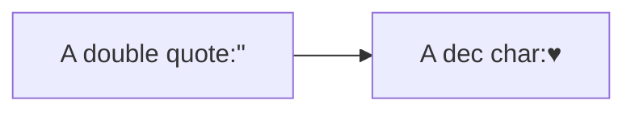

# Flowcharts

## 方向定义

**基本语法**

```
graph 方向描述
    图表中的其他语句...
```

**方向描述**

| 用词 | 含义     |
| ---- | -------- |
| TB   | 从上到下 |
| BT   | 从下到上 |
| RL   | 从右到左 |
| LR   | 从左到右 |

## 节点形状

即流程图中每个文本块，包括开始、结束、处理、判断等。Mermaid 中每个节点都有一个 id，以及节点的文字。

| 表述                                                         | 说明               |
| ------------------------------------------------------------ | ------------------ |
| `id[文字]`                                                   | 矩形节点           |
| `id(文字)`                                                   | 圆角矩形           |
| `id1([This is the text in the box])`                         | 体育场             |
| `id((文字))`                                                 | 圆形节点           |
| `id>文字]`                                                   | 右向旗帜状，不对称 |
| `id{文字}`                                                   | 菱形               |
| `id1[[This is the text in the box]]`                         | 子例程形状         |
| `id1[(Database)]`                                            | 柱状               |
| `id1{{This is the text in the box}}`                         | 六边形             |
| `id1[/This is the text in the box/]` or `id1[\This is the text in the box\]` | 平行四边形         |
| `A[/Christmas\] or B[\Go shopping/]`                         | 梯形               |

## 连接线

| 格式                             | 效果                 |
| -------------------------------- | -------------------- |
| `A-->B`                          | 实线，箭头，无文字   |
| `A---B`                          | 实线，无箭头，无文字 |
| `A--文字---B`或`A---|文字|B`     | 实线，无箭头，文字   |
| `A--文字-->B`或`A-->|文字|B`     | 实线，箭头，文字     |
| `A-.->B`                         | 虚线，箭头，无文字   |
| `A-.文字.->B`                    | 虚线，箭头，文字     |
| `A==>B`                          | 大箭头，无文字       |
| `A==文字==>B`                    | 大箭头，文字         |
| `A -- text --> B -- text2 --> C` | 箭头链               |
| `a --> b & c--> d`               | 多方向               |
| `A & B--> C & D`                 | a,b同时都指向 c,d    |

**长度，虚实，箭头**

| Length            | 1      | 2       | 3        |
| ----------------- | ------ | ------- | -------- |
| Normal            | `---`  | `----`  | `-----`  |
| Normal with arrow | `-->`  | `--->`  | `---->`  |
| Thick             | `===`  | `====`  | `=====`  |
| Thick with arrow  | `==>`  | `===>`  | `====>`  |
| Dotted            | `-.-`  | `-..-`  | `-...-`  |
| Dotted with arrow | `-.->` | `-..->` | `-...->` |


## 文本块

使用 双引号 包裹 文本块

## 使用特殊字符




## 子图

**语法**

```
subgraph title
    graph definition
end
```

**example**

```
graph TB
    c1-->a2
    subgraph one
    a1-->a2
    end
    subgraph two
    b1-->b2
    end
    subgraph three
    c1-->c2
    end
```

**指定显示ID**

```
graph TB
    c1-->a2
    subgraph ide1 [one]
    a1-->a2
    end
```

## flowcharts

使用graphtype流程图，也可以如下图所示在子图之间设置边线。

```
flowchart TB
    c1-->a2
    subgraph one
    a1-->a2
    end
    subgraph two
    b1-->b2
    end
    subgraph three
    c1-->c2
    end
    one --> two
    three --> two
    two --> c2
```

## 交互

可以将click事件绑定到节点，单击可能导致JavaScript回调或链接，该链接将在新的浏览器选项卡中打开。
注意：使用securityLevel ='strict'时禁用此功能，而使用securityLevel ='loose'时启用。

**语法**

```
click nodeId callback
click nodeId call callback()
```

- nodeId is the id of the node
- callback is the name of a javascript function defined on the page displaying the graph, the function will be called with the nodeId as parameter.

```
<body>
  <div class="mermaid">
    graph LR;
        A-->B;
        B-->C;
        C-->D;
        click A callback "Tooltip"
        click B "http://www.github.com" "This is a link"
        click C call callback() "Tooltip"
        click D href "http://www.github.com" "This is a link"
  </div>

  <script>
    var callback = function(){
        alert('A callback was triggered');
    }
    var config = {
        startOnLoad:true,
        flowchart:{
            useMaxWidth:true,
            htmlLabels:true,
            curve:'cardinal',
        },
        securityLevel:'loose',
    };

    mermaid.initialize(config);
  </script>
</body>
```

## 打开文件页面

```
graph LR
A-->B[新窗口打开当前页面]
    click B "README.md"
```


## **注释**

```
graph LR
%% this is a comment A -- text --> B{node}
   A -- text --> B -- text2 --> C
```

可以在流程图中输入注释，解析器将忽略它们。
注释必须自己一行，并且必须以%%（双百分号）开头。
注释开始到下一个换行符之后的所有文本都将被视为注释，包括任何流语法


## 样式

### linkStyle

linkStyle 后面的数字表示第几根线，从 0 开始。可以指定颜色和粗细。

```
graph TD;
    A-->B;
    A-->C;
    B-->D;
    C-->D;
    linkStyle 0 stroke:#0ff,stroke-width:2px;
    linkStyle 3 stroke:#ff3,stroke-width:4px;
```

### 结点样式

```
graph LR
    id1(Start)-->id2(Stop)
    style id1 fill:#f9f,stroke:#333,stroke-width:4px
    style id2 fill:#bbf,stroke:#f66,stroke-width:2px,color:#fff,stroke-dasharray: 5 5
```

### 样式类

```
    classDef className fill:#f9f,stroke:#333,stroke-width:4px;
    class nodeId1 className;
    class nodeId1,nodeId2 className;
    
    
    graph LR
    A:::someclass --> B
    classDef someclass fill:#f96;
```

### css样式

```
<style>
    .cssClass > rect{
        fill:#FF0000;
        stroke:#FFFF00;
        stroke-width:4px;
    }
</style>

graph LR;
    A-->B[AAA<span>BBB</span>];
    B-->D;
    class A cssClass;
```

### Default class

默认赋给所有图形 

```
  classDef default fill:#f9f,stroke:#333,stroke-width:4px;
```

## fontawaresome

```
graph TD
    B["fa:fa-twitter for peace"]
    B-->C[fa:fa-ban forbidden]
    B-->D(fa:fa-spinner);
    B-->E(A fa:fa-camera-retro perhaps?);
```


## 配置

可以调整渲染流程图的宽度。

```
mermaid.flowchartConfig = {
    width: 100%
}
```