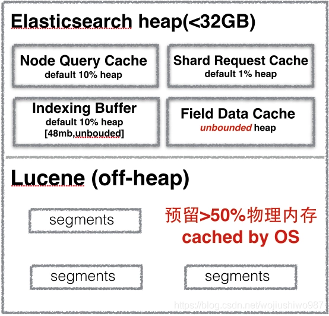

## 什么是[堆内存](https://so.csdn.net/so/search?q=堆内存)

Java 中的堆是 [JVM](https://so.csdn.net/so/search?q=JVM&spm=1001.2101.3001.7020) 所管理的最大的一块内存空间，主要用于存放各种类的实例对象。


在 Java 中，堆被划分成两个不同的区域：

- 新生代 ( Young )、
- 老年代 ( Old )。


新生代 ( Young ) 又被划分为三个区域：

- Eden、
- From Survivor、
- To Survivor。


这样划分的目的是为了使 JVM 能够更好的管理堆内存中的对象，包括[内存](https://so.csdn.net/so/search?q=内存&spm=1001.2101.3001.7020)的分配以及回收。

## 堆内存的作用是什么？

在虚拟机启动时创建。

堆内存的**唯一目的就是创建对象实例**，所有的对象实例和数组都要在堆上分配。

堆是由垃圾回收来负责的，因此也叫做“GC堆”，垃圾回收采用分代算法，

堆由此分为新生代和老年代。

**堆的优势是可以动态地分配内存大小**，生存期也不必事先告诉编译器，因为它是在运行时动态分配内存的，Java的垃圾收集器会自动收走这些不再使用的数据。

但**缺点**是，由于要在运行时动态分配内存，存取速度较慢。当堆内存因为满了无法扩展时就会抛出java.lang.OutOfMemoryError:Java heap space异常。出现这种情况的解决办法具体参见java调优。


## 堆内存如何配置？

默认情况下，[Elasticsearch](https://so.csdn.net/so/search?q=Elasticsearch&spm=1001.2101.3001.7020) JVM使用堆内存最小和最大大小为2 GB（5.X版本以上）。

早期版本默认1GB，官网指出：这明显不够。

在转移到生产环境时，配置足够容量的堆大小以确保Elasticsearch功能和性能是必要的。

Elasticsearch将通过Xms（最小堆大小）和Xmx（最大堆大小）设置来分配jvm.options中指定的整个堆。

```
-Xms2g 
-Xmx2g
```

**通过环境变量设置。**

```
ES_JAVA_OPTS="-Xms2g -Xmx2g" ./bin/elasticsearch 
ES_JAVA_OPTS="-Xms4000m -Xmx4000m" ./bin/elasticsearch

```

## 堆内存配置建议

* 将最小堆大小（Xms）和最大堆大小（Xmx）设置为彼此相等。
* Elasticsearch可用的堆越多，可用于缓存的内存就越多。但请注意，太多的堆内存可能会使您长时间垃圾收集暂停。
* **将Xmx设置为不超过物理内存的50％，以确保有足够的物理内存留给内核文件系统缓存。**


**- 不要将Xmx设置为JVM超过32GB。**

```
宿主机内存大小的一半和31GB，取最小值。
```


## 堆内存为什么不能超过物理机内存的一半？

### **堆对于Elasticsearch绝对重要**。

它被许多内存数据结构用来提供快速操作。但还有另外一个非常重要的内存使用者：Lucene。

1. Lucene旨在利用底层操作系统来缓存内存中的数据结构

2. Lucene段(segment)存储在单个文件中。因为段是一成不变的，所以这些文件永远不会改变
3. 这使得它们非常容易缓存，并且底层操作系统将愉快地将热段（hot segments）保留在内存中以便更快地访问
4. 这些段包括倒排索引（用于全文搜索）和dov values（用于聚合）。

### **Lucene与操作系统缓存**

Lucene的性能依赖于与操作系统的这种交互。**但是如果你把所有可用的内存都给了Elasticsearch的堆**，**那么Lucene就不会有任何剩余的内存**。这会严重影响性能。

### **建议**

**标准建议是将可用内存的50％提供给Elasticsearch堆，而将其他50％空闲**。它不会被闲置; Lucene会高兴地吞噬掉剩下的东西。

### **无聚合场景**

如果您不在字符串字段上做聚合操作（例如，您不需要fielddata），则可以考虑进一步降低堆。堆越小，您可以从Elasticsearch（更快的GC）和Lucene（更多内存缓存）中获得更好的性能。


## 堆内存为什么不能超过32GB？

在Java中，所有对象都分配在堆上并由指针引用。普通的对象指针（OOP）指向这些对象，传统上它们是CPU本地字的大小：32位或64位，取决于处理器。

1. 对于32位系统，这意味着最大堆大小为4 GB

2. 对于64位系统，堆大小可能会变得更大，**但是64位指针的开销意味着仅仅因为指针较大而存在更多的浪费空间**

3. 并且比浪费的空间更糟糕，当在主存储器和各种缓存（LLC，L1等等）之间移动值时，较大的指针**消耗更多的带宽**。


Java使用称为压缩oops的技巧来解决这个问题。而不是指向内存中的确切字节位置，指针引用对象偏移量。这意味着一个32位指针可以引用40亿个对象，而不是40亿个字节。最终，这意味着堆可以增长到约32 GB的物理尺寸，同时仍然使用32位指针。

**一旦你穿越了这个神奇的〜32 GB的边界**，指针就会切换回普通的对象指针。每个指针的大小增加，使用**更多的CPU内存带宽**，并且实际上会丢失内存。实际上，在使用压缩oops获得32 GB以下堆的相同有效内存之前，需要大约40-50 GB的分配堆。

以上小结为：**即使你有足够的内存空间，尽量避免跨越32GB的堆边界**。否则会导致浪费了内存，降低了CPU的性能，并使GC在大堆中挣扎。


## 最新认知

事实上，给ES分配的内存有一个魔法上限值26GB，

这样可以确保启用zero based Compressed Oops，这样性能才是最佳的。

参考:https://elasticsearch.cn/question/3995
https://www.elastic.co/blog/a-heap-of-trouble





[参考链接](https://blog.csdn.net/laoyang360/article/details/79998974)