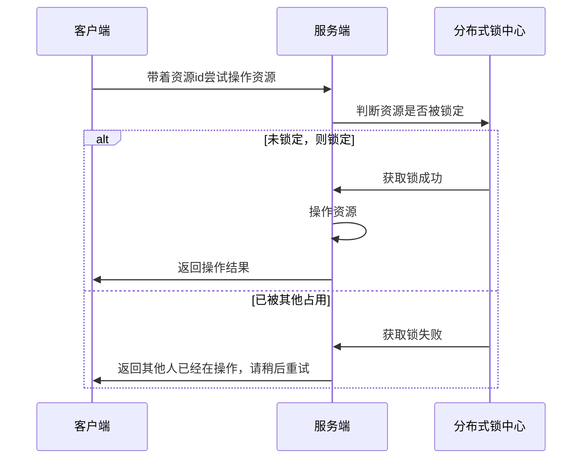

# **分布式锁应该具备哪些条件**

1. 在分布式系统环境下，一个方法在同一时间只能被一个机器的一个线程执行； 
2. 高可用的获取锁与释放锁； 
3. 高性能的获取锁与释放锁； 
4. 具备可重入特性； 
5. 具备锁失效机制，防止死锁； 
6. 具备非阻塞锁特性，即没有获取到锁将直接返回获取锁失败。


# 常见分布式锁方案对比


### 常见分布式锁方案对比

| 分类                              | 方案                                                         | 实现原理                                                     | 优点                                                         | 缺点                                                         |
| --------------------------------- | ------------------------------------------------------------ | ------------------------------------------------------------ | ------------------------------------------------------------ | ------------------------------------------------------------ |
| 基于数据库                        | 基于mysql 表唯一索引                                         | 1.表增加唯一索引 2.加锁：执行insert语句，若报错，则表明加锁失败 3.解锁：执行delete语句 | 完全利用DB现有能力，实现简单                                 | 1.锁无超时自动失效机制，有死锁风险 2.不支持锁重入，不支持阻塞等待 3.操作数据库开销大，性能不高 |
| 基于MongoDB findAndModify原子操作 | 1.加锁：执行findAndModify原子命令查找document，若不存在则新增 2.解锁：删除document | 实现也很容易，较基于MySQL唯一索引的方案，性能要好很多        | 1.大部分公司数据库用MySQL，可能缺乏相应的MongoDB运维、开发人员 2.锁无超时自动失效机制 |                                                              |
| 基于分布式协调系统                | 基于ZooKeeper                                                | 1.加锁：在/lock目录下创建临时有序节点，判断创建的节点序号是否最小。若是，则表示获取到锁；否，则则watch /lock目录下序号比自身小的前一个节点 2.解锁：删除节点 | 1.由zk保障系统高可用 2.Curator框架已原生支持系列分布式锁命令，使用简单 | 需单独维护一套zk集群，维保成本高                             |
| 基于缓存                          | 基于redis命令                                                | 1. 加锁：执行setnx，若成功再执行expire添加过期时间 2. 解锁：执行delete命令 | 实现简单，相比数据库和分布式系统的实现，该方案最轻，性能最好 | 1.setnx和expire分2步执行，非原子操作；若setnx执行成功，但expire执行失败，就可能出现死锁 2.delete命令存在误删除非当前线程持有的锁的可能 3.不支持阻塞等待、不可重入 |
| 基于redis Lua脚本能力             | 1. 加锁：执行SET lock_name random_value EX seconds NX 命令  2. 解锁：执行Lua脚本，释放锁时验证random_value  -- ARGV[1]为random_value, KEYS[1]为lock_nameif redis.call("get", KEYS[1]) == ARGV[1] then  return redis.call("del",KEYS[1])else  return 0end | 同上；实现逻辑上也更严谨，除了单点问题，生产环境采用用这种方案，问题也不大。 | 不支持锁重入，不支持阻塞等待                                 |                                                              |


# Redisson分布式锁的实现

## Example

```java

// 1.构造redisson实现分布式锁必要的Config
Config config = new Config();
config.useSingleServer().setAddress("redis://127.0.0.1:5379").setPassword("123456").setDatabase(0);
// 2.构造RedissonClient
RedissonClient redissonClient = Redisson.create(config);
// 3.获取锁对象实例（无法保证是按线程的顺序获取到）
RLock rLock = redissonClient.getLock(lockKey);
try {
    /**
     * 4.尝试获取锁
     * waitTimeout 尝试获取锁的最大等待时间，超过这个值，则认为获取锁失败
     * leaseTime   锁的持有时间,超过这个时间锁会自动失效（值应设置为大于业务处理的时间，确保在锁有效期内业务能处理完）
     */
    boolean res = rLock.tryLock((long)waitTimeout, (long)leaseTime, TimeUnit.SECONDS);
    if (res) {
        //成功获得锁，在这里处理业务
    }
} catch (Exception e) {
    throw new RuntimeException("aquire lock fail");
}finally{
    //无论如何, 最后都要解锁
    rLock.unlock();
}
```

## 基于LUA脚本的加锁解锁

**介绍**

如果要手写一个分布式锁组件，肯定要定义2个接口：加锁、解锁；redisson 的作者就是在加锁和解锁的执行层面采用Lua脚本，有原子性保证。

* 加锁和解锁过程中还巧妙地利用了redis的发布订阅功能

### **加锁Lua脚本**

**脚本入参**

| 参数    | 示例值                                 | 含义                                                         |
| ------- | -------------------------------------- | ------------------------------------------------------------ |
| KEY个数 | 1                                      | KEY个数                                                      |
| KEYS[1] | my_first_lock_name                     | 锁名                                                         |
| ARGV[1] | 60000                                  | 持有锁的有效时间：**毫秒**                                   |
| ARGV[2] | 58c62432-bb74-4d14-8a00-9908cc8b828f:1 | **唯一标识**：获取锁时set的唯一值，实现上为redisson客户端**ID(UUID)+线程ID** |

```lua

-- 若锁不存在：则新增锁，并设置锁重入计数为1、设置锁过期时间
if (redis.call('exists', KEYS[1]) == 0) then
    redis.call('hset', KEYS[1], ARGV[2], 1);
    redis.call('pexpire', KEYS[1], ARGV[1]);
    return nil;
end;
 
-- 若锁存在，且唯一标识也匹配：则表明当前加锁请求为锁重入请求，故锁重入计数+1，并再次设置锁过期时间
if (redis.call('hexists', KEYS[1], ARGV[2]) == 1) then
    redis.call('hincrby', KEYS[1], ARGV[2], 1);
    redis.call('pexpire', KEYS[1], ARGV[1]);
    return nil;
end;
 
-- 若锁存在，但唯一标识不匹配：表明锁是被其他线程占用，当前线程无权解他人的锁，直接返回锁剩余过期时间
return redis.call('pttl', KEYS[1]);
```

**当且仅当返回nil，才表示加锁成功**，否则返回锁的超时时间


**流程图**


### **解锁Lua脚本**

**脚本入参**

| 参数    | 示例值                                      | 含义                          |
| ------- | ------------------------------------------- | ----------------------------- |
| KEY个数 | 2                                           | KEY个数                       |
| KEYS[1] | my_first_lock_name                          | 锁名                          |
| KEYS[2] | redisson_lock__channel:{my_first_lock_name} | **解锁消息PubSub频道**        |
| ARGV[1] | 0                                           | **redisson定义0表示解锁消息** |
| ARGV[2] | 30000                                       | 设置锁的过期时间；默认值30秒  |
| ARGV[3] | 58c62432-bb74-4d14-8a00-9908cc8b828f:1      | 唯一标识；同加锁流程          |

**脚本内容**

```lua
-- 若锁不存在：则直接广播解锁消息，并返回1
if (redis.call('exists', KEYS[1]) == 0) then
    redis.call('publish', KEYS[2], ARGV[1]);
    return 1; 
end;
 
-- 若锁存在，但唯一标识不匹配：则表明锁被其他线程占用，当前线程不允许解锁其他线程持有的锁
if (redis.call('hexists', KEYS[1], ARGV[3]) == 0) then
    return nil;
end; 
 
-- 若锁存在，且唯一标识匹配：则先将锁重入计数减1
local counter = redis.call('hincrby', KEYS[1], ARGV[3], -1); 
if (counter > 0) then 
    -- 锁重入计数减1后还大于0：表明当前线程持有的锁还有重入，不能进行锁删除操作，但可以友好地帮忙设置下过期时期
    redis.call('pexpire', KEYS[1], ARGV[2]); 
    return 0; 
else 
    -- 锁重入计数已为0：间接表明锁已释放了。直接删除掉锁，并广播解锁消息，去唤醒那些争抢过锁但还处于阻塞中的线程
    redis.call('del', KEYS[1]); 
    redis.call('publish', KEYS[2], ARGV[1]); 
    return 1;
end;
 
return nil;
```

**流程**


**广播解锁消息有什么用？** 

* 是为了通知其他争抢锁阻塞住的线程，从阻塞中解除，并再次去争抢锁。

**返回值0、1、nil有什么不一样？** 

* 当且仅当返回1，才表示当前请求真正触发了解锁Lua脚本；但客户端又并不关心解锁请求的返回值，好像没什么用


## 流程

## 用户操作时序图



# 代码实现

- [ ] **实现 *JDK* 锁接口**
    > lock锁接口详见 [Lock](../java/java多线程与锁/基于AQS的同步工具/Lock锁接口.md)

    - [x] 无阻塞方式
    - [ ] 阻塞方式
    - [ ] 超时方式
    - [ ] 支持可配置锁定时长，超时自动续期
    - [ ] 锁资源管理界面 手动释放锁
    - [ ] 支持多底层切换
        - [ ] 单机环境，支持使用 JDK各个锁实现
        - [ ] 集群环境，支持 redis，*zookeeper*

- [ ] 设计 *JMH* 基准比对测试
- [ ] 设计*Jmeter* 测试场景
- [ ] **基于注解的分布式锁支持**

- [ ] **支持基于Spring注解的动态代理支持**
- [ ] **支持 *SpringEL* 表达式**
- [ ] *SpringBootStarter* 支持

# 类设计

## 锁信息

* 锁定 唯一资源 ID
* 锁定人
* 锁定过期时间


