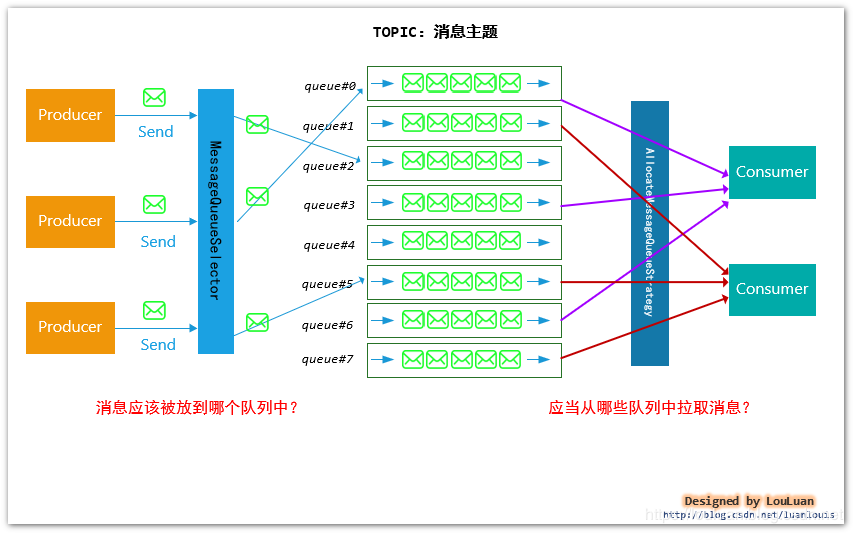
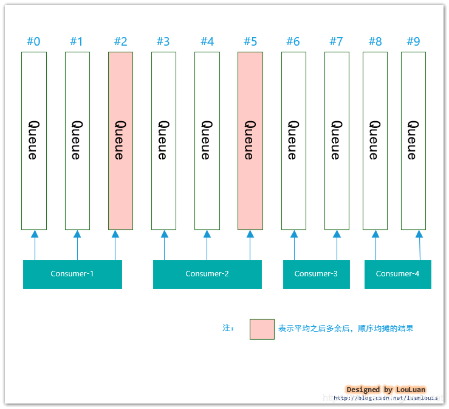
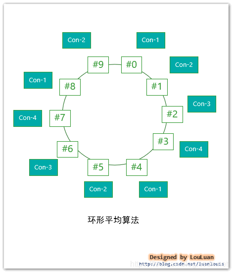
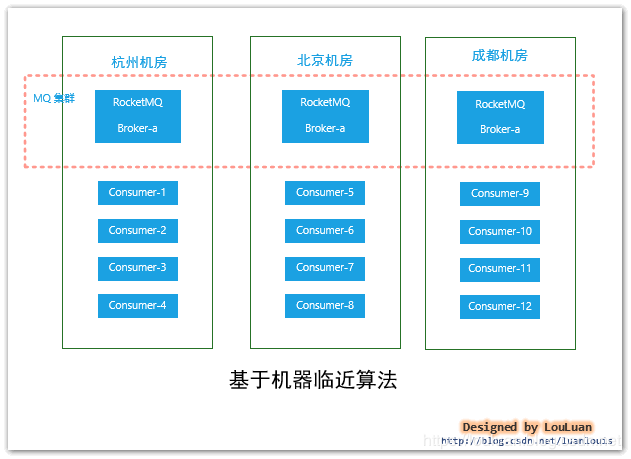

### 前言

RocketMQ的消息投递分分为两种：一种是`生产者`往MQ Broker中投递

另外一种则是MQ broker 往`消费者` 投递(这种`投递`的说法是从**消息传递的角度阐述的**，实际上底层是`消费者`从MQ broker 中Pull拉取的)


### RocketMQ的消息模型



为了提高MQ的可用性和灵活性，一个Topic在实际存储的过程中，采用了多队列的方式

每个消息队列在使用中应当保证**先入先出**（FIFO,First In First Out）的方式进行消费

那么，基于这种模型，就会引申出两个问题：

**生产者** 在发送相同Topic的消息时，消息体应当被放置到哪一个消息队列(MessageQueue)中?

**消费者** 在消费消息时，应当从哪些消息队列中拉取消息?

### 生产者(Producer)投递消息的策略

#### 默认投递方式：基于`Queue队列`轮询算法投递

默认情况下，采用了最简单的轮询算法，这种算法有个很好的特性就是，保证每一个`Queue队列`的消息投递数量尽可能均匀，算法如下所示：

```java
/**
*  根据 TopicPublishInfo Topic发布信息对象中维护的index，每次选择队列时，都会递增
*  然后根据 index % queueSize 进行取余，达到轮询的效果
*
*/
public MessageQueue selectOneMessageQueue(final TopicPublishInfo tpInfo, final String lastBrokerName) {
        return tpInfo.selectOneMessageQueue(lastBrokerName);
}

/**
*  TopicPublishInfo Topic发布信息对象中
*/
public class TopicPublishInfo {
    //基于线程上下文的计数递增，用于轮询目的
    private volatile ThreadLocalIndex sendWhichQueue = new ThreadLocalIndex();
   

    public MessageQueue selectOneMessageQueue(final String lastBrokerName) {
        if (lastBrokerName == null) {
            return selectOneMessageQueue();
        } else {
            int index = this.sendWhichQueue.getAndIncrement();
            for (int i = 0; i < this.messageQueueList.size(); i++) {
                //轮询计算
                int pos = Math.abs(index++) % this.messageQueueList.size();
                if (pos < 0)
                    pos = 0;
                MessageQueue mq = this.messageQueueList.get(pos);
                if (!mq.getBrokerName().equals(lastBrokerName)) {
                    return mq;
                }
            }
            return selectOneMessageQueue();
        }
    }

    public MessageQueue selectOneMessageQueue() {
        int index = this.sendWhichQueue.getAndIncrement();
        int pos = Math.abs(index) % this.messageQueueList.size();
        if (pos < 0)
            pos = 0;
        return this.messageQueueList.get(pos);
    }
}
```

#### 消息投递延迟最小

默认的投递方式比较简单，但是也暴露了一个问题，就是有些`Queue队列`可能由于自身数量积压等原因，可能在投递的过程比较长，对于这样的`Queue队列`会影响后续投递的效果。

基于这种现象，RocketMQ在每发送一个MQ消息后，都会统计一下消息投递的`时间延迟`，根据这个`时间延迟`，可以知道往哪些`Queue队列`投递的速度快

在这种场景下，会优先使用`消息投递延迟最小`的策略，如果没有生效，再使用`Queue队列轮询`的方式。

```java
public class MQFaultStrategy {
    /**
     * 根据 TopicPublishInfo 内部维护的index,在每次操作时，都会递增，
     * 然后根据 index % queueList.size(),使用了轮询的基础算法
     *
     */
    public MessageQueue selectOneMessageQueue(final TopicPublishInfo tpInfo, final String lastBrokerName) {
        if (this.sendLatencyFaultEnable) {
            try {
                // 从queueid 为 0 开始，依次验证broker 是否有效，如果有效
                int index = tpInfo.getSendWhichQueue().getAndIncrement();
                for (int i = 0; i < tpInfo.getMessageQueueList().size(); i++) {
                    //基于index和队列数量取余，确定位置
                    int pos = Math.abs(index++) % tpInfo.getMessageQueueList().size();
                    if (pos < 0)
                        pos = 0;
                    MessageQueue mq = tpInfo.getMessageQueueList().get(pos);
                    if (latencyFaultTolerance.isAvailable(mq.getBrokerName())) {
                        if (null == lastBrokerName || mq.getBrokerName().equals(lastBrokerName))
                            return mq;
                    }
                }
                
                // 从延迟容错broker列表中挑选一个容错性最好的一个 broker
                final String notBestBroker = latencyFaultTolerance.pickOneAtLeast();
                int writeQueueNums = tpInfo.getQueueIdByBroker(notBestBroker);
                if (writeQueueNums > 0) {
                     // 取余挑选其中一个队列
                    final MessageQueue mq = tpInfo.selectOneMessageQueue();
                    if (notBestBroker != null) {
                        mq.setBrokerName(notBestBroker);
                        mq.setQueueId(tpInfo.getSendWhichQueue().getAndIncrement() % writeQueueNums);
                    }
                    return mq;
                } else {
                    latencyFaultTolerance.remove(notBestBroker);
                }
            } catch (Exception e) {
                log.error("Error occurred when selecting message queue", e);
            }
          // 取余挑选其中一个队列
            return tpInfo.selectOneMessageQueue();
        }

        return tpInfo.selectOneMessageQueue(lastBrokerName);
    }
}
```

#### 顺序消息的投递方式

**上述两种投递方式属于对消息投递的时序性没有要求的场景，这种投递的速度和效率比较高。而在有些场景下，需要保证同类型消息投递和消费的顺序性。**

```
这种情况下，我们希望消费者消费消息的顺序和我们发送是一致的，然而，有上述MQ的投递和消费机制，我们无法保证顺序是正确的，对于顺序异常的消息，消费者 即使有一定的状态容错，也不能完全处理好这么多种随机出现组合情况。
```

基于上述的情况，RockeMQ采用了这种实现方案：**对于相同订单号的消息，通过一定的策略，将其放置在一个 queue队列中**，然后消费者再采用一定的策略(一个线程独立处理一个queue,保证处理消息的顺序性)，能够保证消费的顺序性

##### 消息投递队列选择

`生产者`是如何能将相同订单号的消息发送到同一个`queue队列`的：

默认实现：

| 投递策略                 | 策略实现类                      | 说明                                                         |
| :----------------------- | :------------------------------ | :----------------------------------------------------------- |
| 随机分配策略             | SelectMessageQueueByRandom      | 使用了简单的随机数选择算法                                   |
| 基于Hash分配策略         | SelectMessageQueueByHash        | 根据附加参数的Hash值，按照消息队列列表的大小取余数，得到消息队列的index |
| 基于机器机房位置分配策略 | SelectMessageQueueByMachineRoom | 开源的版本没有具体的实现，基本的目的应该是机器的就近原则分配 |

### 如何为消费者分配`queue队列`

RocketMQ对于消费者消费消息有两种形式：

- `BROADCASTING`:广播式消费，这种模式下，一个消息会被通知到每一个`消费者`
- `CLUSTERING`: 集群式消费，这种模式下，一个消息最多只会被投递到一个`消费者`上进行消费 模式如下：

#### **基于queue队列的分配**

在RoketMQ底层，消息指定分配给消费者的实现，是通过`queue队列`分配给`消费者`的方式完成的：也就是说，`消息`分配的单位是消息所在的`queue队列`

 将`queue队列`指定给特定的`消费者`后，`queue队列`内的所有消息将会被指定到`消费者`进行消费。

RocketMQ定义了策略接口`AllocateMessageQueueStrategy`，对于给定的`消费者分组`,和`消息队列列表`、`消费者列表`，`当前消费者`应当被分配到哪些`queue队列`

```java
/**
 * 为消费者分配queue的策略算法接口
 */
public interface AllocateMessageQueueStrategy {

    /**
     * Allocating by consumer id
     *
     * @param consumerGroup 当前 consumer群组
     * @param currentCID 当前consumer id
     * @param mqAll 当前topic的所有queue实例引用
     * @param cidAll 当前 consumer群组下所有的consumer id set集合
     * @return 根据策略给当前consumer分配的queue列表
     */
    List<MessageQueue> allocate(
        final String consumerGroup,
        final String currentCID,
        final List<MessageQueue> mqAll,
        final List<String> cidAll
    );

    /**
     * 算法名称
     *
     * @return The strategy name
     */
    String getName();
}
```

#### **消费队列分配算法**

| 算法名称                              | 含义                 |
| :------------------------------------ | :------------------- |
| AllocateMessageQueueAveragely         | 平均分配算法         |
| AllocateMessageQueueAveragelyByCircle | 基于环形平均分配算法 |
| AllocateMachineRoomNearby             | 基于机房临近原则算法 |
| AllocateMessageQueueByMachineRoom     | 基于机房分配算法     |
| AllocateMessageQueueConsistentHash    | 基于一致性hash算法   |
| AllocateMessageQueueByConfig          | 基于配置分配算法     |

#### 顺序-平均分配算法



**源码**

```java
package org.apache.rocketmq.client.consumer.rebalance;
import java.util.ArrayList;
import java.util.List;
import org.apache.rocketmq.client.consumer.AllocateMessageQueueStrategy;
import org.apache.rocketmq.client.log.ClientLogger;
import org.apache.rocketmq.logging.InternalLogger;
import org.apache.rocketmq.common.message.MessageQueue;
/**
 * Average Hashing queue algorithm
 */
public class AllocateMessageQueueAveragely implements AllocateMessageQueueStrategy {
    private final InternalLogger log = ClientLogger.getLog();

    @Override
    public List<MessageQueue> allocate(String consumerGroup, String currentCID, List<MessageQueue> mqAll,
        List<String> cidAll) {
        if (currentCID == null || currentCID.length() < 1) {
            throw new IllegalArgumentException("currentCID is empty");
        }
        if (mqAll == null || mqAll.isEmpty()) {
            throw new IllegalArgumentException("mqAll is null or mqAll empty");
        }
        if (cidAll == null || cidAll.isEmpty()) {
            throw new IllegalArgumentException("cidAll is null or cidAll empty");
        }

        List<MessageQueue> result = new ArrayList<MessageQueue>();
        if (!cidAll.contains(currentCID)) {
            log.info("[BUG] ConsumerGroup: {} The consumerId: {} not in cidAll: {}",
                consumerGroup,
                currentCID,
                cidAll);
            return result;
        }
				//当前消费者
        int index = cidAll.indexOf(currentCID);
        //获取多余的消费队列
        int mod = mqAll.size() % cidAll.size();
        //计算 当前消费者 应该所得的 消费队列的 个数
        int averageSize =
            mqAll.size() <= cidAll.size() ? 1 : (mod > 0 && index < mod ? mqAll.size() / cidAll.size()
                + 1 : mqAll.size() / cidAll.size());
        //计算 当前消费者所位于 消费队列 列表中的起点
        int startIndex = (mod > 0 && index < mod) ? index * averageSize : index * averageSize + mod;
        //如果 消费者过多，mqAll.size() - startIndex可能会 为负数，这就可能导致 后续的消费者无法获取到队列
        int range = Math.min(averageSize, mqAll.size() - startIndex);
        for (int i = 0; i < range; i++) {
            result.add(mqAll.get((startIndex + i) % mqAll.size()));
        }
        return result;
    }

    @Override
    public String getName() {
        return "AVG";
    }
}
```

#### 环形平均算法



**环形顺序分配**

这种算法最终分配的结果是： `consumer-1`: #0，#4，#8 `consumer-2`: #1,  #5, # 9 `consumer-3`: #2，#6 `consumer-4`: #3，#7

```java
package org.apache.rocketmq.client.consumer.rebalance;
import java.util.ArrayList;
import java.util.List;
import org.apache.rocketmq.client.consumer.AllocateMessageQueueStrategy;
import org.apache.rocketmq.client.log.ClientLogger;
import org.apache.rocketmq.logging.InternalLogger;
import org.apache.rocketmq.common.message.MessageQueue;

/**
 * Cycle average Hashing queue algorithm
 */
public class AllocateMessageQueueAveragelyByCircle implements AllocateMessageQueueStrategy {
    private final InternalLogger log = ClientLogger.getLog();

    @Override
    public List<MessageQueue> allocate(String consumerGroup, String currentCID, List<MessageQueue> mqAll,
        List<String> cidAll) {
     		......	
        int index = cidAll.indexOf(currentCID);
        for (int i = index; i < mqAll.size(); i++) {
            if (i % cidAll.size() == index) {
                result.add(mqAll.get(i));
            }
        }
        return result;
    }

    @Override
    public String getName() {
        return "AVG_BY_CIRCLE";
    }
}
```

#### 基于机房临近原则算法




 对于跨机房的场景，会存在网络、稳定性和隔离心的原因，该算法会根据`queue`的部署机房位置和`消费者consumer`的位置，过滤出当前`消费者consumer`相同机房的`queue队列`，然后再结合上述的算法，如基于平均分配算法在`queue队列`子集的基础上再挑选。相关代码实现如下：

```java
package org.apache.rocketmq.client.consumer.rebalance;

import java.util.ArrayList;
import java.util.List;
import java.util.Map;
import java.util.TreeMap;
import org.apache.commons.lang3.StringUtils;
import org.apache.rocketmq.client.consumer.AllocateMessageQueueStrategy;
import org.apache.rocketmq.client.log.ClientLogger;
import org.apache.rocketmq.common.message.MessageQueue;
import org.apache.rocketmq.logging.InternalLogger;

/**
 * An allocate strategy proxy for based on machine room nearside priority. An actual allocate strategy can be
 * specified.
 *
 * If any consumer is alive in a machine room, the message queue of the broker which is deployed in the same machine
 * should only be allocated to those. Otherwise, those message queues can be shared along all consumers since there are
 * no alive consumer to monopolize them.
 */
public class AllocateMachineRoomNearby implements AllocateMessageQueueStrategy {
    private final InternalLogger log = ClientLogger.getLog();

    private final AllocateMessageQueueStrategy allocateMessageQueueStrategy;//actual allocate strategy
    private final MachineRoomResolver machineRoomResolver;

    public AllocateMachineRoomNearby(AllocateMessageQueueStrategy allocateMessageQueueStrategy,
        MachineRoomResolver machineRoomResolver) throws NullPointerException {
        if (allocateMessageQueueStrategy == null) {
            throw new NullPointerException("allocateMessageQueueStrategy is null");
        }

        if (machineRoomResolver == null) {
            throw new NullPointerException("machineRoomResolver is null");
        }

        this.allocateMessageQueueStrategy = allocateMessageQueueStrategy;
        this.machineRoomResolver = machineRoomResolver;
    }

    @Override
    public List<MessageQueue> allocate(String consumerGroup, String currentCID, List<MessageQueue> mqAll,
        List<String> cidAll) {
        ......
        //group mq by machine room: broker部署机房
        Map<String/*machine room */, List<MessageQueue>> mr2Mq = new TreeMap<String, List<MessageQueue>>();
        for (MessageQueue mq : mqAll) {
            String brokerMachineRoom = machineRoomResolver.brokerDeployIn(mq);
            if (StringUtils.isNoneEmpty(brokerMachineRoom)) {
                if (mr2Mq.get(brokerMachineRoom) == null) {
                    mr2Mq.put(brokerMachineRoom, new ArrayList<MessageQueue>());
                }
                mr2Mq.get(brokerMachineRoom).add(mq);
            } else {
                throw new IllegalArgumentException("Machine room is null for mq " + mq);
            }
        }

        //group consumer by machine room，consumer部署机房
        Map<String/*machine room */, List<String/*clientId*/>> mr2c = new TreeMap<String, List<String>>();
        for (String cid : cidAll) {
            String consumerMachineRoom = machineRoomResolver.consumerDeployIn(cid);
            if (StringUtils.isNoneEmpty(consumerMachineRoom)) {
                if (mr2c.get(consumerMachineRoom) == null) {
                    mr2c.put(consumerMachineRoom, new ArrayList<String>());
                }
                mr2c.get(consumerMachineRoom).add(cid);
            } else {
                throw new IllegalArgumentException("Machine room is null for consumer id " + cid);
            }
        }

        List<MessageQueue> allocateResults = new ArrayList<MessageQueue>();

        //1.allocate the mq that deploy in the same machine room with the current consumer
        String currentMachineRoom = machineRoomResolver.consumerDeployIn(currentCID);
        List<MessageQueue> mqInThisMachineRoom = mr2Mq.remove(currentMachineRoom);
        List<String> consumerInThisMachineRoom = mr2c.get(currentMachineRoom);
      	//当前存在 borker 与 consumer部署在同一机房，则使用其余分配算法继续分配
        if (mqInThisMachineRoom != null && !mqInThisMachineRoom.isEmpty()) {
            allocateResults.addAll(allocateMessageQueueStrategy.allocate(consumerGroup, currentCID, mqInThisMachineRoom, consumerInThisMachineRoom));
        }

      	//broker没有对应的 consumer部署的 集群 共享所有的 message queue
        //2.allocate the rest mq to each machine room if there are no consumer alive in that machine room
        for (String machineRoom : mr2Mq.keySet()) {
            if (!mr2c.containsKey(machineRoom)) { // no alive consumer in the corresponding machine room, so all consumers share these queues
                allocateResults.addAll(allocateMessageQueueStrategy.allocate(consumerGroup, currentCID, mr2Mq.get(machineRoom), cidAll));
            }
        }

        return allocateResults;
    }

    @Override
    public String getName() {
        return "MACHINE_ROOM_NEARBY" + "-" + allocateMessageQueueStrategy.getName();
    }

    /**
     * A resolver object to determine which machine room do the message queues or clients are deployed in.
     *
     * AllocateMachineRoomNearby will use the results to group the message queues and clients by machine room.
     *
     * The result returned from the implemented method CANNOT be null.
     */
    public interface MachineRoomResolver {
        String brokerDeployIn(MessageQueue messageQueue);

        String consumerDeployIn(String clientID);
    }
}

```

#### 基于机房分配算法

```
该算法适用于属于同一个机房内部的消息，去分配queue。这种方式非常明确，基于上面的机房临近分配算法的场景，这种更彻底，直接指定基于机房消费的策略。这种方式具有强约定性，比如broker名称按照机房的名称进行拼接，在算法中通过约定解析进行分配。
```

```java
/*
 * Licensed to the Apache Software Foundation (ASF) under one or more
 * contributor license agreements.  See the NOTICE file distributed with
 * this work for additional information regarding copyright ownership.
 * The ASF licenses this file to You under the Apache License, Version 2.0
 * (the "License"); you may not use this file except in compliance with
 * the License.  You may obtain a copy of the License at
 *
 *     http://www.apache.org/licenses/LICENSE-2.0
 *
 * Unless required by applicable law or agreed to in writing, software
 * distributed under the License is distributed on an "AS IS" BASIS,
 * WITHOUT WARRANTIES OR CONDITIONS OF ANY KIND, either express or implied.
 * See the License for the specific language governing permissions and
 * limitations under the License.
 */
package org.apache.rocketmq.client.consumer.rebalance;

import java.util.ArrayList;
import java.util.List;
import java.util.Set;
import org.apache.rocketmq.client.consumer.AllocateMessageQueueStrategy;
import org.apache.rocketmq.common.message.MessageQueue;

/**
 * Computer room Hashing queue algorithm, such as Alipay logic room
 */
public class AllocateMessageQueueByMachineRoom implements AllocateMessageQueueStrategy {
    private Set<String> consumeridcs;

    @Override
    public List<MessageQueue> allocate(String consumerGroup, String currentCID, List<MessageQueue> mqAll,
        List<String> cidAll) {
        List<MessageQueue> result = new ArrayList<MessageQueue>();
        int currentIndex = cidAll.indexOf(currentCID);
        if (currentIndex < 0) {
            return result;
        }
        List<MessageQueue> premqAll = new ArrayList<MessageQueue>();
      	//挑选配置的 IDC
        for (MessageQueue mq : mqAll) {
            String[] temp = mq.getBrokerName().split("@");
            if (temp.length == 2 && consumeridcs.contains(temp[0])) {
                premqAll.add(mq);
            }
        }

        int mod = premqAll.size() / cidAll.size();
        int rem = premqAll.size() % cidAll.size();
        int startIndex = mod * currentIndex;
        int endIndex = startIndex + mod;
      	//根据 mod rem 挑选队列
        for (int i = startIndex; i < endIndex; i++) {
            result.add(premqAll.get(i));
        }
      	//如果 currentIndex在当前 rem的覆盖范围中
        if (rem > currentIndex) {
            result.add(premqAll.get(currentIndex + mod * cidAll.size()));
        }
        return result;
    }

    @Override
    public String getName() {
        return "MACHINE_ROOM";
    }

    public Set<String> getConsumeridcs() {
        return consumeridcs;
    }

    public void setConsumeridcs(Set<String> consumeridcs) {
        this.consumeridcs = consumeridcs;
    }
}
```

#### 基于一致性hash算法

使用这种算法，会将`consumer消费者`作为Node节点构造成一个hash环，然后`queue队列`通过这个hash环来决定被分配给哪个`consumer消费者`。

**什么是一致性hash 算法** ? 一致性hash算法用于在分布式系统中，保证数据的一致性而提出的一种基于hash环实现的算法，：[一致性哈希算法原理](https://www.cnblogs.com/lpfuture/p/5796398.html)

代码实现原理：[MQ的一致性算法实现原理](MQ的一致性算法实现原理.md)


```java
package org.apache.rocketmq.client.consumer.rebalance;

import java.util.ArrayList;
import java.util.Collection;
import java.util.List;
import org.apache.rocketmq.client.consumer.AllocateMessageQueueStrategy;
import org.apache.rocketmq.client.log.ClientLogger;
import org.apache.rocketmq.common.consistenthash.ConsistentHashRouter;
import org.apache.rocketmq.common.consistenthash.HashFunction;
import org.apache.rocketmq.common.consistenthash.Node;
import org.apache.rocketmq.logging.InternalLogger;
import org.apache.rocketmq.common.message.MessageQueue;

/**
 * Consistent Hashing queue algorithm
 */
public class AllocateMessageQueueConsistentHash implements AllocateMessageQueueStrategy {
    private final InternalLogger log = ClientLogger.getLog();

    private final int virtualNodeCnt;
    private final HashFunction customHashFunction;

    public AllocateMessageQueueConsistentHash() {
        this(10);
    }

    public AllocateMessageQueueConsistentHash(int virtualNodeCnt) {
        this(virtualNodeCnt, null);
    }

    public AllocateMessageQueueConsistentHash(int virtualNodeCnt, HashFunction customHashFunction) {
        if (virtualNodeCnt < 0) {
            throw new IllegalArgumentException("illegal virtualNodeCnt :" + virtualNodeCnt);
        }
        this.virtualNodeCnt = virtualNodeCnt;
        this.customHashFunction = customHashFunction;
    }

    @Override
    public List<MessageQueue> allocate(String consumerGroup, String currentCID, List<MessageQueue> mqAll,
        List<String> cidAll) {

        Collection<ClientNode> cidNodes = new ArrayList<ClientNode>();
        for (String cid : cidAll) {
            cidNodes.add(new ClientNode(cid));
        }

        final ConsistentHashRouter<ClientNode> router; //for building hash ring
        if (customHashFunction != null) {
            router = new ConsistentHashRouter<ClientNode>(cidNodes, virtualNodeCnt, customHashFunction);
        } else {
            router = new ConsistentHashRouter<ClientNode>(cidNodes, virtualNodeCnt);
        }

        List<MessageQueue> results = new ArrayList<MessageQueue>();
        for (MessageQueue mq : mqAll) {
            ClientNode clientNode = router.routeNode(mq.toString());
            if (clientNode != null && currentCID.equals(clientNode.getKey())) {
                results.add(mq);
            }
        }
        return results;
    }

    @Override
    public String getName() {
        return "CONSISTENT_HASH";
    }

    private static class ClientNode implements Node {
        private final String clientID;

        public ClientNode(String clientID) {
            this.clientID = clientID;
        }

        @Override
        public String getKey() {
            return clientID;
        }
    }
}
```

#### 基于配置分配算法

```
AllocateMessageQueueByConfig
```


### 多个broker模式下同一个Topic的分区是如何分配的

